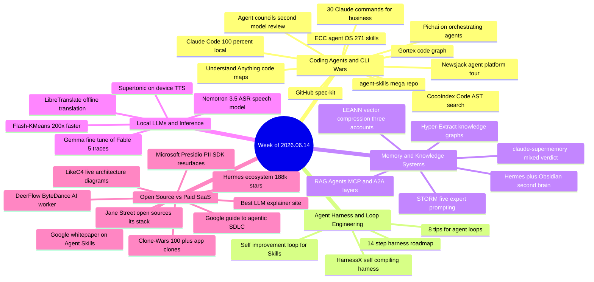

# Weekly Tech Digest — Week of 2026.06.14

51 captures reviewed · 45 in this digest · [Open this week in the knowledge graph](./graph.html#2026.06.14)

## This week's through-lines

Four currents ran through this week's captures. First, agents are finally being pointed at the problem of understanding code before touching it — semantic code search (CocoIndex Code, Gortex, Understand Anything), spec-driven workflows (GitHub's spec-kit), and diagrams generated straight from source (LikeC4) all shipped in the same seven days. Second, the harness quietly became more interesting than the model sitting inside it: a self-compiling harness paper, a 14-step harness roadmap, disciplined loop-engineering tips, and a loop that rewrites its own Skills all argue that the wrapper around the LLM is where the real engineering is happening now. Third, local inference kept nibbling at cloud APIs — offline translation, on-device TTS, a 0.6B speech model, a local Claude Code clone — but almost every one of those claims got a skeptical, often well-informed pushback in the replies. And fourth, nothing shipped this week without a fact-check: two "brand new" open-source drops (Microsoft's Presidio, ByteDance's DeerFlow) turned out to be old news, a Stanford technique got its own math corrected by a reader, and the wildest-sounding story of the week — that Anthropic's Claude Fable 5 got banned days after launch — turned out to be true, and already resolved.

## Coding Agents & CLI Wars

### ECC — an operating system for coding agents

Someone open-sourced a 271-skill, 67-agent, 92-command bundle that layers on top of Claude Code, Cursor, Codex, OpenCode, Gemini CLI, and GitHub Copilot, installable in two commands via a Claude Code plugin marketplace. The pitch is skill packs, memory persistence, continuous learning, security scanning, and production-ready workflows across 12+ language ecosystems — MIT licensed, free.

*Why it matters: as agent tooling fragments across five-plus CLIs, "install once, works everywhere" bundles like this are becoming the default way people actually configure their agents, rather than hand-rolling each setup.*

**Resources:** [github.com/affaan-m/ECC](https://github.com/affaan-m/ECC)

### Claude Code, running 100% local for $0 a month

claude-code-local wires a 122B-parameter local model into the Claude Code harness, claiming 65 tok/s on a MacBook — faster, by this account, than cloud Opus. Replies were immediately skeptical about the real VRAM and hardware requirements behind that number.

*Why it matters: the claim itself matters less than the pattern — "run the coding-agent harness locally against an open model" keeps recurring, and this is the loudest version of it yet.*

**Resources:** [github.com/nicedreamzapp/claude-code-local](https://github.com/nicedreamzapp/claude-code-local)

### CocoIndex Code, Gortex, and Understand Anything: agents finally get to read the map

Three separate tools shipped this week solving the same problem: coding agents currently search code the way `grep` does, by text, and it's expensive and imprecise. CocoIndex Code builds AST-based semantic search into Claude Code, Codex, and Cursor, claiming 70% fewer tokens spent on codebase search. Gortex indexes a repository into a queryable code graph exposed via CLI, MCP server, and web UI, with a precomputed depth-3 reach index for near-instant impact analysis and up to 50x fewer tokens per lookup. Understand Anything went further still — 59.2k GitHub stars and #1 trending — turning an entire codebase into a queryable dependency graph in minutes; one tester logged a 249-node map built in about 25 minutes for roughly 130k tokens.

*Why it matters: three independent teams converging on "give the agent a structural map of the code, not just a text index" in the same week is a strong signal this is the next layer of coding-agent infrastructure, not a one-off.*

**Resources:** [CocoIndex Code](https://github.com/cocoindex-io/cocoindex-code) · [Gortex](https://github.com/zzet/gortex) · [Understand Anything](https://github.com/Egonex-AI/Understand-Anything) *(post text names the repo as Lum1104/Understand-Anything; the capture's structured link points to Egonex-AI/Understand-Anything — noting the discrepancy rather than guessing which is canonical)*

### GitHub's spec-kit: spec first, code second

GitHub published its own spec-driven development workflow — six commands (`constitution`, `specify`, `clarify`, `plan`, `tasks`, `implement`) that turn a plain-language idea into a structured specification before any code gets written. It crossed 95k stars and 8.3k forks within days of release and works with Claude Code, Cursor, Copilot, Codex, Gemini CLI and 25+ other agents.

*Why it matters: this is GitHub itself, not a third party, telling the market how it thinks agentic coding should work — specification as the durable artifact, code as the disposable output.*

**Resources:** [github.com/github/spec-kit](https://github.com/github/spec-kit)

### Agent councils: let a second model check the work

Building on Andrej Karpathy's llm-council app (ask several models the same question, have them rank each other's answers blind), builders this week described running that pattern inside a loop: one model does the work, a model from a different lab reviews it before every delivery. The logic is that same-lab reviewers share the same blind spots, while a different lab's model catches what the first one talked itself into.

*Why it matters: multi-model review is emerging as a cheap, structural fix for the "agent believes its own bad ideas" failure mode, without needing a human in the loop for every step.*

**Resources:** [github.com/calvinnwq/agent-swarm](https://github.com/calvinnwq/agent-swarm) *(Karpathy's own llm-council was referenced but no direct link was captured in the post)*

### Where do recurring agent workflows actually live?

One builder spent 12 hours installing the same product across every agent surface and reported back: Claude chat handles one-shot tasks well but can't run complex scheduled workflows; Claude Cowork is more sandboxed and limited than expected, with no easy path to persist to local machines; ChatGPT is the weakest for skill-based workflows since skills are still gated to business/enterprise plans; and local CLI agents (Claude Code, Codex, Hermes, OpenClaw) are where real, persistent, scheduled orchestration actually lives today.

*Why it matters: it's a rare, concrete comparison of where recurring automation actually survives across today's agent surfaces, rather than a marketing claim about any one of them.*

**Resources:** [newsjack.sh](http://newsjack.sh/)

## Agent Harness & Loop Engineering

### HarnessX: a harness that compiles itself

A new paper treats the agent harness — model, tools, permissions, context — as a typed, editable artifact that a loop can optimize from its own execution traces, framing it as an operational mirror of reinforcement learning: the harness is the state, an edit is the action, a trace plus a score is the feedback. Edits never ship blind — a loop reads traces, plans a change, writes it, critiques it, and a gate only keeps the new version if it beats the current one on unseen tasks. The paper's headline result: the weakest model improved the most, while the strongest barely moved.

*Why it matters: this is the first serious attempt to make harness design itself a target for automated optimization rather than hand-tuning — a plausible next rung after prompt and context engineering.*

**Resources:** [arxiv.org/abs/2606.14249](http://arxiv.org/abs/2606.14249)

### A 14-step roadmap from one agent to a self-improving system

A detailed breakdown draws a hard line between three layers people keep conflating: the harness (the static environment one agent runs inside — model, tools, permissions, context), the loop (the harness run on a timer, spawning helpers and feeding itself), and the self-improving system (a loop plus memory that compounds, so every run leaves the next one sharper). It builds directly on Addy Osmani's loop-engineering framing and argues the whole harness lives in one folder that should stay small enough to explain every file in it.

*Why it matters: as "loop" and "harness" get used interchangeably in agent discourse, a clean vocabulary for the three layers is genuinely useful for anyone trying to debug why their setup produces slop.*

**Resources:** [movez.substack.com](https://movez.substack.com/)

### 8 tips for writing quality agent loops

A practical checklist: prefer closed loops over open ones (open loops burn tokens and money), only loop repeatable work with a checkable "done," run parallel agents in separate git worktrees, use a separate agent to verify the work, enforce quality gates with tests and linters rather than LLM judgment, and maintain a `RULES.md` for repeated mistakes — one that a human manages directly, since that's where human input actually matters.

*Why it matters: it's a concrete, testable checklist rather than another abstract "loops are the future" post — the kind of thing you can hold a team to.*

**Resources:** [craftbettersoftware.com/p/loop-engineering-101](https://craftbettersoftware.com/p/loop-engineering-101)

### A self-improvement loop for your Skills

Zach Lloyd (Warp) walked through a concrete self-improvement loop: an inner loop applies a Skill — say, GitHub issue triage — via an automated integration, recording every interaction. An outer loop, running on a schedule via Warp's Oz cloud-agent platform, reads back every run plus any human corrections and rewrites the Skill file itself to better match observed feedback. A full sample repo with the triage Skill and the GitHub Actions wiring is included.

*Why it matters: this is one of the more concrete, reproducible demonstrations of a Skill that improves itself from real usage rather than a one-off manual edit.*

**Resources:** [Sample repo](https://github.com/warpdotdev-demos/issue-triage-loop) · [Oz platform](https://github.com/warpdotdev/oz-for-oss)

## Memory & Knowledge Systems

### claude-supermemory: persistent memory for Claude Code, mixed verdict

A new tool gives Claude Code persistent memory across sessions. The most-liked reply called it skippable unless you specifically need team-shared memory, pointing to a lighter local-only alternative ("claude mem") as the better default for solo use.

*Why it matters: the agent-memory space is crowded enough now that "skip it, use the simpler local option" is becoming a common and credible response to each new entrant.*

**Resources:** [github.com/supermemoryai/claude-supermemory](https://github.com/supermemoryai/claude-supermemory)

### Hermes + Obsidian + NotebookLM as a compounding second brain

A new integration, Hermes-Open Knowledge Format (Hermes-OKF), pairs the Hermes agent with Obsidian and NotebookLM into what's pitched as a local, self-wiring second brain — markdown-first, writing its own skills, mapping its own knowledge, and never starting from zero on a new session. It's described as a better version of Karpathy's "LLM wiki" concept.

*Why it matters: it's one node in a much larger Hermes-centric tooling ecosystem that shipped several companion projects this week (see the Open Source section below) — worth watching whether it consolidates or fragments.*

**Resources:** [github.com/EliaszDev/hermes-okf](https://github.com/EliaszDev/hermes-okf)

### LEANN shrinks vector storage 97% — and hit the feed from three different accounts

LEANN uses graph-based selective recomputation with high-degree-preserving pruning to compress 60 million text chunks from 201GB down to 6GB with no accuracy loss claimed, computing embeddings on demand instead of storing them all — no GPU required, fully private, runs on a laptop. The same repository was posted independently by three separate accounts this week, each framing it as "vector databases are cooked."

*Why it matters: when the identical open-source repo gets independently rediscovered and reposted three times in one week, that's usually a real signal about where attention is heading, not just one account's hype.*

**Resources:** [github.com/StarTrail-org/LEANN](https://github.com/StarTrail-org/LEANN)

### STORM: ask five experts instead of one

Built on a peer-reviewed Stanford technique, STORM restructures a single research question into five persona-based prompts — practitioner, skeptic, economist, historian, academic — each surfacing a different angle before a synthesis pass, claimed to produce 25% more organized output than a single prompt. A reader promptly corrected the post's own math: it's five prompts, not four as originally claimed, and accused the post itself of being written by AI without the "peer review" it claimed to apply.

*Why it matters: it's a genuinely useful multi-perspective prompting pattern, but also this week's cleanest example of a "do your own research" post getting fact-checked in its own replies.*

**Resources:** [Prompts (Google Drive)](https://drive.google.com/file/d/1xYitfs5_JlC-2gBmInHjrjdToDN_ikmc/view?usp=drivesdk)

### RAG, Agents, MCP, and A2A: one mental model

A framing post argues RAG (retrieval plus grounded generation), AI agents, MCP, and A2A aren't competing approaches but different layers of the same system. *(This capture's snapshot failed to save; the summary here is based only on the post's excerpt, not the full text — flagged per the honesty policy rather than filled in with a guess.)*

*Why it matters: as these four terms get used loosely and interchangeably, a layered mental model is a useful corrective even in outline form.*

**Resources:** *(no link captured in post)*

## Local LLMs & Inference

### LibreTranslate: offline translation, with real caveats

LibreTranslate runs 40-language translation entirely on-device — no API key, no usage limits, self-hosted in under five minutes, with a REST API for building it into other tools. Several replies pushed back hard on the framing: quality is well behind current frontier LLMs and DeepL, especially on legal or medical text, and one commenter called running it on sensitive documents "suicidal" compared to more accurate paid options.

*Why it matters: it's a genuinely useful and free tool for the privacy-over-quality tradeoff, but this week's replies were an unusually well-informed check on the "Google Translate is cooked" framing.*

**Resources:** [github.com/LibreTranslate/LibreTranslate](http://github.com/LibreTranslate/LibreTranslate)

### Supertonic: on-device TTS, disputed quality claims

A 66M-parameter, MIT-licensed text-to-speech model claims 167x real-time speed on an M4 Pro, runs on a Raspberry Pi or e-reader, and reportedly beats ElevenLabs Flash and OpenAI TTS-1 on raw throughput while handling currency, dates, and phone numbers correctly out of the box. The top reply called the claim clickbait, saying the voice quality itself is nowhere near ElevenLabs.

*Why it matters: throughput and on-device numbers are real and interesting; voice quality is a separate axis entirely, and this week's replies were right to keep those apart.*

**Resources:** [github.com/supertone-inc/supertonic](https://github.com/supertone-inc/supertonic)

### NVIDIA's 0.6B speech recognition model, CPU-only

Nemotron-3.5-ASR is pitched at 40+ languages, streaming output, no GPU required, and 2.5x the speed of the official Nemo runtime with identical recognition results claimed. *(Note: the only link this capture recovered points to a different model, MediaTek Research's Breeze-ASR-25, raised in the replies — not to Nemotron-3.5-ASR itself, which had no direct link captured.)*

*Why it matters: sub-1B, CPU-only ASR that's genuinely usable would matter a lot for local agent pipelines, but the honest state here is that the primary source link isn't confirmed.*

**Resources:** [huggingface.co/MediaTek-Research/Breeze-ASR-25](https://huggingface.co/MediaTek-Research/Breeze-ASR-25) *(reply-sourced, not the Nemotron model itself)*

### A Gemma fine-tune trained on Claude Fable 5's banned reasoning traces

A hobbyist fine-tuned Gemma-4-12B on verified Python chain-of-thought traces — primarily from Composer 2.5, with Fable 5 used to redo the cases Composer missed — and ran it at 20+ tok/s on an 8GB consumer GPU, framing it as a workaround to Fable 5's export ban. That ban was real: the US government issued export controls on Claude Fable 5 and Mythos 5 on June 12, three days after Fable 5's public launch, after Amazon researchers found a jailbreak; Anthropic had no way to verify user nationality in time, so access was suspended globally, including for Anthropic's own foreign-national employees, until it was restored on July 1. Commenters were split on the fine-tune itself — several said a 12–25B model trained on Fable 5's outputs doesn't come close to the source model.

*Why it matters: the export-control story is one of this week's few captures where an outlandish-sounding claim checked out completely, and it's a preview of how distillation debates will keep surfacing around any model with usage restrictions.*

**Resources:** [Gemma4-12B-Coder GGUF](https://huggingface.co/yuxinlu1/gemma-4-12B-coder-fable5-composer2.5-v1-GGUF)

### Flash-KMeans: 200x faster clustering on GPU

An IO-aware rewrite of exact KMeans fuses the distance calculation with nearest-centroid assignment so results compute on-chip without writing the full distance matrix to memory, and turns the scattered centroid-update writes into sequential reductions. Claimed results: 33x over cuML, 200x over FAISS. Relevant use cases named: dynamic re-indexing for vector search, faster per-layer weight-codebook search for quantization, and viable in-loop token routing for MoE models.

*Why it matters: KMeans has always been an offline preprocessing step; if these speedups hold up, it becomes viable inside runtime-critical systems instead.*

**Resources:** [github.com/svg-project/flash-kmeans](http://github.com/svg-project/flash-kmeans)

## Open Source vs Paid SaaS

### Jane Street's $39.6B stack, open on GitHub

Jane Street — by this account the most profitable trading firm on earth last year — has open-sourced core (an OCaml standard-library replacement), magic-trace (CPU-instruction-level tracing for when a profiler gives up), async (the concurrency engine reportedly moving billions of dollars daily), and hardcaml (chip design in OCaml).

*Why it matters: production infrastructure from a firm at that level of profitability, released for free, is a genuinely rare chance to study battle-tested systems code rather than toy examples.*

**Resources:** [github.com/janestreet](http://github.com/janestreet)

### Microsoft's Presidio PII SDK resurfaces — it's not new

Presidio detects and anonymizes PII (names, emails, SSNs, credit cards, even DICOM medical images) before it reaches a model, across Python, PySpark, Docker, and Kubernetes. Multiple replies pointed out Presidio has existed for years, and that default accuracy is mediocre — Microsoft's own evaluation notebooks reportedly show custom recognizers boosting the F-score by roughly 30% over defaults.

*Why it matters: PII redaction ahead of a model is genuinely the right place to put this kind of filter, but this week's replies are a useful reminder to check whether a tool is "new" before treating it as news.*

**Resources:** [github.com/microsoft/presidio](https://github.com/microsoft/presidio)

### DeerFlow: ByteDance's open-source AI worker — also not new

DeerFlow is described as a ByteDance-built agent that plans, spins up parallel sub-agents, writes and tests code, and builds websites, dashboards, and slide decks end to end — 22.7k GitHub stars, #1 on GitHub Trending, MIT licensed. Multiple replies said it's been available for months, pushing back on the "just dropped" framing. *(No legitimate project link was captured in this post — the only URL recovered was an unrelated affiliate page and has been omitted rather than passed along.)*

*Why it matters: it's a real, apparently substantial open-source multi-agent system, but a second week-over-week example of "breaking" framing outpacing the actual timeline.*

**Resources:** *(no reliable link captured — see note above)*

### Hermes agent ecosystem crosses 188k stars, five satellite tools ship in one week

A roundup named five projects built on top of the Hermes agent platform: GBRAIN (22.8k stars, a persistent markdown-first memory layer built by Y Combinator's Garry Tan, run on his own setup at 146K+ pages and 24K+ people), Hermes Workspace (5.7k stars, a full web GUI with live sub-agent monitoring), Mission Control (5.3k stars, a multi-agent fleet dashboard with per-agent cost tracking), SkillClaw (1.9k stars, auto-deduplicates and evolves a skill library from usage data), and AgentTrace (a local-first TUI for post-run session audits across Hermes, Claude Code, Codex, Gemini CLI, OpenClaw and more).

*Why it matters: whatever Hermes itself is, it now has a small industry of memory, dashboard, skill-evolution, and observability tooling built around it in the same week — the kind of satellite ecosystem that usually signals real adoption.*

**Resources:** [GBRAIN](https://github.com/garrytan/gbrain) · [Hermes Workspace](https://github.com/outsourc-e/hermes-workspace) · [Mission Control](https://github.com/builderz-labs/mission-control) · [SkillClaw](https://github.com/AMAP-ML/SkillClaw) · [AgentTrace](https://github.com/luoyuctl/agenttrace)

### Google's whitepaper on building and evaluating Agent Skills

A free Kaggle whitepaper from Google covers how to build and evaluate Agent Skills, including meta-skills and self-improving skills.

*Why it matters: it's a rare vendor-published, structured treatment of a topic (Skills) that's mostly been defined by scattered blog posts and Twitter threads so far.*

**Resources:** [kaggle.com/whitepaper-agent-skills](https://www.kaggle.com/whitepaper-agent-skills)

### A 50-page guide to the shift from vibe coding to agentic engineering

Another free whitepaper covers the new software development life cycle under AI agents, including treating agent context and rules as versioned code alongside the codebase itself.

*Why it matters: it pairs directly with this week's spec-kit story — both are attempts to formalize what "agentic engineering process" actually means once the SDLC assumes an agent is doing the implementation.*

**Resources:** [kaggle.com/whitepaper-the-new-SDLC-with-vibe-coding](https://www.kaggle.com/whitepaper-the-new-SDLC-with-vibe-coding)

### LikeC4 turns code into live architecture diagrams

Write the model, get the diagram; change the code, and the diagram updates — 98k downloads a month, with several replies noting most engineers haven't heard of it. It was posted independently by two different accounts this week.

*Why it matters: "diagrams as code" pairs naturally with this week's semantic-code-search tools — both are about giving agents (and humans) a structural view of a codebase instead of a stale PNG.*

**Resources:** [github.com/likec4/likec4](http://github.com/likec4/likec4)

### A free site for learning how LLMs actually work

A no-cost explainer walking through transformer internals drew repeated praise in the replies as clearer than existing video explainers on the same topic.

*Why it matters: as "explain transformers" content proliferates, replies calling one out as genuinely better than the alternatives is a useful signal.*

**Resources:** [0xkato.xyz/how-llms-actually-work](http://0xkato.xyz/how-llms-actually-work)

## Quick hits

- **Sundar Pichai on orchestrating agents** — a 30-minute interview clip where Google's CEO argues the shift is from writing code to orchestrating agents, and that the skill gap will bite hardest in 2027. [Watch](https://youtu.be/IB7IW6zX-H0)
- **30 Claude slash commands for running a solo business** — a full set of money, marketing, ops, sales, content, and research commands built as Claude Code-style slash commands. [Video](https://youtu.be/XD4tfm-12rg?si=lKsWWSQUwcgbPI3g)
- **agent-skills: 60.8k stars** — a free collection of production-grade engineering skills for Claude Code, Codex, Cursor and Gemini CLI; this capture's snapshot failed, so details are limited to the post's excerpt. *(no link captured)*
- **Hyper-Extract** turns messy documents into structured knowledge graphs and timelines — a reply asked whether it can say "I don't know" instead of confidently misreading a document. [github.com/yifanfeng97/Hyper-Extract](https://github.com/yifanfeng97/Hyper-Extract)
- **Free AI courses straight from the source** — a roundup of free training from Anthropic, Google, Meta, NVIDIA, Microsoft, OpenAI, IBM, AWS, DeepLearning.AI, and Hugging Face. [anthropic.skilljar.com](https://anthropic.skilljar.com/)
- **10 free websites worth bookmarking** — Nextcloud (self-hosted Drive/Dropbox), the Internet Archive, Photopea (browser Photoshop), Syncthing, and Ninite, alongside two paywall/journal-bypass tools worth knowing your local laws before using. [nextcloud.com](http://nextcloud.com/)
- **10 GitHub repos vs. paid AI courses** — includes microsoft/generative-ai-for-beginners and rasbt/LLMs-from-scratch; no links were captured in the post. *(no link captured)*
- **100+ open-source clones** of Netflix, Spotify, Instagram, Airbnb, WhatsApp, TikTok and more, each with source, live demo, and tech stack listed. [github.com/GorvGoyl/Clone-Wars](https://github.com/GorvGoyl/Clone-Wars)
- **20 GitHub repos for an AI engineering career** — spans OpenClaw, TensorFlow, AutoGPT, n8n, Ollama, and LangChain; a reply noted OpenClaw hasn't seen a commit since 2023. [github.com/arize-ai/phoenix](https://github.com/arize-ai/phoenix) *(only reliably captured link from this post)*
- **A curated list of workflow automation tools and AI agents**, awesome-list style. [github.com/dariubs/awesome-workflow-automation](https://github.com/dariubs/awesome-workflow-automation)
- **Stanford's 2-hour lecture on building LLMs from scratch** — tokenization, scaling laws, SFT, RLHF, DPO. *(the only link this capture recovered was an unrelated OpenAI error-codes page, so no direct lecture link is given)*
- **10 GitHub repos worth a look for AI engineers** — includes Hands-On-Large-Language-Models, microsoft/ai-agents-for-beginners, Karpathy's autoresearch (a 630-line overnight experiment loop), and walkinglabs/learn-harness-engineering. [github.com/Sumanth077/Hands-On-AI-Engineering](https://github.com/Sumanth077/Hands-On-AI-Engineering)
- **A full-stack AI engineering roadmap, 0 to 100** — fundamentals through RAG, agents, infra, evals, and security. [Roadmap](https://mk0r.com/r/4yjqjfi6) *(shortener; final destination not independently verified)*
- **yabai**, a tiling window manager for macOS using binary space partitioning, beyond the OS's default 16-space limit. [osp.fyi/yabai](https://osp.fyi/yabai) *(recurring second-hop shortener)*
- **A collection of patterns for building software with AI assistance**, posted with no additional commentary. [github.com/PaulDuvall/ai-development-patterns](https://github.com/PaulDuvall/ai-development-patterns)

---

*51 captures reviewed for tag `2026.06.14`. 45 appear above; 3 were set aside and are not included: one described a username/email deanonymization and behavioral-profiling tool that this digest declined to detail or link, and two were thin, reply-spam-only posts with no substantive claim or captured link worth reporting. Entries marked with a note on failed snapshots, mismatched links, or replies that corrected the original claim are flagged as such rather than smoothed over — captured text and Terry's own notes are the only sources used for any claim in this digest.*
