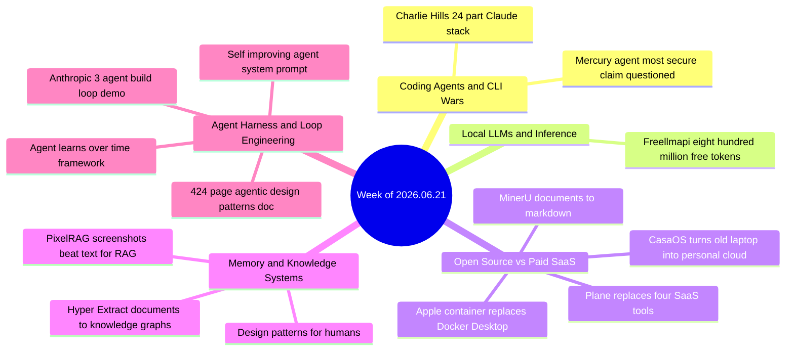

# Weekly Tech Digest — Week of 2026.06.21

14 captures · [view in the cumulative graph](./graph.html#2026.06.21)

## This week's through-lines

The dominant current this week is **kill the subscription**: Plane replaces Jira, Linear, Monday, and ClickUp for the price of a Docker deploy; CasaOS turns an old laptop into a personal cloud that replaces Netflix, Google Photos, Dropbox, and 1Password; Apple's own `container` tool makes Docker Desktop's paid license optional on Mac; and freellmapi promises 800 million free tokens a month across every major model. Four unrelated posts, one shared pitch — stop renting, start self-hosting.

Harness-over-model kept building on itself: a framework splitting agent improvement into model, harness, and context (with "learn from user corrections" as the underrated fourth lever), a viral 424-page agentic-design-patterns doc, a from-scratch system prompt for self-improving agents, and Anthropic's own demo of a three-agent plan/build/judge loop assembling a working app in 40 minutes, with the tagline "the winners won't have the smartest model, they'll have the best loop."

Getting clean, structured knowledge out of messy sources keeps splitting into more approaches: MinerU turns any document format into Markdown with OCR and LaTeX-quality math; Hyper-Extract goes further and turns unstructured text into full knowledge graphs, Obsidian vaults, or MCP-ready knowledge bases; and PixelRAG skips text parsing entirely, retrieving screenshots of pages instead and reading them with a vision-language model.

This was also a week of real-time overclaim-checking: a "I read the whole 424-page doc" post gets called out for having a bot summarize it instead; freellmapi's "no strings attached" free-tokens pitch gets tempered by someone who hit silent key rotation and corrupted output on a similar aggregator; and mercury-agent's "most secure AI agent out there" claim gets met with a blunt "compared to what threat model?"

## Coding Agents & CLI Wars

### The 24-part Claude stack behind one person's business

A detailed rundown of a working setup: 8 plugins (including `gstack` for 23 dev tools in one install, `superpowers` for a full dev methodology, and a Codex-in-Claude bridge), 8 skills loaded on demand (frontend design, skill-creator, an MCP builder, a token-trimming "caveman" skill), and 8 live MCP server connections (Notion, Slack, Zapier, Perplexity, a meeting-notes feed). A reply asks the sharper question: eight plugins is eight new ways composition can break — what's the orchestration story at scale?

*Why it matters:* a concrete, named inventory of what a real multi-plugin/skill/MCP Claude setup looks like in practice, rather than a hypothetical — useful as a checklist even if you don't adopt all 24 pieces.

**Resources:** [full install list](https://charliehills.substack.com/p/resource)

### Mercury Agent's "most secure" claim, questioned on arrival

A GitHub-native pitch for an open-source MIT-licensed agent: "real human brain architecture," "fully soul driven," token-efficient, and permission-gated for new directories or unusual commands. A reply cuts through the marketing language directly: "most secure ain't the same as secure enough — what's the actual threat model here?"

*Why it matters:* a reminder that security claims without a stated threat model are marketing, not an audit.

**Resources:** [github.com/cosmicstack-labs/mercury-agent](https://github.com/cosmicstack-labs/mercury-agent) · [octopal.ca](https://octopal.ca/) (referenced alternative architecture)

## Local LLMs & Inference

### freellmapi promises 800M free tokens a month, replies urge caution

An open-source, MIT-licensed drop-in API replacement claiming 800 million free tokens a month across GPT-4, Claude, Gemini, Llama, and Mistral, no card or key required, positioned as a one-line endpoint swap. A reply with direct experience is the more useful data point here: they tried a nearly identical aggregator last year and hit silent key rotation mid-batch — 50 transactions half-categorized, no error thrown, output looked complete but wasn't.

*Why it matters:* "free tokens, no strings" claims for a multi-provider proxy are worth stress-testing for silent failure modes before pointing production traffic at one — the failure isn't the price, it's not knowing when it silently breaks.

**Resources:** [github.com/tashfeenahmed/freellmapi](http://github.com/tashfeenahmed/freellmapi)

## Open Source vs Paid SaaS

### Plane — one self-hosted deploy replaces Jira, Linear, Monday, and ClickUp

Open-source (52,900+ stars) project management suite covering work items, sprints with burndown charts, modules, custom views, a docs editor with AI capabilities, analytics, and Kanban/list/spreadsheet/Gantt views — deployed once via Docker or Kubernetes, run on your own hardware. The pitch: a 10-person team pays roughly $3,018/year combining Jira, Linear, and Monday; Plane is free, unlimited users, unlimited projects. A reply reframes what's actually being purchased: "you're not paying for project management, you're paying for the permission to access your own team's data — self-host once and that sentence stops being true."

*Why it matters:* part of this week's broader "kill the subscription" wave — a full-featured, credible alternative to three SaaS tools stacked together, not just one.

**Resources:** [github.com/makeplane/plane](https://github.com/makeplane/plane) · [self-hosted pricing](https://plane.so/pricing?mode=self-hosted)

### MinerU — any document format to clean Markdown in under two minutes

Open-source (68,551 stars) tool from Shanghai AI Laboratory's OpenDataLab team: converts PDFs, Word, PowerPoint, Excel, or scanned images into Markdown with reading-order-aware multi-column parsing, built-in OCR, LaTeX-quality equation recognition, and merged/multi-page table handling across up to 10,000-page documents in batch. Plugs into Claude Desktop, Cursor, Windsurf, LangChain, LlamaIndex, RAGFlow, Dify, and FastGPT. Built originally to extract training data from millions of scientific documents, then open-sourced.

*Why it matters:* positioned squarely against paid OCR (Adobe Acrobat Pro at $239.88/year, ABBYY FineReader at $165/year, Mistral OCR at $2/1,000 pages) with a claim of matching or beating their table and equation handling for free, running entirely on your own machine.

**Resources:** [mineru.net](http://mineru.net/) · [github.com/opendatalab/mineru](https://github.com/opendatalab/mineru)

### Apple quietly makes Docker Desktop's paid license optional on Mac

`apple/container` (26.5k stars) runs Linux containers natively on Apple Silicon as lightweight VMs via macOS virtualization, fully OCI-compatible with any registry, written in Swift, using standard container CLI syntax — no Docker Desktop daemon, no $21/developer/month commercial license. Replies flag the real gap: no Compose support yet, which several call the blocking issue for treating it as a full OrbStack/Docker Desktop replacement.

*Why it matters:* another "kill the subscription" entry, but from Apple itself rather than a scrappy open-source team — notable that Microsoft made the equivalent move on Windows via WSL Containers the same month.

**Resources:** [github.com/apple/container](http://github.com/apple/container) · [releases](http://github.com/apple/container/releases)

### CasaOS — turn the laptop in your closet into a personal cloud

Open-source (34,116 stars) home-server platform: one command turns an old laptop, Raspberry Pi, or mini PC into a personal server reachable from anywhere, with a one-click app store covering Jellyfin (Netflix replacement), Immich (Google Photos replacement), Nextcloud (Dropbox replacement), Vaultwarden (1Password replacement), Syncthing, Home Assistant, and AdGuard. A reply pushes back on the framing specifically: Jellyfin doesn't really "replace" Netflix since you don't own new content, and running an old laptop 24/7 raises real heat and reliability questions a server chassis is built to handle.

*Why it matters:* the sharpest example this week of the self-hosting pitch, plus the sharpest reply pushing back on where the analogy breaks down — worth reading both.

**Resources:** [cloudron.io](http://cloudron.io/) (alternative referenced in thread)

## Memory & Knowledge Systems

### Hyper-Extract turns documents into knowledge graphs, not just chunks

Open-source tool that converts unstructured text into knowledge graphs, hypergraphs, temporal/spatial graphs, strongly typed data models, Obsidian vaults, or MCP-ready knowledge bases, with 80+ YAML templates across finance, legal, medical, and other domains, runnable locally via vLLM. A reply raises the key design question up front: if you define the schema before extraction, it's an extractor; if it generates the schema from each document, it's a clustering tool — those behave very differently at scale, and schema drift (the same entity typed three different ways across documents) is where these tools tend to quietly fail.

*Why it matters:* a more ambitious bet than plain RAG chunking — "what RAG looks like when it grows a spine" — but the reply thread's schema-drift warning is the load-bearing caveat before pointing it at a real corpus.

**Resources:** [github.com/yifanfeng97/Hyper-Extract](https://github.com/yifanfeng97/Hyper-Extract)

### PixelRAG — skip text parsing, retrieve screenshots instead

Open-source (Apache-2.0) retrieval system out of Berkeley SkyLab/BAIR, advised by Databricks CTO Matei Zaharia: instead of parsing a page to text and embedding chunks, it screenshots the page and has a vision-language model read the answer directly off the pixels. The team built a visual index of 30M+ Wikipedia screenshots that beats the strongest text-RAG baseline by 18.1% on text-only QA, on the reasoning that HTML-to-text parsing alone can silently drop 40%+ of a page's tables, charts, and layout. Ships a Claude Code plugin that lets Claude screenshot a live URL and read the rendered page instead of scraping the DOM. A reply adds real-world texture: screenshot-based retrieval still stalls on paywalls, captchas, and dynamic content that loads a few seconds after the shot — though the author notes render-timing issues are fixable by waiting on network-idle before capturing.

*Why it matters:* a genuinely different bet on the document-ingestion problem running through this week — instead of parsing better, stop parsing.

**Resources:** [github.com/StarTrail-org/PixelRAG](https://github.com/StarTrail-org/PixelRAG)

## Agent Harness & Loop Engineering

### The three things an agent can actually learn from — and the one everybody skips

A framework splitting agent improvement into three levers: the model (only trainable by big labs, and only where right/wrong is scorable, like code and math), the harness (the tools, steps, and safety checks you build around the model — the highest-leverage lever you actually control), and the context (a plain-text record of what the agent has learned so far). The post's real point is a fourth, overlooked lever: learning from every user correction. A reply operationalizes it well: capture what was wrong, why, what rule would catch it next time, and what check should run before handoff.

*Why it matters:* a clean, actionable restatement of "the harness matters more than the model" that's been the through-line of the last several weeks, with a concrete mechanism (the correction loop) instead of just the slogan.

**Resources:** no link captured; framework described directly in the post

### A 424-page agentic design patterns doc — and a very public "did you actually read it" callout

A widely-shared 424-page document on agentic design patterns gets condensed into 15 practical patterns (prompt chaining, routing, reflection, tool use, planning, multi-agent orchestration, memory management, RAG, guardrails/human-in-the-loop). A reply calls out the "I read the whole thing" framing directly: the summary reads like a bot's output, not a human's, and a subsequent reply shows a Grok-generated summary being passed around as if it were the original poster's own synthesis. Other replies name the three most-skipped chapters as the ones that matter most for production: exception handling, guardrails, and evaluation/monitoring — precisely the ones in the back half nobody reaches.

*Why it matters:* the pattern list itself is a solid quick reference, but the real story is the callout — AI-summarized content increasingly gets presented as "I read the whole thing," and this week someone said so publicly.

**Resources:** [PDF (Google Drive mirror)](https://drive.google.com/file/d/1-5ho2aSZ-z0FcW8W_jMUoFSQ5hTKvJ43/view?usp=drivesdk) · [PDF (direct)](https://irp.cdn-website.com/ca79032a/files/uploaded/Agentic-Design-Patterns.pdf)

### Anthropic shows a three-agent loop building a full app in 40 minutes

A demo from the Claude Code team: one agent plans, one builds, one judges, cycling until the app actually works — end to end in 40 minutes. The framing that spread with it: "the winners won't have the smartest model, they'll have the best loop." A reply raises the honest counterpoint most of these demos skip: the compute overhead of running three agents in a judged loop may cost more in tokens than it saves in human time, depending on what you're valuing.

*Why it matters:* a concrete, official demonstration of the plan/build/judge loop pattern that's been circulating as theory for weeks — directly from the team that builds Claude Code, which lends it more weight than the usual third-party "loop engineering" post.

**Resources:** no link captured; video referenced in the post

## Quick hits

- **[design-patterns-for-humans](https://github.com/kamranahmedse/design-patterns-for-humans)** — ultra-simplified plain-English explanations of common software design patterns.
- **[A system prompt for self-improving agents](http://github.com/fainir/most-capable-agent-system-prompt)** — a from-scratch system prompt aimed at agents that improve themselves over time.

---

*14 captures processed for tag `2026.06.21`. Honesty policy: entries are built only from captured post text, Terry's notes, and resolved links — anything not directly verifiable is labeled as such rather than guessed at.*
