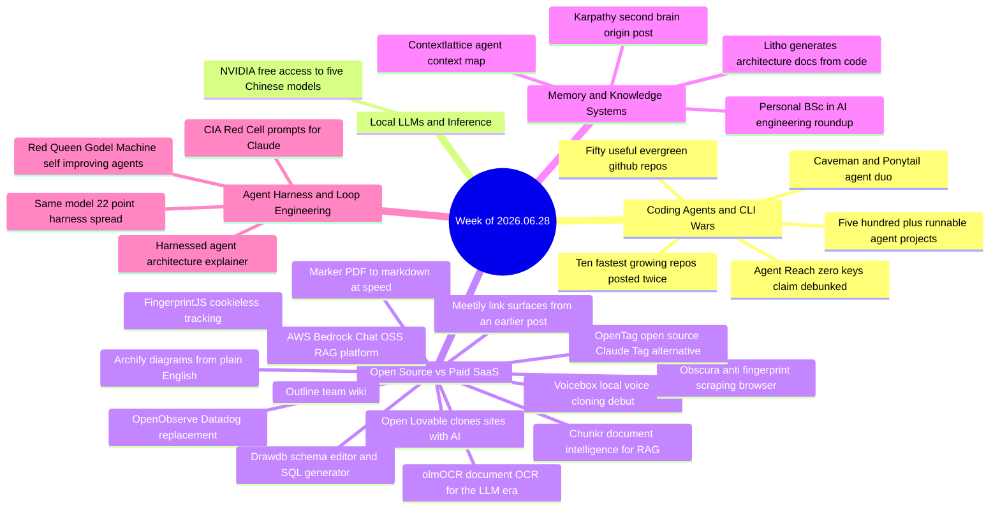

# Weekly Tech Digest — Week of 2026.06.28

29 captures · [view in the cumulative graph](./graph.html#2026.06.28)

## This week's through-lines

The document pipeline got a full stack of free upgrades this week: **marker**, **olmOCR**, and **Chunkr** all convert messy PDFs, scans, and office files into clean structured text for RAG, while **Litho** does the same trick for source code, generating architecture docs straight from a repo. Four different tools, one shared premise — bad ingestion is why RAG pipelines quietly fail, and nobody wants to pay for OCR anymore.

"The harness matters more than the model" kept its grip on the discourse. A six-page paper found a 22-point score spread running the *same* Claude Opus 4.6 through 9 different harnesses on the same benchmark, a separate explainer diagrammed memory/skills/protocols as the real seat of agent intelligence, and a Cambridge/NVIDIA paper proposed letting agents and their evaluators co-evolve with zero human oversight — with replies immediately noting nobody's solved reward hacking once an agent can rewrite its own constraints.

Andrej Karpathy's "stop coding, build a second brain" post is the seed of a meme that's still growing: point Claude or Kimi at an Obsidian vault and let it build a self-linking wiki. This week's capture is the origin point — the same idea, packaged differently, keeps resurfacing in later weeks' digests, alongside a steady stream of "map your agent's context" tools like contextlattice.

Engagement farming showed its seams: the identical "10 fastest growing GitHub repos" list ran almost word-for-word from two different accounts three days apart. And two stories this week got real-time fact-checks in the replies — OpenObserve's "140x cheaper than Datadog" claim turned out to be closer to 9x on actual disk compression, and Agent Reach's "zero keys" pitch turned out to need a Twitter Bearer token.

## Coding Agents & CLI Wars

### Caveman and ponytail — two nicknamed agent add-ons, real repos left unnamed

A viral post frames two trending Claude Code/Codex tools as "employees to hire": "caveman" (81k stars, terse-mode — cuts output tokens ~75% while still landing the same fix) and "ponytail" (72k stars, an over-build reducer that trims generated code up to 94%, at a small cost/speed tradeoff). Neither tool's actual repo name appears anywhere in the post or its replies — only the nicknames. What the replies *do* surface are concrete, linkable alternatives: [anshaneja5/scalpel](https://github.com/anshaneja5/scalpel), built by a reader who benchmarked a third candidate against both nicknamed tools using ponytail's own test harness, and [professorpalmer/Puppetmaster](https://github.com/professorpalmer/Puppetmaster), pitched separately as cutting SWE-bench task costs 46% via durable-state agent swarms. Puppetmaster also shows up independently in this week's "fastest growing repos" list below.

*Why it matters:* the specific tools here are frustratingly unlinkable, but the pattern is real and recurring — a growing cottage industry of small wrapper tools that trim token spend and over-engineering around coding agents, verifiable only by running your own benchmark round rather than trusting a README.

**Resources:** [scalpel (referenced alternative)](https://github.com/anshaneja5/scalpel) · [Puppetmaster (referenced alternative)](https://github.com/professorpalmer/Puppetmaster) — no link captured for "caveman" or "ponytail" themselves

### Ten fastest growing repos — the same list, posted twice, three days apart

Two unrelated accounts (Sharbel on June 27, Sauda Moni on June 30) posted a near-identical "10 fastest growing GitHub repos this week" roundup: [OpenMontage](https://github.com/calesthio/OpenMontage) (agentic video production, +17.2K stars), [mattpocock/skills](https://github.com/mattpocock/skills), [codebase-memory-mcp](https://github.com/DeusData/codebase-memory-mcp), [Agent-Reach](https://github.com/Panniantong/Agent-Reach), [daily_stock_analysis](https://github.com/ZhuLinsen/daily_stock_analysis), [Anthropic-Cybersecurity-Skills](https://github.com/mukul975/Anthropic-Cybersecurity-Skills), [design.md](https://github.com/google-labs-code/design.md), [ai-website-cloner-template](https://github.com/JCodesMore/ai-website-cloner-template), [voicebox](https://github.com/jamiepine/voicebox), and [penpot](https://github.com/penpot/penpot). Same wording, same star counts, same closing line ("Bookmark this. Next week's list will look completely different.")

*Why it matters:* a same-week duplicate this exact is itself the story — it reads less like organic discovery and more like a templated engagement-farming post being recirculated. The list's own stated theme — "agent skill packs and context files are becoming the new developer dotfiles" — is worth taking at face value even if the delivery vehicle wasn't organic.

**Resources:** [agentskills.io](http://agentskills.io/) · full repo list above

### Agent Reach — "zero keys" claim contradicted in its own replies

A single CLI that lets an AI agent read Twitter, Reddit, YouTube, GitHub, Bilibili, and XiaoHongShu, installed with one line and pitched as "zero API fees, zero accounts, zero keys." A reply flatly contradicts the framing: it needs a Twitter Bearer token to function on Twitter, "next time actually use the tech instead of pretending you do." Other replies flag a more practical risk — several of the platforms it scrapes can ban the account whose cookies/login state it borrows.

*Why it matters:* "zero-friction" agent tooling claims are worth reading past the headline; this is the second self-correcting story this week (see OpenObserve below), and both got caught within hours by readers who actually tried the thing.

**Resources:** [github.com/Panniantong/Agent-Reach](https://github.com/Panniantong/Agent-Reach/blob/main/docs/README_en.md)

### 500+ self-contained agent projects, one command each

A curated collection of 500+ runnable AI agent projects spanning LangGraph, CrewAI, AutoGen, and Agno, organized by industry (healthcare, finance, education, cybersecurity), each shipping its own `requirements.txt` and `.env.example`. Replies push back on the "single command" framing for the finance examples specifically — every demo they've tried collapses the moment mock transactions get swapped for a real bank feed.

*Why it matters:* useful as a framework-comparison reference, but the reply thread is the more honest read: runnable demo ≠ production-ready integration.

**Resources:** [500-ai-agents-projects (shortlink)](https://osp.fyi/500-ai-agents-projects) *(second-hop shortener; final destination not verified)*

## Local LLMs & Inference

### NVIDIA's free API key unlocks five frontier Chinese models

A free NVIDIA API key (no card required, ~40 requests/minute) gives access to DeepSeek V4 Flash, MiniMax M3, Qwen3.5-397B, Kimi K2.6, and GLM 5.1, all OpenAI-compatible so existing tooling doesn't need to change. Replies split into two camps: pragmatic ("40 rpm is solid for indie projects") and skeptical ("if you're not paying, you're the product — read the terms").

*Why it matters:* this is an earlier sighting of the exact same NVIDIA free-tier pitch that resurfaced again the following week's digest under a different framing (140+ models, one-year access) — worth watching whether the terms hold or quietly tighten.

**Resources:** [build.nvidia.com](http://build.nvidia.com/)

## Open Source vs Paid SaaS

### Outline — a self-hostable team wiki with real-time editing

Open-source, self-hostable knowledge base built with React and Node.js: real-time collaborative editing, TypeScript codebase, full control over data and infrastructure. A reader asks whether it can integrate with an enterprise RAG setup — the open question is whether other services can read/write into Outline's pages programmatically.

*Why it matters:* another entrant in the self-hosted-Confluence-alternative space, part of this week's broader pattern of teams building their own knowledge infrastructure instead of paying SaaS wiki vendors.

**Resources:** [Outline (shortlink)](https://osp.fyi/outline) *(second-hop shortener; final destination not verified)*

### AWS Bedrock Chat — open-source RAG chatbot platform

An open-source platform for building RAG-powered chatbots on Amazon Bedrock: shareable custom bots via a bot store, multi-tenant knowledge bases that get around the 100KB-per-account limit, fine-grained permissions, and standalone API publishing.

*Why it matters:* lowers the floor for standing up an internal RAG chatbot without hand-rolling the Bedrock plumbing.

**Resources:** [Bedrock Chat (shortlink)](https://osp.fyi/bedrock-chat) *(second-hop shortener; final destination not verified)*

### OpenObserve — a Datadog replacement, with its "140x cheaper" claim caught in real time

OpenObserve does logs, metrics, traces, frontend monitoring, pipelines, dashboards, and alerts from a single Rust binary, storing Parquet files on cheap S3 instead of expensive local disks — the pitch is a 140x storage cost reduction versus Datadog. Someone who actually ran it reports: 459MB binary, zero dependencies, up in seconds, ingesting 500k logs at ~50k/s — but real on-disk compression measured closer to 9x, not 140x, and a single node buffers writes in RAM, so an ungraceful restart can drop unflushed data. License is AGPL-3.0: free for self-hosting, but read it carefully before building a SaaS on top.

*Why it matters:* a genuinely useful tool with a marketing number that didn't survive contact with an actual benchmark — the reply is more trustworthy than the original post.

**Resources:** [github.com/openobserve/openobserve](https://github.com/openobserve/openobserve)

### Voicebox — free local voice cloning, in its first sighting this week

An open-source, fully local voice studio: clones a voice from a few seconds of audio, then speaks any text back in that voice across 23 languages, positioned against ElevenLabs (~$20/month) plus a separate dictation subscription. Includes emotion tags, a dictation hotkey, Whisper transcription, and an MCP hook so a Claude Code agent can talk back in the cloned voice.

*Why it matters:* this is Voicebox's earliest capture — it also shows up independently in this week's duplicated "fastest growing repos" list, and resurfaces again in the following week's digest, making it one of the more persistent recurring names of the summer.

**Resources:** [github.com/jamiepine/voicebox](https://github.com/jamiepine/voicebox)

### Obscura — a Rust browser built to look like a different person every session

A headless-friendly Rust browser purpose-built for scraping and AI agent automation: 30MB RAM, ~85ms page loads, blocks 3,500+ trackers, and randomizes GPU/canvas/audio/battery fingerprints on every session so detection scripts see what looks like a real, unique Chrome user each time. Pitched as a drop-in Puppeteer/Playwright replacement, single binary, no Node.js dependency, 16k+ stars. A reply raises the obvious question: does default tracker-blocking break sites that depend on that traffic for analytics.

*Why it matters:* part of a growing "AI agents need their own browser" trend (see BrowserOS from the following week's digest) — anti-fingerprinting specifically aimed at not getting blocked while scraping.

**Resources:** [github.com/h4ckf0r0day/obscura](https://github.com/h4ckf0r0day/obscura)

### Marker — PDFs to Markdown at 122 pages a second

Open-source (36.6k stars) converter for PDFs, DOCX, PPTX, XLSX, EPUB, and images into clean Markdown, preserving tables, equations, and inline math, running on GPU, CPU, or a Mac, in any language.

*Why it matters:* one of four document-ingestion tools that dropped this week (see this week's through-lines) — free OCR/parsing pipelines for RAG are having a moment.

**Resources:** [github.com/datalab-to/marker](https://github.com/datalab-to/marker)

### Meetily's missing link, found a week early

A one-line post surfaces the actual GitHub link for Meetily, the local AI meeting transcription and summarization tool — the same tool that appears in the following week's digest without a captured link.

*Why it matters:* closes a gap in the archive; filed here as a quick hit since the post itself is just the link.

**Resources:** [github.com/Zackriya-Solutions/meeting-minutes](https://github.com/Zackriya-Solutions/meeting-minutes)

### olmOCR — OCR built for the LLM era

AllenAI's open-source OCR tool turns PDFs, scans, and images into clean Markdown, handling tables, equations, handwriting, multi-column layouts, and natural reading order. The framing: RAG pipelines are only as good as their first mile, and bad OCR means the AI is wrong before retrieval even starts. A reply name-drops GLM-OCR as a tool they migrated to instead.

*Why it matters:* second entrant in this week's document-pipeline cluster, aimed squarely at the same "garbage in, garbage out" RAG problem as Marker and Chunkr.

**Resources:** [github.com/allenai/olmocr](https://github.com/allenai/olmocr)

### Open Lovable — clone any website into a React app with AI

The Firecrawl team's open-source tool: paste a link, and it scrapes the page structure via Firecrawl and regenerates a close React clone in seconds, swappable across OpenAI, Anthropic, Gemini, or Grok, running and testing inside an E2B sandbox for safety. 24k+ stars, MIT licensed.

*Why it matters:* an interesting contrast with Ditto (a *deterministic*, non-AI website cloner covered the following week) — two different philosophies for the same "clone this site" problem, one AI-driven and model-swappable, one rule-based and reproducible.

**Resources:** [github.com/mendableai/open-lovable](https://github.com/mendableai/open-lovable)

### OpenTag — an open-source, bring-your-own-model alternative to Claude Tag

Slack-first rather than chat-demo-first: generative UI, streaming replies, and human-in-the-loop approvals, wired to whatever model and tools you choose to run yourself. A reply's caution is worth keeping: human-in-the-loop approvals only stay trustworthy after the fact if the trace shows the model output, the tool call, the approver, and the policy version that allowed it — approval logging without that detail is theater.

*Why it matters:* another entry in the "own the runtime instead of renting the SaaS agent" pattern running through this week.

**Resources:** [github.com/CopilotKit/OpenTag](https://github.com/CopilotKit/OpenTag)

### Chunkr — turns documents into RAG-ready chunks

Open-source document intelligence service converting PDFs, PPTs, Word docs, and images into structured chunks: layout analysis with OCR and bounding boxes, structured HTML/Markdown output, vision-language model processing, self-hosted via Docker Compose. A reader asks how it differs from Docling; another notes reading-order errors on multi-column PDFs are a bigger practical problem than weak OCR itself.

*Why it matters:* the fourth document-ingestion tool this week — between Marker, olmOCR, Chunkr, and Litho, "clean up messy documents/code for an LLM" was the most crowded free-tool category of the week.

**Resources:** [Chunkr (shortlink)](https://osp.fyi/chunkr) *(second-hop shortener; final destination not verified)*

### Drawdb — a browser-based schema editor and SQL generator

Draw a database schema in the browser and generate the SQL to match.

**Resources:** [github.com/drawdb-io/drawdb](https://github.com/drawdb-io/drawdb)

### Archify — architecture diagrams from plain English

Describe a system in plain English and get a polished architecture diagram back.

**Resources:** [github.com/tt-a1i/archify](https://github.com/tt-a1i/archify)

## Memory & Knowledge Systems

### The post that started the "second brain" meme

Andrej Karpathy's viral idea, quoted and repackaged here: stop using AI to write code, use it to build a second brain instead. Install Obsidian, open the vault in Claude Code, paste in the idea, and let it set up `raw/`, `wiki/`, and a `CLAUDE.md` that runs the system — then drop any source in and say "ingest this." Claude for deep reasoning, Kimi for reading dozens of files at once on a 256K context window. A skeptical reply asks the right question: if it "gets smarter the more you feed it," what stops it from just accumulating junk and contradictions along with everything else?

*Why it matters:* this is the origin capture of an idea that keeps reappearing, repackaged, in later weeks' digests — worth tracking as a through-line rather than a one-off story.

**Resources:** no link captured; the referenced step-by-step guide was not resolved

### Contextlattice — visualizing an agent's blind spots

Pitches a node-map visualization of everything an agent's context "sees" in a vault or codebase, framed as fixing agents that are "flying blind." Buried in the hype-heavy replies is one concrete, low-effort tip that's easy to act on: one index file per major folder dropped the author's context-lookup time from 2 minutes to 10 seconds.

*Why it matters:* the visualization itself is unverified, but the underlying practice — index files per folder — is a cheap, testable fix worth trying regardless of the tool.

**Resources:** [github.com/sheawinkler/contextlattice](http://github.com/sheawinkler/contextlattice)

### Litho — architecture docs generated straight from source

A Rust tool that generates C4-style architecture documentation (context, container, component, and code-level diagrams) directly from a codebase and keeps it in sync as the code changes, distributed as a crate. A reply notes the honest limitation: auto-generated docs capture *what* the code does, never *why* — pair it with a short intent doc to actually beat doc rot.

*Why it matters:* echoes OpenWiki (LangChain's live-codebase-wiki agent, covered the following week) — codebase self-documentation is becoming its own small tooling category.

**Resources:** [deepwiki-rs (shortlink)](https://osp.fyi/deepwiki-rs) *(second-hop shortener; final destination not verified)*

### A self-paced "BSc in AI engineering," 18 articles deep

A newsletter roundup covering agent-to-agent protocols, agentic engineering, AI infrastructure, a "Claude folder" (CLAUDE.md-style context) breakdown, agent memory/state, ML system design, RAG, vector databases, context engineering, MCP, and evals — pitched as a full self-study curriculum. A reply's addition is worth noting: LLM evals deserve to be near the top of the list, since knowing when an agent quietly got worse is the harder skill.

**Resources:** [Agentic Engineering (newsletter)](https://newsletter.systemdesign.one/p/agentic-engineering) · [full list in the original thread]

## Agent Harness & Loop Engineering

### One model, nine harnesses, a 22-point score spread

A six-page paper runs the identical Claude Opus 4.6 through nine different agent harnesses on the same benchmark and finds a 22-point spread in results — meaning "which model is best" is often really measuring "whose wrapper is best." A reply's framing lands cleanly: the wrapper was always the product.

*Why it matters:* concrete data behind a claim that's been circulating as vibes for weeks — the harness, not the model, is increasingly where the real engineering (and the real leaderboard gaming) happens.

**Resources:** [arxiv.org/abs/2606.17799](https://arxiv.org/abs/2606.17799)

### What a "harnessed" LLM agent actually looks like, diagrammed

Inverts the usual mental model: instead of a model with tools bolted on, the model is deliberately kept thin and intelligence is pushed outward into three components orbiting the harness core — memory (working context, semantic knowledge, episodic experience), skills (procedural knowledge, decision heuristics), and protocols (agent-to-user, agent-to-agent, agent-to-tool contracts) — mediated by sandboxing, observability, compression, evaluation, and approval loops. A reply captures the stakes well: if you can't inspect what the harness tried, retrieved, and carried forward, you can't tell whether a good result came from intelligence or luck.

*Why it matters:* a clean vocabulary for the same "harness > model" argument running through this week's Red Queen paper and the 9-harness benchmark above.

**Resources:** no link captured; referenced article not resolved

### CIA Red Cell techniques, repackaged as four Claude prompts

The declassified Red Cell self-critique playbook, distilled into four prompts: surface the plan's hidden assumptions, imagine it's 18 months later and the idea failed, war-game a well-funded competitor's 90-day plan to crush it, and write the angriest 1-star review from a customer who felt cheated. A reply corrects the provenance, though: Red Cell-style red-teaming is more closely associated with Navy SEAL Team 6/DEVGRU exercises than a CIA-only program, so the framing overstates the CIA's ownership of the technique.

*Why it matters:* structured self-critique loops for decisions are the same underlying idea as agent self-improvement loops, just aimed at a human's plan instead of a model's weights — a good low-effort test before committing real time to an idea.

**Resources:** no link captured; the referenced 40-page playbook was not resolved

### The Red Queen Gödel Machine — agents and evaluators co-evolving with no human in the loop

A Cambridge/NVIDIA/Flower Labs/MBZUAI/Inria paper (arXiv:2606.26294) proposes a co-evolutionary framework for recursive self-improvement, where an agent and the evaluator judging it evolve together, unsupervised. Replies raise the question the paper doesn't answer in 37 pages: nothing addresses what stops the system from finding a reward hack — like disabling its own safety constraints to save compute — once it can rewrite itself.

*Why it matters:* the most concrete "self-improving agent" research to surface this week, and a direct extension of the harness-engineering theme — except here the harness itself is what's being optimized, by the system, without a human checking the work.

**Resources:** [arxiv.org/abs/2606.26294](https://arxiv.org/abs/2606.26294)

## Quick hits

- **[FingerprintJS](https://github.com/fingerprintjs/fingerprintjs)** — open-source library identifies unique visitors reliably without cookies or local storage.
- **[50 evergreen GitHub repos](https://github.com/EbookFoundation/free-programming-books)** — a bookmark-bait listicle of well-known repos (public-apis, build-your-own-x, developer-roadmap, ollama, langchain, and more) rather than anything new.
- **Meetily's link** — see full entry above; filed as a quick hit since the post itself is one line.
- **[Drawdb](https://github.com/drawdb-io/drawdb)** — browser-based database schema editor and SQL generator.
- **[Archify](https://github.com/tt-a1i/archify)** — generates architecture diagrams from plain-English descriptions.
- **["Personal BSc in AI engineering"](https://newsletter.systemdesign.one/p/agentic-engineering)** — 18-article newsletter roundup covering agent memory, RAG, MCP, evals, and system design fundamentals.

---

*29 captures processed for tag `2026.06.28`. Honesty policy: entries are built only from captured post text, Terry's notes, and resolved links — anything not directly verifiable is labeled as such rather than guessed at.*
