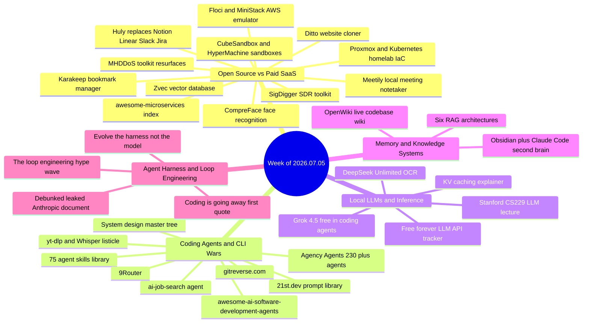

# Weekly Tech Digest — Week of 2026.07.05

*38 captures reviewed, 33 stories below (four multi-account duplicates merged) · [open this week in the knowledge graph](./graph.html#2026.07.05)*

## This week's through-lines

Four currents ran through this week's captures. First, a "loop engineering" content wave hit the feed from at least three unrelated accounts, each running the identical hook — Karpathy's LOOPS.md, a supposed "Claude Code team" course, Jensen Huang's GTC quote — pointing to a promised "article below" that never actually shows up as a link. A reply debunking a separate "leaked Anthropic document" hoax explicitly named this exact trend as the thing being exploited, which makes it this week's most self-aware post. Second, open source kept gutting recurring SaaS bills: Floci/MiniStack against LocalStack, Karakeep against Pocket, Huly against Notion/Linear/Slack/Jira, Meetily against Otter and Fireflies, CubeSandbox against E2B. Third, Claude Code is now the default substrate everyone builds on top of rather than around — Agency Agents, ai-job-search, 21st.dev, 9Router, and a 75-skill library all assume it as the runtime. Fourth, and tying the first three together: nearly every viral claim this week only became trustworthy once someone corrected it in the replies — Floci's real memory footprint, Zvec's "just dropped" framing, Agency Agents being mostly prompt files, the free-LLM-API list's durability. Verification is happening in the thread, not the post.

## Open Source vs Paid SaaS

### Floci / MiniStack — an AWS emulator that hit the feed from two directions, with the specs to match

A single Go binary claiming to boot 45 emulated AWS services (S3, Lambda, DynamoDB, SQS, SNS, IAM, CloudFormation, Step Functions, and more) in under a second, with a 13MiB memory footprint and zero Docker dependency, drop-in compatible with the AWS SDK and CLI. It surfaced twice this week under two different names from two different accounts — one Spanish-language post calling it "Floci," one English post also calling it "Floci," with a reply referencing "MiniStack" as apparently the same tool. The claims didn't survive contact with replies: one commenter pointed out the launch command is literally `docker compose up`, contradicting "no Docker"; another says the real binary is closer to 50MB, not 13, and that it needs Docker plus WSL plus a 46MB AWS CLI installer to actually run. A third reply sums it up: "Real tool, fake pitch... the tiny, instant, no-Docker claims are all false, and the new version makes you sign up. Use the older free one."

*Why it matters: the underlying pitch — a fast, cheap alternative to $40/mo LocalStack Pro — is a real and valuable idea, but the specific numbers being repeated across accounts this week don't hold up under the first person who actually ran it.*

**Resources:** [github.com/floci-io/floci](https://github.com/floci-io/floci)

### Huly — one self-hosted app to replace Notion, Linear, Slack, and Jira

A 26,000+ star open-source project bundled as a single Docker Compose deploy that aims to replace four separate SaaS subscriptions with one self-hosted stack. A reply notes the real bar isn't spinning it up — it's whether it holds up to real multi-team data volume without dedicated DevOps support.

*Why it matters: the "one tool replaces four" pitch keeps recurring in this space, and each time it does the actual test is data migration and long-term maintenance, not the initial docker-compose up.*

**Resources:** [github.com/hcengineering/platform](https://github.com/hcengineering/platform)

### Meetily — a fully local meeting notetaker aimed at Otter and Fireflies

Open-source, MIT-licensed meeting assistant that transcribes locally (Whisper or Parakeet), captures mic and system audio from Zoom/Meet/Teams, and summarizes via Ollama or a cloud model if you choose — all without uploading audio to a third-party server. Pitched directly against Otter and Fireflies' roughly $200/year plans.

*Why it matters: "your meeting audio stays on your machine" is a real differentiator as more teams get uneasy about where AI notetakers actually send their recordings.*

**Resources:** *(no link captured in post)*

### Karakeep — the bookmark manager built for a post-Pocket world

Self-hosted, AI-tagged bookmark manager (formerly named Hoarder) that saves links, notes, images, and PDFs with automatic tagging, full-text search, and browser extensions, explicitly positioned as a response to Mozilla shutting down Pocket. AGPL-3.0, designed to run on a Raspberry Pi, home NAS, or VPS.

*Why it matters: read-it-later services have a track record of dying and taking saved links with them; self-hosting is the direct answer to that risk.*

**Resources:** [github.com/karakeep-app/karakeep](https://github.com/karakeep-app/karakeep)

### CubeSandbox / HyperMachine — hardware-isolated sandboxes for running thousands of agents on one box

CubeSandbox, open-sourced out of China (Tencent Cloud), claims 60ms cold starts and a 5MB memory footprint per instance, positioned as a drop-in replacement for E2B by swapping a single URL. A reply immediately surfaced a competing project, nervosys/HyperMachine, arguing it came first and is better.

*Why it matters: as more products run swarms of short-lived agents, the cost of isolating each one cheaply becomes as important as the model behind it — and this is a contested, fast-moving corner of that stack.*

**Resources:** [github.com/TencentCloud/CubeSandbox](https://github.com/TencentCloud/CubeSandbox) · [github.com/nervosys/HyperMachine](https://github.com/nervosys/HyperMachine) (alternative raised in replies)

### Zvec — Alibaba's serverless vector database

`pip install zvec` and go — no server, no Docker, no cloud bill — with dense, sparse, and hybrid search in one Apache 2.0-licensed API, claiming billion-scale vector search in milliseconds. One reply pushes back on the "just dropped" framing, noting the project has been out for a while already; another flags the open question of how it performs once datasets outgrow local/dev scale.

*Why it matters: a genuinely serverless vector DB is useful regardless of the hype framing, but the giveaway-driven promotion (bot-like "ZVEC" replies throughout the thread) is worth discounting.*

**Resources:** [github.com/alibaba/zvec](https://github.com/alibaba/zvec)

### Ditto — clones any website into clean, editable code in minutes

A deterministic (not AI-driven) tool that clones a website into React/Next.js or Vite with Tailwind, split into components and design tokens, preserving interactions and hover effects. Free, open source, with a REST API and MCP server included. Supports single-page or full multi-page site clones.

*Why it matters: because it's deterministic rather than model-generated, it's fast and consistent — a good starting point for AI coding tools rather than a replacement for them.*

**Resources:** [ditto.site](https://www.ditto.site/)

### SigDigger — turn a $20 SDR dongle into a professional signal analyzer

Built solo by a licensed ham radio operator in Spain, this open-source signal intelligence suite demodulates FSK/PSK/ASK signals, decodes analog video and voice, and analyzes unknown bursty signals in real time — work that used to require a Rohde & Schwarz analyzer. Self-contained AppImage for Linux and macOS, no compilation needed.

*Why it matters: it's a legitimate education and hobbyist tool for understanding the RF environment (one reply is careful to frame it as a "powerful scanner," not a device for breaking into cars or secured systems).*

**Resources:** [github.com/BatchDrake/SigDigger](https://github.com/BatchDrake/SigDigger)

## Coding Agents & CLI Wars

### Agency Agents — 230+ prebuilt specialist agents for Claude Code, with a credibility asterisk

A repo claiming 129k stars packages 230+ role-based agents (Backend Architect, Frontend Developer, Security Engineer, SEO Specialist, and more) that install into Claude Code via a checkbox-menu installer, letting you say "activate Frontend Developer mode" to switch personas. Replies are split: several call it a genuine time-saver for setup, but one notes bluntly that "230 roles doesn't mean 230 working agents — most of these are a system prompt and a folder name, the deliverable part is still on you," a critique the original poster doesn't really dispute.

*Why it matters: persona libraries speed up getting started, but as one reply puts it, "the gap isn't agent libraries — it's knowing what output you actually need."*

**Resources:** [github.com/msitarzewski/agency-agents](https://github.com/msitarzewski/agency-agents) *(URL inferred from capture text — the link actually captured in the post pointed elsewhere)*

### 21st.dev — a prompt library for animated UI components

A catalog of thousands of community-built React/Next.js/Tailwind UI components, each with a ready-made prompt attached — browse, find an effect you like, copy the prompt, paste it into Claude Code, done. No need to describe "smooth scroll" or "hover glow" from scratch.

*Why it matters: as one reply puts it, half of getting good results from any coding agent is knowing where to steal the prompt from, and this turns a component catalog directly into a prompt database.*

**Resources:** [21st.dev](http://21st.dev/)

### ai-job-search — a Claude Code agent that runs your job hunt

Fork the repo, fill in your profile, and it scrapes job boards, ranks postings by fit, drafts a tailored CV and cover letter in LaTeX per job, spawns a second agent to research the company and critique the draft, compiles and inspects the PDF for exact page length, and preps mock interview rounds. It gained 5,000+ stars in a single day. The stated design principle: it never invents skills, so gaps stay visible instead of getting keyword-stuffed.

*Why it matters: it's a concrete example of agents moving from chat into an execution layer — a full pipeline instead of a single prompt.*

**Resources:** *(no link captured in post; repo referenced only by name)*

### 75 agent skills library for Claude Code, Codex, and Cursor

A free, forkable library of 75 skills, including "Video to Super Prompt" (turns a screen recording into a detailed one-shot prompt), "HTML to Interaction Prompts" (extracts every section, button, animation, and WebGL effect from an existing page), and automated landing-page inspiration capture. A reply raises a fair concern: without provenance tracking or degradation tests, shared skill libraries become another vector for silent behavior changes when the underlying models or repos update.

*Why it matters: skill libraries are becoming the reusable-workflow layer above raw prompts — useful, but only as trustworthy as their maintenance.*

**Resources:** [github.com/MengTo/Skills](https://github.com/MengTo/Skills)

### 9Router — one local router in front of 40+ AI providers

Points Claude Code, Codex, Cursor, Cline, Copilot, and others at `localhost:20128` and handles routing, format translation, quota tracking, and auto-fallback across providers — including a 3-tier fallback that drops from your paid subscription to cheap to free rather than stopping your session. Claims 20-40% token savings via output compression. 20,100+ stars, MIT license, `npm install -g 9router`. One reply is more skeptical: routers like this are a decent stopgap but don't fix the actual inconsistencies between AI provider APIs.

*Why it matters: as more coding tools support "any OpenAI-compatible backend," a router that automates the failover between them is a genuinely useful piece of infrastructure, not just a convenience.*

**Resources:** [github.com/decolua/9router](https://github.com/decolua/9router)

## Local LLMs & Inference

### Grok 4.5 goes free in coding agents — for now

xAI made its new coding model free in coding agents: 500k context, 83.3% on terminal-bench 2.1, 64.7% on SWE-bench Pro, and a claimed 4.2x efficiency advantage over Opus 4.8, all for $0 during a limited window (pricing after: $2/M in, $6/M out). Works with Hermes, Aider, OpenCode, Cline, and Claude Code via a two-minute CLI setup. Reception is mixed: some report the free tier vanishing after a few minutes of real use, one says a single prompt burned 100k tokens before being asked to upgrade, while others report normal usage holding up fine.

*Why it matters: "free" coding-model windows are becoming a recurring go-to-market tactic, and the actual limits seem to vary a lot by account — worth testing before building a workflow around it.*

**Resources:** [x.ai/cli/install.sh](https://x.ai/cli/install.sh) · [console.x.ai](http://console.x.ai/)

### DeepSeek Unlimited OCR — flat memory, no matter the document length

Claims a fix to attention that keeps memory flat regardless of document length, with no slowdown by page 40, a 93% benchmark score, and a sub-0.11 error rate past 40 pages. Notably, the repository is hosted under Baidu's GitHub namespace despite the DeepSeek branding — as captured, unverified further.

*Why it matters: long-document OCR that doesn't slow down or blow out memory would be a real capability jump, if the benchmark claims hold up outside the vendor's own numbers.*

**Resources:** [github.com/baidu/Unlimited-OCR](http://github.com/baidu/Unlimited-OCR)

### Why KV caching turns O(n²) decoding into O(n)

A widely-shared explainer framed as an ML interview question: without KV caching, autoregressive generation recomputes the same attention keys and values for every prior token at every step, turning what should be a 9-second inference into 42 seconds. Caching the K/V matrices after their first computation and reusing them for subsequent tokens turns that quadratic cost into linear cost — at the price of memory. It also explains why the first generated token always takes longest (the full prompt's KV cache has to be computed before generation starts). A reply adds the production-scale wrinkle: caches break on document reordering, and a single GPU can throw away roughly 15TB of reusable cache per day without a system built to manage it.

*Why it matters: it's a genuinely useful mental model for why inference latency behaves the way it does, and for why production KV-cache management is its own hard problem beyond the single-request case.*

**Resources:** *(no link captured for the referenced follow-up article)*

### The free-forever LLM API tracker — posted twice, worth one caveat

A 25,000-star GitHub repo tracking LLM APIs that stay free permanently — Google AI Studio, Groq, Cerebras, OpenRouter, NVIDIA NIM, Mistral, and dozens more, with exact rate limits and OpenAI SDK compatibility — appeared twice this week from the same account. Replies are the useful part: one commenter describes building a categorization pipeline around a "permanently free" endpoint that quietly went to a 404 one morning, with the repo still showing it as active a week later.

*Why it matters: "free forever" is a claim that ages worst of all — treat this as a starting point for prototyping, not a foundation for anything in production.*

**Resources:** [github.com/mnfst/awesome-free-llm-apis](https://github.com/mnfst/awesome-free-llm-apis)

## Memory & Knowledge Systems

### Obsidian + Claude Code as a "second brain" — two pitches, one counter-pitch

Two separate posts this week pitch the same combination: open your Obsidian vault in Claude Code, drop in a CLAUDE.md schema, feed it articles/PDFs/transcripts, and from then on you ask instead of searching. One version frames it through Andrej Karpathy's "LLM-Wiki" framework and adds urgency — a claimed deadline on Fable 5's $20 Pro plan extended to July 12th — to push readers to map their vault before "reasoning moves to expensive APIs." A reply pushes back on the whole premise: Obsidian is single-player, and once more than one agent needs to write to the graph while staying legible to a human, a local vault stops compounding — pitching a shared, attributed knowledge base (Syncpen) instead.

*Why it matters: the underlying problem (agents that forget everything between sessions) is real and worth solving, but watch for the artificial urgency wrapped around the pitch.*

**Resources:** [syncpen.io](http://syncpen.io/) *(counter-pitch mentioned in replies; no link captured for either original post)*

### OpenWiki — a live wiki that keeps your coding agent's context current

LangChain's open-source agent builds a wiki for your codebase, connects it to your coding agent, and keeps it updated as the repo changes — giving long-term repo context without stuffing everything into CLAUDE.md. A detailed reply describes the manual version of this workflow (architecture docs, a running CLAUDE.md/AGENTS.md, a compressed "handoff file" at ~80% context) and welcomes OpenWiki as automating a lot of that by hand-maintained process. Another reply raises the sharper question: a repo wiki is only useful if it stays close to the diff, since a stale explanation is worse than no explanation when the agent trusts it with full confidence.

*Why it matters: keeping an agent's understanding of a codebase both current and trustworthy — not just present — is the actual hard problem this category is trying to solve.*

**Resources:** [github.com/langchain-ai/openwiki](https://github.com/langchain-ai/openwiki) · related: [github.com/coderamp-labs/gitingest](https://github.com/coderamp-labs/gitingest)

### Six RAG architectures, and when to use each

A rundown of Simple RAG (FAQ bots), Hybrid RAG (semantic + keyword + reranking for messy enterprise docs), Corrective RAG (scores relevance, triggers fallback search — for medical/legal/financial), Self-RAG (model decides when to retrieve and critiques its own output), Graph RAG (entities and relationships for multi-hop questions), and Agentic RAG (an agent routes and validates across sources and APIs). A reply sharpens the takeaway: most production RAG failures aren't retrieval failures, they're architecture mismatches — you can't bolt agentic routing onto a simple top-k pipeline and expect it to handle multi-hop questions.

*Why it matters: "RAG isn't working" is usually a diagnosis problem — matching the architecture to the actual question shape matters more than swapping embeddings or rerankers.*

**Resources:** *(no link captured in post)*

## Agent Harness & Loop Engineering

### The "loop engineering" hype wave — three accounts, one script, no links

Three separate, unrelated accounts ran what looks like the same content playbook this week: a dramatic hook about "loop engineering" being the new must-know skill, a reference to Andrej Karpathy's LOOPS.md file or a supposed free "Claude Code team" course, and a promise to "read the full article/guide below" — in all three cases, with no actual link or substantive content captured in the post itself. One version invokes Nvidia CEO Jensen Huang ("nobody writes prompts anymore, the new job is to write and handle loops"); another invokes a leaked personal workflow file; a third claims to be an official Claude Code course.

*Why it matters: this is worth naming as a pattern rather than three separate stories — see the next entry for a reply thread that calls this exact playbook out by name.*

**Resources:** *(no links captured across any of the three posts)*

### Debunked: the "$2.3M Anthropic engineer leaked a document and got fired" post

A viral post claims an Anthropic lead engineer making $2.3M/year leaked a 12-page document on the five ways agent loops break (blind, tangled, nodding, amnesiac, and manual loops) and was fired 15 minutes after publishing. A reply flatly calls it fabricated: no such firing happened, it's a template — two days earlier a different account ran the identical hook with a different salary ("$2.2M/year") and a different "leaked" artifact. The debunking reply lays out the playbook explicitly: invent a fired insider with a specific salary, attach a document styled to look internal, repackage real public concepts as "leaked," and farm engagement from people who think they got forbidden knowledge — while noting the underlying content about agent loop failure modes is itself legitimate and already freely published (LangChain's "The Art of Loop Engineering," swyx's "loopcraft"). Its closing line: "can anyone name the person who was fired? If not, you're the product."

*Why it matters: this is the clearest instance this week of a reply thread doing real fact-checking work, and it explicitly ties back to the same "loop engineering" buzzword driving the hype wave above.*

**Resources:** *(no link captured in original post)*

### Evolve the harness, not the model

A Hugging Face writeup describes taking a frozen open model that scored 0% on a hard legal-agent benchmark, leaving its weights untouched, and running an automated loop that rewrites only the code around it — the harness that feeds context, runs tool calls, and decides when a run ends. By the end, the system matched Sonnet 4.6 on the benchmark's headline metric at roughly 7x lower cost, with zero weight changes. The 0% score, it turns out, was measuring the harness, not legal reasoning: the model kept doing the analysis correctly but saving the output under the wrong filename or in the wrong folder. The single biggest gain came from automatic, correct file placement — not any change to the model's intelligence — and the fixes transferred across model sizes within a family while prompt-based fixes did not. A reply cautions that harness fixes born from one benchmark's quirks may not generalize to different task shapes.

*Why it matters: this is a rare case of a "loop engineering" story actually showing its work — a real benchmark, a real mechanism, and a specific, surprising finding (the harness outweighing the model) instead of a promised article that never arrives.*

**Resources:** [huggingface.co/spaces/joelniklaus/harness-optimization](https://huggingface.co/spaces/joelniklaus/harness-optimization) · [github.com/zeenie-ai/MachinaOS](https://github.com/zeenie-ai/MachinaOS)

### "Coding is going away first. Then all of software engineering."

A widely-shared quote attributed to Anthropic's CEO argues the 5% of engineers who survive will be the ones who understand systems thinking — models, harnesses, loops, self-improving agents — rather than syntax or which model is best this week. Replies are split: one mock "Claude says" rebuttal calls it "a bold claim from a company selling the thing that's ending it," arguing judgment, tradeoffs, and legacy mess don't collapse into "systems thinking"; another counters that most engineers can't even debug why their own agent looped 40 times on a trivial task, so the 5% that survives will be the ones who still understand what's happening under the abstraction.

*Why it matters: it's a genuine, ongoing debate about what skills survive agentic coding — worth reading the pushback alongside the quote itself, not just the quote.*

**Resources:** *(no link captured in post)*

## Quick hits

- **awesome-microservices index** — a curated index of microservice platforms, frameworks, and toolkits across 15+ languages, covering team dynamics as well as tech. [osp.fyi/awesome-microservices](https://osp.fyi/awesome-microservices) *(second-hop shortener; final destination not verified)*
- **awesome-ai-software-development-agents** — a curated list of autonomous AI agents for software development. [github.com/flatlogic/awesome-ai-software-development-agents](https://github.com/flatlogic/awesome-ai-software-development-agents)
- **MHDDoS toolkit resurfaces** — a previously public, multi-method DDoS toolkit recirculated in the feed this week; noted here as a factual capture, not an endorsement or how-to. [osp.fyi/mhddos](https://osp.fyi/mhddos) *(second-hop shortener; final destination not verified)*
- **Proxmox + Kubernetes homelab IaC** — infrastructure-as-code for a Proxmox and Kubernetes homelab. [github.com/Mafyuh/iac](https://github.com/Mafyuh/iac)
- **Stanford CS229 LLM lecture** — a free, 104-minute Stanford lecture on how LLMs are built from scratch. *(no link captured)*
- **gitreverse.com** — swap "github" for "gitreverse" in any repo URL to get a guessed prompt for how it was built; replies are skeptical it's really that simple, and the reconstruction's accuracy is unverified. [gitreverse.com](https://www.gitreverse.com/)
- **System design master tree** — a ten-branch outline of system design fundamentals, from client-server basics and CAP theorem through observability, DevOps, and self-healing systems. *(no link captured)*
- **yt-dlp and Whisper listicle** — a thin "save thousands of dollars" post recovered only via its resolved shortlinks, pointing to two well-known repos: yt-dlp and OpenAI's Whisper. Full post text was unavailable; this capture was flagged not-sane by the pipeline and recovered through the fallback chain. [github.com/yt-dlp/yt-dlp](https://github.com/yt-dlp/yt-dlp)
- **CompreFace** — open-source face recognition with landmark, mask, and demographic detection. [github.com/exadel-inc/CompreFace](https://github.com/exadel-inc/CompreFace)

---

*38 captures reviewed for tag `2026.07.05`, 33 stories after merging four multi-account duplicates (Floci/MiniStack, the free-LLM-API tracker, the Obsidian+Claude second-brain pitch, and the three-way "loop engineering" hype wave). Honesty policy: summaries are drawn only from captured content and curator notes, never fabricated. Entries whose sources or links couldn't be fully recovered say so plainly — "(no link captured)", "(URL inferred from capture)", "(second-hop shortener; final destination not verified)".*
