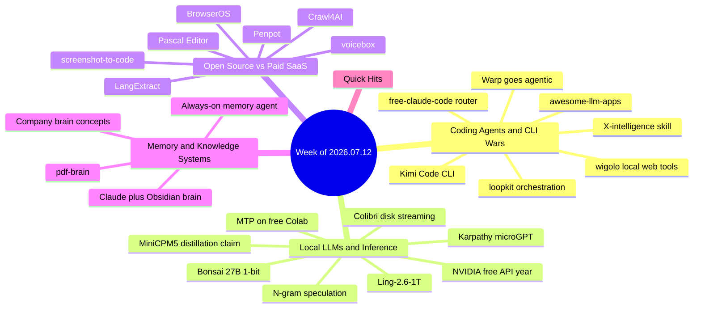

# Weekly Tech Digest — Week of 2026.07.12

*Captured Jul 12–19, 2026 · 36 posts · [Interactive knowledge graph](./graph.html#2026.07.12)*

## This week's through-lines

Three currents ran through nearly everything captured this week. First, **the coding-agent CLI wars went from simmer to boil**: Moonshot shipped a free, open-source Claude Code clone (twice over in this feed — the story hit from multiple accounts), a router repo lets Claude Code drive ten free models, and the conversation shifted from "which model" to "which loop" — orchestration patterns like plan/execute/judge routing are becoming the real differentiator. Second, **local inference keeps eating the frontier's lunch from below**: 1-bit quantization put a 27B model in the browser, a 744B model ran on a 25 GB machine with no GPU, and free decoding tricks (N-gram speculation, multi-token prediction) doubled throughput on free-tier hardware. Third, **open source continued its methodical commoditization of paid SaaS** — this week's casualties (per the posts, at least): document extraction, voice cloning, Figma, v0, BIM software, and web crawling.

A meta-observation worth keeping: several of the week's loudest claims were substantially corrected in their own reply threads. The "distilled Claude Fable 5" 1B model turned out to be an SFT fine-tune on Claude outputs, not a true distillation; Ling-2.6-1T's benchmark parity claims drew informed skepticism. Reply threads are doing real editorial work — this digest leans on them.

---

## Coding agents & the CLI wars

### Kimi Code CLI — Moonshot's free Claude Code clone
Moonshot (the lab behind Kimi K3) released Kimi Code CLI: open source, MIT-licensed, and free, with the K3 model behind it starting at $3/M input tokens. It ships several features Claude Code lacks: screen recordings as input, built-in coder/explore/plan subagents each in separate contexts, a plan mode before any file edits, agent-driven MCP configuration via `/mcp-config`, editor integration (VS Code, JetBrains, Zed), and a single no-Node binary that starts in milliseconds. This story hit the feed from two separate accounts in the same week — a signal of how much attention the Claude Code competitive space is drawing. *Why it matters: the agentic-CLI category is now competitive on features and price, not just model quality.*
**Resources:** [github.com/MoonshotAI/kimi-code](https://github.com/MoonshotAI/kimi-code)

### Warp's open-source client becomes a full agentic dev environment
Warp's open-source terminal client now ships a built-in coding agent and interoperates with Claude Code, Codex, Gemini CLI, and others — positioning the terminal itself as the agent shell. Replies raised the right questions: how cleanly it handles context sharing between agents, diffs, approvals, and escape hatches when an agent goes sideways. *Why it matters: the terminal is becoming the neutral ground where multiple vendors' agents coexist.*
**Resources:** [osp.fyi/warp](https://osp.fyi/warp) *(second-hop shortener; final destination not verified in this run)*

### free-claude-code — rerouting Claude Code to free models
A repo claiming 26k stars and 4,000 forks reroutes the Claude Code CLI to DeepSeek, Kimi, and eight other free models via an endpoint swap — same CLI, different model, reportedly ~$200/mo saved. Notably, the poster conceded under pushback that quality holds "on small tasks" while Claude models still win on hard ones — a rare moment of hype self-correction. *Why it matters: cost pressure on agentic coding is real, and the CLI/model decoupling makes switching trivial.*
**Resources:** [github.com/Alishahryar1/free-claude-code](https://github.com/Alishahryar1/free-claude-code)

### loopkit — "the loop routes the models"
Framed as a folder of orchestration patterns from a $1.2M/yr Google engineer: plan with a frontier model, execute with a cheap one, judge with a frontier one (~2× cheaper overall); human-in-the-loop escalation that writes `BLOCKED.md` and waits; decision logs that survive context compaction; a `/polish` verb running six quality passes on a diff; self-refilling feature lists. The storytelling is pure engagement-bait, but the patterns themselves are a coherent snapshot of current multi-model orchestration practice. *Why it matters: model routing and loop design are emerging as the skill that separates solo shippers from everyone else.*
**Resources:** [github.com/Archive228/loopkit](https://github.com/Archive228/loopkit) · [ddshub.cc](http://ddshub.cc/)

### wigolo — a local-first web layer for coding agents
An MCP server giving Claude Code, Cursor, Codex, and Gemini CLI search, fetch, crawl, extract, and research tools that run entirely on-device: multi-engine search with rank fusion and on-device reranking, fetch escalation from plain HTTP to headless browser, and a local cache under `~/.wigolo` for offline re-queries. No API keys, no per-query cloud bill (~978 stars, ~192/day at capture). *Why it matters: agent web research is a metered-SaaS choke point; this makes it private and free.*
**Resources:** [github.com/KnockOutEZ/wigolo](https://github.com/KnockOutEZ/wigolo)

### x-agent-intelligence — a skill for agent-curated X news feeds
elvis (DAIR.AI) shared a skill that tracks high-signal X accounts for AI news and generates a self-contained HTML feed artifact via X's MCP tools, on any schedule. Works across Codex, Claude, and other agents; account curation stays manual, with starter handle lists in the repo assets. *Why it matters: directly adjacent to this digest's own pipeline — an existence proof for agent-curated news products.*
**Resources:** [github.com/dair-ai/dair-academy-plugins — x-agent-intelligence](https://github.com/dair-ai/dair-academy-plugins/tree/main/plugins/x-agent-intelligence) · [X MCP docs](https://docs.x.com/tools/mcp) · [github.com/madhavajay/alex](https://github.com/madhavajay/alex)

### awesome-llm-apps crosses 123k stars
Shubham Saboo's repo of 100+ open-source AI agents and agent skills trended again on GitHub, with recent additions including self-improving agent skills that rewrite themselves against evals, a real-time voice insurance-claims agent team, and an always-on Hacker News briefing agent. A reply thread raised a sharp design point: self-improving skills need a release boundary (immutable versions) to stay auditable. *Why it matters: the go-to reference catalog for agent patterns keeps compounding.*
**Resources:** [github.com/Shubhamsaboo/awesome-llm-apps](https://github.com/Shubhamsaboo/awesome-llm-apps)

---

## Local LLMs & inference performance

### Bonsai 27B: 1-bit quantization puts a 27B model in your browser
Xenova reports Bonsai 27B shrinking from 54 GB to 3.8 GB (−93%) via 1-bit quantization while retaining ~90% of its capability — now running locally in the browser on custom WebGPU kernels (written, notably, by Claude Fable 5 and GPT 5.6 Sol). Replies surfaced real-world compatibility bugs that the author fixed within hours. *Why it matters: browser-local inference of mid-size models moves from demo to plausible deployment target.*
**Resources:** [huggingface.co/collections/prism-ml/bonsai-27b](https://huggingface.co/collections/prism-ml/bonsai-27b) · [WebGPU kernels demo](https://huggingface.co/spaces/webml-community/bonsai-webgpu-kernels)

### Colibri runs a 744B model on a 25 GB machine, no GPU
COLIBRI exploits sparse activation: it holds the model's core in RAM and streams the remaining parameters from disk on demand, running GLM-5.2 (744B) on consumer hardware. The catch, confirmed by the author in replies: ~1 token/sec — a proof of concept, not a daily driver. *Why it matters: "giant models need giant RAM" is now an engineering constraint, not a law.*
**Resources:** [github.com/JustVugg/colibri](https://github.com/JustVugg/colibri) · related: [inferno](https://github.com/nektarlabs/inferno) · [evocoder](https://github.com/tscott6767/evocoder)

### Ling-2.6-1T — a trillion-parameter open model with big claims
InclusionAI's Ling-2.6-1T claims frontier-adjacent agentic coding (72.2% SWE-bench Verified, 256K context), free on OpenRouter and pluggable into Claude Code, while burning a fraction of the tokens of US frontier models. Replies were split: VRAM requirements are enormous for local use, and some challenged the benchmark parity outright. *Why it matters: open trillion-parameter models are now table stakes in the China-vs-US release cadence — but verify before believing.*
**Resources:** [huggingface.co/inclusionAI/Ling-2.6-1T](https://huggingface.co/inclusionAI/Ling-2.6-1T)

### The "distilled Claude Fable 5 into 1B" model — and its debunking
A 657 MB, 128K-context model billed as "Claude Fable 5 distilled to 1B, running 100% locally" made the rounds. The most valuable content was in the replies: a detailed correction explaining this is supervised fine-tuning of a small open model on Claude-generated outputs — it inherits stylistic patterns, not frontier capability. *Why it matters: a clean case study in how model-release hype works in 2026, preserved fact-check and all.*
**Resources:** [huggingface.co/GnLOLot/MiniCPM5-1B-Claude-Opus-Fable5-Thinking-GGUF](https://huggingface.co/GnLOLot/MiniCPM5-1B-Claude-Opus-Fable5-Thinking-GGUF)

### N-gram speculative decoding: free speedups for repetitive generation
For workloads heavy in repetition — structured JSON, document edits, boilerplate — a hidden llama.cpp flag enables N-gram speculative decoding: fast-forwarding through text that already exists in the prompt. No draft model, no extra VRAM, near-zero overhead, demonstrated on Colab's free T4. *Why it matters: most local-LLM users are leaving significant throughput on the table for zero cost.*
**Resources:** [Colab walkthrough](https://colab.research.google.com/drive/12HEcqK7PLG7bqFgUouq5FustdOyijJpn?usp=sharing)

### Multi-Token Prediction hits 64.9 t/s on a free Colab T4
The companion technique: MTP with latest llama.cpp and Unsloth GGUFs pushed Gemma 4 26B (QAT, MoE) from 48.3 to ~65 t/s generation on Colab's free 16 GB T4 tier, with benchmark data for Qwen 3.5 9B alongside. *Why it matters: free-tier hardware plus decoding tricks now delivers genuinely usable local-LLM speeds — a zero-cost lab for learning inference engineering.*
**Resources:** [Colab benchmark](https://colab.research.google.com/drive/1-Y5ZgN08-yMwRZc7PvhAuJxoPpzzoZcQ?usp=sharing) · [Qwen3.5-9B-MTP GGUF](https://huggingface.co/unsloth/Qwen3.5-9B-MTP-GGUF) · [Gemma-4-26B QAT GGUF](https://huggingface.co/unsloth/gemma-4-26B-A4B-it-qat-GGUF)

### NVIDIA: free access to 140+ models for a year
NVIDIA's build.nvidia.com is offering a year of free API access to 140+ models (GLM 5.2, MiniMax M3, Nemotron-3-Ultra-550B, Kimi K2.7, more) at 40 req/min — a drop-in replacement for the $50–200/mo API spend typical of agent builders, with one base URL working across Hermes, Cursor, and OpenCode. *Why it matters: the marginal cost of experimenting with agent stacks just went to zero for a year.*
**Resources:** [build.nvidia.com/models](http://build.nvidia.com/models) · [community setup notes](https://github.com/tashfeenahmed/freellmapi)

### Karpathy's microGPT: a full GPT in 200 lines of pure Python
Karpathy published a complete GPT — tokenizer, attention, training loop, generation — in ~200 dependency-free lines that train on a laptop in about a minute, with a web version and a Colab. Not a toy metaphor: the actual mechanism every LLM runs on, on one screen. *Why it matters: the single best on-ramp this year for understanding LLMs end-to-end rather than by analogy.*
**Resources:** [microgpt post](https://github.com/karpathy/karpathy.github.io/blob/master/_posts/2026-02-12-microgpt.markdown) *(URL inferred from capture — no live link in the source post)*

---

## Open source vs. paid SaaS

### LangExtract — Google open-sources document extraction
LangExtract extracts structured data from unstructured text with every entity mapped to its exact source location, handles 100+ page documents with high recall, generates interactive HTML for human verification, and works with Gemini, Ollama, or local models — few-shot task definition, no fine-tuning. Positioned (by the poster) as a free replacement for regex pipelines, custom NER, and enterprise extraction APIs. *Why it matters: source-grounded extraction with verification UX is exactly what compliance-sensitive document work needs — and it's now free.*
**Resources:** [github.com/google/langextract](https://github.com/google/langextract) · displaces: [AWS Textract](https://aws.amazon.com/textract/)

### voicebox — local, MIT-licensed voice cloning via MCP
Jamie Pine's voicebox (41.6k stars in weeks) clones any voice from ~10 seconds of audio across 23 languages, running fully local via Tauri/Rust with seven TTS engine options. Claude Code, Cursor, Cline, and any MCP-aware agent can speak in the cloned voice through a single `voicebox.speak` call; global dictation is included. Squarely aimed at ElevenLabs' $22–330/mo tiers. *Why it matters: voice is becoming a free, local, agent-native capability rather than a metered API.*
**Resources:** [github.com/jamiepine/voicebox](https://github.com/jamiepine/voicebox)

### Penpot — the open-source Figma with agent-editable designs
Penpot mirrors Figma's layout and workflow, free and self-hostable, with a differentiator that lands squarely in this week's themes: an MCP server that lets AI agents edit designs directly. Free dev mode (CSS/SVG/HTML), native design tokens syncing design and code, real-time collaboration. *Why it matters: design tooling joins the list of categories where the open alternative is agent-native before the incumbent.*
**Resources:** [github.com/penpot/penpot](https://github.com/penpot/penpot)

### screenshot-to-code — the free v0 alternative at 73k stars
Abi Raja's solo project converts any screenshot, mockup, or screen recording into working code (HTML+Tailwind, React, Vue, Bootstrap, Ionic), extracts real logos and images via Gemini, and self-hosts with one Docker Compose line. Works with Gemini 3.1 Pro, Claude Opus 4.8, and GPT-5.5. *Why it matters: screenshot-to-prototype is now commodity infrastructure, not a $149/mo product.*
**Resources:** *(no link captured in post — repo is `abi/screenshot-to-code` on GitHub, widely known)*

### Pascal Editor — a browser-native 3D building editor
An open-source 3D building/BIM editor running entirely in-browser on React Three Fiber and WebGPU: full building/level/wall/zone hierarchy editable in real time, ECS-style GPU-powered updates, undo/redo, and dirty-node tracking so only changed geometry re-renders. Aimed at workflows that cost $50K+/seat in commercial BIM. *Why it matters: WebGPU is enabling genuinely heavyweight professional tooling to go browser-native and free.*
**Resources:** *(no link captured in post — flagged for follow-up)*

### Crawl4AI — the rage-built crawler at 60k stars
The origin story: in 2023, developer Unclecode hit a "$16 open source" webpage-to-Markdown tool, built his own in days out of spite, and open-sourced it for real. Crawl4AI renders JavaScript, waits for dynamic content, and emits clean structured Markdown built for AI consumption — now 60k+ stars, 1M+ downloads/month, Peak XV-backed. *Why it matters: clean web-to-Markdown is foundational AI infrastructure, and the free version won.*
**Resources:** [github.com/unclecode/crawl4AI](https://github.com/unclecode/crawl4AI)

### BrowserOS — a Chromium fork with the agent loop baked in
An ex-Google engineer's privacy-first browser with a native AI agent: 53+ natural-language automation tools, a built-in MCP server so Claude Code or Gemini CLI can drive the browser, scheduled autonomous tasks, a cowork mode where agents read the web and write local files in one task, 40+ app integrations, and BYO keys or local Ollama. The pointed thesis: Chrome structurally can't ship this against its own ad business. *Why it matters: the browser-as-agent-runtime argument, in shippable form.*
**Resources:** [github.com/browseros-ai/BrowserOS](https://github.com/browseros-ai/BrowserOS)

---

## Memory & knowledge systems

### Claude piped into Obsidian as a self-organizing second brain
A workflow wiring Claude into an Obsidian vault via a continuous RAG pipeline: it scans daily notes against the entire vault after every entry, mapping connections automatically — no manual tagging, folders, or linking. The pitch: scattered notes become a queryable private database synthesized through Claude's context window. *Why it matters: directly relevant to anyone (present company included) building knowledge graphs from captured content.*
**Resources:** *(no link captured in post — workflow described in an attached video)*

### Google's always-on memory agent
An open-sourced Gemini agent that runs continuously: drop any file (PDF, image, audio, video) into a watched folder and it ingests, links it to every prior memory, and writes new insights while idle — "no RAG, no vector DB, no forgetting." Replies raised the obvious sustainability question (cost of never forgetting) and some blunt skepticism about indiscriminate ingestion. A reply thread also surfaced TwinAatma, an MCP-native "cognitive twin" comparison. *Why it matters: ambient, always-on memory is the next battleground after context windows.*
**Resources:** [always-on-memory-agent](https://github.com/GoogleCloudPlatform/generative-ai/tree/main/gemini/agents/always-on-memory-agent) · [TwinAatma](https://github.com/Gargeya-Grey/TwinAatma)

### The "company brain" vocabulary
A useful glossary post arguing most teams wire together MCPs and hope scattered docs behave like a system. Six load-bearing terms: knowledge graph (structure AI can reason over), MCP (access ≠ memory), skills (orchestration logic above the API connection), hybrid search, and more. *Why it matters: a clean conceptual frame separating access, memory, and orchestration — the distinctions that make or break internal AI deployments.*
**Resources:** [Smriti](https://github.com/vn-envy/Smriti) · [LLM-Brain](https://github.com/w00ch3a/LLM-Brain) · [worktellect.com](https://worktellect.com/)

### pdf-brain — local semantic search over PDFs and Markdown
Joel Hooks' tool indexes PDFs and Markdown locally for semantic search and AI enrichment — small, focused, and local-first. A reply surfaced unlayer/elements, an open-source React library building emails, web pages, and PDFs from one source. *Why it matters: personal-scale, private semantic search keeps getting easier to self-host.*
**Resources:** [github.com/joelhooks/pdf-brain](https://github.com/joelhooks/pdf-brain) · [unlayer/elements](https://github.com/unlayer/elements)

---

## Quick hits

- **Grok Build is now open source** — Musk's announcement, no further detail or link in the post. *(no link captured)*
- **[OpenVid](https://github.com/CristianOlivera1/openvid)** — browser-based tool for professional product demos and UI mockups.
- **[LikeC4](https://github.com/likec4/likec4)** — live software-architecture diagrams generated from code definitions; see also [gittr.space](http://gittr.space/) for per-repo architecture views.
- **[MacUSB](https://alternativeto.net/software/macusb/about/)** — free, open-source Rufus-style bootable USB creator for Mac (Apple Silicon), covering legacy macOS, Windows, and Linux installers — no Terminal required.
- **[Prowler](https://osp.fyi/prowler)** — open-source cloud security/compliance automation for AWS, Azure, GCP, and K8s; 1000+ checks, CIS/PCI-DSS/HIPAA/SOC2 frameworks. *(second-hop shortener link)*
- **[Tunnelto](https://github.com/agrinman/tunnelto)** — Rust-based open-source ngrok alternative for exposing localhost; a reply notes it's been dormant ~2 years and suggests [portmap.io](http://portmap.io/).
- **[NeuTTS](https://osp.fyi/neutts)** — open-source on-device TTS with voice cloning from ~3 seconds of audio. *(second-hop shortener link)*
- **Markdown-native Notepad** — instant-open, no-account Markdown editor with live rendering and optional local AI endpoint; "Obsidian meets VS Code, way lighter." *(no link captured)*
- **[awesome-cloudflare](https://osp.fyi/awesome-cloudflare)** — 80+ curated open-source tools built on Cloudflare's stack. *(second-hop shortener link; a reply notes the list is Chinese-first)*

---

*Digest generated from 36 Raindrop captures (tag `2026.07.12`) via permanent-copy snapshots. Entries marked "(no link captured)" reflect posts whose outbound links were not recoverable from the capture — summaries are drawn only from captured content, never fabricated. Explore the growing [knowledge graph](./graph.html) across all weeks.*
