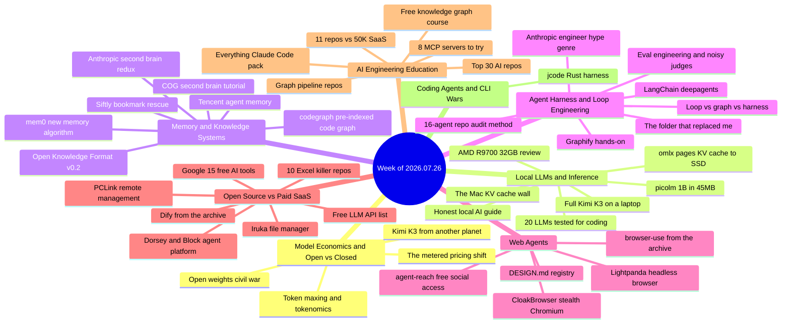

# Weekly Tech Digest — Week of 2026.07.26

*Captured Jul 26–Aug 1, 2026 · 48 posts · [Interactive knowledge graph](./graph.html#2026.07.26)*

## This week's through-lines

Four currents ran through this week's captures. First, **the open-weights fight stopped being subtext and became the week's headline story** — ZDNET declared an outright "AI civil war" between open and closed labs, Alberto Romero argued Moonshot's Kimi K3 erases the US–China frontier gap entirely (weights published July 27), and a genuinely wild demo ran the full unmodified 2.78-trillion-parameter K3 on a 64GB MacBook by streaming experts off NVMe. Threaded through all of it is money: ZDNET's "token-maxing" piece and a Medium breakdown of Copilot's move to metered credits both say the same thing — predictable AI pricing is dying, "tokenomics" is now a CFO discipline, and open weights are increasingly pitched as the escape hatch. Second, **agent memory became a crowded battleground**: mem0 shipped a new memory algorithm with big benchmark claims (and honest fine print), Tencent open-sourced a local memory system whose replies immediately supplied the caveats, jcode built a semantic memory graph into a coding harness, and the second-brain genre kept churning — from a solid hands-on COG tutorial to another "Anthropic engineer's secret system" post with zero links. Third, **the graph-engineering hype cycle entered week two, but the debunkers now live in the replies**: two more "Anthropic's $X-million engineer" posts got community-fact-checked in their own threads (one self-identified Anthropic lead engineer replied simply "this is not true"), while the real substance moved nearby — a free graduate knowledge-graph course, two competing code-knowledge-graph tools at 60–100k stars, and Google's Open Knowledge Format v0.2 quietly shipping provenance and attested computation for agent-written knowledge. Fourth, **local inference matured around memory management, not model size**: two separate deep dives diagnosed the same Mac failure mode (the KV cache), omlx's fix is paging cache to SSD, AMD's 32GB card got an honest hands-on review, and the WASTE engine showed trillion-parameter streaming is a storage problem now.

Also notable: three stories hit the feed from multiple accounts in the same week — agent-reach, Jack Dorsey/Block's agent platform, and Graphify — which is itself a signal of what the timeline is amplifying.

## Model Economics & Open vs Closed

### Open weights vs. closed — ZDNET calls it a civil war

Steven Vaughan-Nichols frames the open/closed split as no longer China-vs-US but a war between two ways of building LLMs, with Anthropic and OpenAI on the proprietary side and "most everyone else" on the other. The trigger: Moonshot's Kimi K3 approaching frontier speed, and a Trump OSTP claim that Moonshot "distilled Anthropic's Fable" — which even OSTP's Kratsios had to qualify, since legitimate distillation is standard practice and the line between legal and illegitimate use is "paper-thin." Microsoft responded with an "Open Weights and American AI Leadership" policy statement (backed by Amazon, Nvidia, Google) arguing open weights let institutions match the right model to the right job without frontier prices, and nearly 200 startups (the Little Tech Association) urged the administration not to restrict Chinese open models. The piece is careful on the open-weights ≠ open-source distinction and predicts AI pricing will "explode by year's end," making open weights the only affordable path.

*Why it matters: the open-weights debate has moved from ideology to explicit economic and national-policy terms, and the industry coalition lining up behind open weights now includes most of big tech except the two leading labs.*

**Resources:** [ZDNET article](https://www.zdnet.com/article/open-weight-ai-civil-war/)

### Kimi K3 "is from another planet" — the zero-months gap

Alberto Romero's long analysis of Moonshot's Kimi K3: the first Chinese open model at the level of the best American frontier models, on par with Anthropic's Mythos/Fable and OpenAI's GPT-5.6 in some areas. His framing: DeepSeek proved China could match efficiency under hardware constraints; Moonshot proves those efficiency gains can reach frontier intelligence. The "six to nine months behind" estimate is now "zero months, zero weeks, zero days." Weights were due to publish July 27 — after which, he argues, the geopolitical discourse escalates: if the US considered Mythos dangerous enough to withhold from allies, a Mythos-level open Chinese model changes the entire regulatory calculus.

*Why it matters: this is the sober long-form version of the claim the hype posts keep gesturing at — and it pairs directly with the ZDNET civil-war piece as the week's geopolitical frame.*

**Resources:** [Medium article](https://albertoromgar.medium.com/moonshot-is-chinese-but-its-ai-models-are-from-another-planet-bdcf05fbd6cb) · [Kimi K3 announcement](https://www.kimi.com/blog/kimi-k3)

### "Token-maxing" is out; tokenomics is in

ZDNET's Mark Samuels reports from Snowflake Summit 2026: the era of celebratory token leaderboards is over. Boomi CEO Steve Lucas says he personally spent 10x more on Claude last year than the year before — "that's not sustainable." The emerging discipline is "tokenomics": measuring, pricing, and managing token consumption as a core business activity. Notably, the leaders quoted (Snowflake's Ramaswamy, Whoop's Luizzi) all land on the same posture — don't restrict agent use, but wrap it in guardrails, observability, and enablement so people learn to accomplish goals efficiently.

*Why it matters: enterprise token spend is now a board-level line item, which explains both the cost-optimization tooling wave and the open-weights pressure in the other capture threads this week.*

**Resources:** [ZDNET article](https://www.zdnet.com/article/token-maxing-ai-cost-sink-use-agents-without-busting-budget/)

### The metered-pricing shift: Copilot credits, consumption contracts, and the bill nobody budgeted

Behind the clickbait title ("NVIDIA Just Changed AI Forever"), this piece assembles a real pattern: GitHub Copilot moved from flat seats to a metered credit pool on June 1; Anthropic has reportedly shifted enterprise contracts toward consumption pricing; Uber reportedly burned its entire 2026 AI budget in about four months. Gartner is quoted expecting inference spending (~$20.6B this year, more than double last year) to overtake training for the first time, heading toward two-thirds of all AI compute. The article's answer — local hardware like NVIDIA's DGX Spark as a fixed-cost alternative — is where the NVIDIA angle comes in.

*Why it matters: read together with the token-maxing piece, this is the demand-side story for everything else in this digest: metered pricing is exactly what makes local inference, free tiers, and open weights suddenly rational.*

**Resources:** [Medium article](https://medium.com/no-time/nvidia-just-changed-ai-forever-and-almost-nobody-noticed-7eb0fe89ec20)

## Local LLMs & Inference

### WASTE: the full 2.78T-parameter Kimi K3 running on a 64GB MacBook

Brian Roemmele reports hands-on testing of Marco Bambini's WASTE (Weight-Aware Streaming Tensor Engine), a dependency-free C inference engine that runs the complete, unmodified Kimi K3 by exploiting its Mixture-of-Experts sparsity: only ~4% of weights fire per token, so the ~27GB "trunk" stays in RAM while 82,000+ routed experts live on NVMe as vector-quantized records, streamed in on demand with cache-bypassing reads. Measured: 0.32–0.34 tokens/sec on a 64GB MacBook Pro, logits matching the reference implementation to within parts per million, vision tower working. The 1.42TB weights convert to a 982GiB container; RAM floor is ~29GB. The thread is honest about limits: expert I/O dominates, thinking tokens are brutally expensive at this speed, and it's "a research instrument, not a finished product."

*Why it matters: proof that trillion-scale open models are now a storage-bandwidth problem rather than a RAM problem — the local-inference ceiling just moved in a way that matters for the whole open-weights story above.*

**Resources:** [X thread](https://x.com/brianroemmele/status/2082909527515779164) *(no repo link captured in post)*

### 20+ LLMs tested for coding — only 5 worked

Rost Glukhov ran 20+ models (9B–122B, various quantizations, 16GB VRAM, llama.cpp/Ollama plus OpenCode Zen's free tier) through two concrete tasks: build a Go CLI implementing the IndexNow protocol, and generate a strict website migration map. Winner: Qwen 3.5 27B at IQ3_XXS — 34 tok/s, 5% error rate, all 8 unit tests passing. Best agentic: Bigpicle via OpenCode Zen (proactively searched the web, found correct endpoints first try). The failure data is the useful part: Qwen 3.5 35B produced a 98.8% error rate on migration maps by silently dropping page slugs, and GPT-OSS 20B fails in default mode but becomes capable with high thinking enabled.

*Why it matters: concrete, reproducible-ish evidence that quantization level and task type matter more than parameter count — and that structured-output reliability is a separate axis from code quality.*

**Resources:** [Medium article](https://medium.com/@rosgluk/i-tested-20-llms-for-coding-tasks-only-5-actually-worked-3ca40f2a125d)

### omlx: the local LLM server that pages its KV cache to SSD

A developer's story of losing a 70K-token context to a MacBook sleep — LM Studio silently dropped the KV cache, forcing a four-minute re-read of the entire prefix. omlx, an open-source MLX-based LLM server for Apple Silicon, makes one design decision the others don't: it writes KV cache blocks to SSD as safetensors files (hot tier in RAM, vLLM-style block layout, so conversations sharing a system prompt share cached blocks). Same OpenAI-compatible serving job as LM Studio/Ollama, but the cache survives restarts, sleep, and memory pressure.

*Why it matters: KV-cache persistence is the single biggest quality-of-life gap in local inference for long agentic sessions, and this is the first tool in the captures to treat it as the headline feature.*

**Resources:** [Blog post](https://blog.s10n.dev/i-deleted-lm-studio-after-a-week-with-omlx-ceb6879ccd3f) · [omlx repo](https://github.com/jundot/omlx)

### Why your Mac LLM just died: the KV cache wall, explained

The companion diagnosis piece (independent author, same week): a thorough explainer of why Mac LLM sessions die under load. The KV cache grows linearly with context — Llama 3.1-8B needs 4.2GB at 8K tokens, 16.8GB at 32K — and Apple Silicon's unified memory means model weights, cache, OS, and Chrome all fight for the same pool. His benchmark: a 4-bit Qwen2.5-32B on a 24GB MacBook leaves 0.2GB for cache — process killed within 2 tokens. Argues the whole ecosystem (llama.cpp included) optimized weights and kernels while leaving the cache "the missing piece nobody talks about," written as motivation for the author's VeloxQuant-MLX project.

*Why it matters: two independent captures in one week identifying the KV cache as local inference's real bottleneck is a trend, not a coincidence — expect cache-tiering features to become a local-tooling battleground.*

**Resources:** [Medium article](https://medium.com/@rajveer.rathod1301/why-your-mac-llm-just-died-and-the-missing-piece-nobody-talks-about-240039733d6a) *(VeloxQuant-MLX mentioned; no repo link captured)*

### AMD Radeon AI Pro R9700 32GB, bought and benchmarked

Andrew Zhu bought the ~$1,349 R9700 with his own money to test the community buzz. On paper vs the used-market king RTX 3090: 32GB vs 24GB VRAM, PCIe 5.0, 300W TDP — but ~640GB/s memory bandwidth vs the 3090's ~936GB/s (46% faster), and ROCm/Vulkan vs CUDA's maturity. His framing of why AMD is worth considering at all in 2026: VRAM is the binding constraint as models grow while memory prices climb and RTX 5090s push past $4,000.

*Why it matters: a single 32GB card at $1,349 changes the calculus for local model size in the post-memory-spike era, if you can live outside CUDA — an honest data point in a space full of spec-sheet punditry.*

**Resources:** [Medium article](https://xhinker.medium.com/i-bought-an-amd-ai-pro-r9700-32gb-to-test-i-d1db25c91a04)

### Running AI models locally: an honest beginner's field report

A refreshingly hype-free walkthrough of what actually happens when you run local models in 2026: what quantization does (140GB at full precision → ~8GB quantized, GGUF as the safe default), and a clean audience split of the tool landscape — Ollama for developers, LM Studio for GUI users, Jan/GPT4All for privacy-first offline use, AnythingLLM for document workspaces, llama.cpp/vLLM/TextGen WebUI underneath for tuners, with vLLM specifically for multi-user serving.

*Why it matters: a solid link to hand anyone asking "can I actually do this on my laptop" — it sets expectations correctly instead of promising a free ChatGPT.*

**Resources:** [Medium article](https://bleadvertiserapp.medium.com/running-ai-models-locally-what-actually-happens-when-you-try-it-c7bf513d2b4e)

## Memory & Knowledge Systems

### mem0's new memory algorithm: big benchmark jumps, honest fine print

The mem0 repo (62.3k stars) is leading with its April 2026 memory algorithm rewrite: 92.5 on LoCoMo (+21 points over its previous algorithm), 94.4 on LongMemEval, at ~7K tokens and ~1s latency, single-pass retrieval. The changes: ADD-only extraction (one LLM call, no UPDATE/DELETE — memories accumulate rather than overwrite), agent-generated facts stored first-class, entity linking across memories, multi-signal retrieval (semantic + BM25 + entity matching fused), and time-aware ranking. The README's own caveat is worth quoting: scores reflect the managed platform's proprietary optimizations; open-source users should expect "directionally similar gains but not identical numbers" — though the evaluation framework itself is open-sourced.

*Why it matters: the memory-layer race is consolidating around benchmark performance, and mem0 stating the open-core gap plainly is more useful than the usual conflation of hosted and OSS numbers.*

**Resources:** [mem0 repo](https://github.com/mem0ai/mem0)

### Tencent's local agent memory system — with the replies as peer review

A viral post pitched TencentCloud's open-sourced agent memory system: fully local, "no cloud, no API bills," claiming 61% fewer tokens per session, persona accuracy up from 48% to 76%, and 51% higher task success. The reply thread did the real work: one commenter noted it's strong *conversational* memory but doesn't solve agentic state ("no way of storing hard information an agent actually needs"); another described the actual architecture (sessions distilled into a pyramid, tool logs offloaded to files with a Mermaid state graph left in context, hybrid BM25+vector recall); and a long-term user reported the "no cloud" claim is oversold since L2/L3 formation needs an embedding model plus an LLM, and that he's had to modify half of it in practice.

*Why it matters: a textbook case of this feed's recurring pattern — the headline claims need the replies, and "conversational memory vs agentic state" is becoming the load-bearing distinction in this category.*

**Resources:** [TencentDB-Agent-Memory repo](https://github.com/TencentCloud/TencentDB-Agent-Memory)

### codegraph: a pre-indexed code knowledge graph that syncs on change

At 64k stars, codegraph builds a local, Rust-kerneled code knowledge graph for Claude Code, Codex, Gemini, Cursor, OpenCode, and others — pre-indexed and auto-syncing on code changes, pitched as "fewer tokens, fewer tool calls, 100% local." One-command install with no Node required, framework-aware route mapping, even mixed iOS/React Native bridging. A hosted "CodeGraph platform" (impact analysis per PR) is coming, so expect an open-core split.

*Why it matters: alongside Graphify (below), the code-knowledge-graph category now has two 60k+-star competitors in the same month — pre-indexed graphs are becoming the consensus answer to agents wasting tokens on exploratory file reads.*

**Resources:** [codegraph repo](https://github.com/colbymchenry/codegraph)

### COG: a second brain in 15 minutes with Markdown, Git, and any agent

A genuinely useful tutorial for the huytieu/COG-second-brain project (MIT): Cognition + Obsidian + Git. The entire "brain" is .md files in a Git repo — no database, no server, no subscription; you pay only for the agent API you already use. Works with Claude Code, Cursor, Kiro, Gemini CLI, or Codex; Obsidian is just a pleasant viewer over the folder. All the intelligence lives in skills — markdown instructions the agent executes over the vault — with worker agents for heavy tasks and Git/iCloud sync.

*Why it matters: this is the substantive, linkable version of the idea the "leaked second brain" genre keeps mythologizing — plain files plus an agent, owned by you.*

**Resources:** [Medium tutorial](https://medium.com/@roanmonteiro/build-a-second-brain-in-15-minutes-just-markdown-git-and-an-ai-agent-c9d74ba992bb) · [COG-second-brain repo](https://github.com/huytieu/COG-second-brain)

### "An Anthropic engineer's second brain" — the genre returns, still without links

Last week's content-mill format is back: an unnamed "Anthropic engineer," three folders (raw/ immutable ground truth, wiki/ where Claude writes structured knowledge, output/ for finished work) plus a persistent CLAUDE.md, five named automations, and escalating compounding-returns promises. No repo, no name, no links — the format's signature. The one substantive exchange in the replies: a suggestion to add a quarantine folder between raw/ and wiki/ so one bad extraction can't poison downstream context, which the author endorsed.

*Why it matters: tracked as genre rather than news — the underlying architecture is real and appears in COG above with actual code, but the "insider secret" framing remains an engagement device.*

**Resources:** [X thread](https://x.com/rvaniaaaa/status/2083113895670038829) *(no links captured in post — characteristic of the format)*

### Google's Open Knowledge Format v0.2: provenance for agent-written knowledge

When an agent writes ten thousand wiki pages overnight, nobody is accountable for any of them — OKF v0.2's answer is checkable signals in YAML frontmatter: sources (with author and usage counts, raw signals rather than a trust score), generated/verified fields keeping human-checked and machine-checked separate, stale_after as a hard date, and draft/stable/deprecated status. The standout is Attested Computation: a metric's approved query lives in the knowledge base, the agent fills in only parameters, and a post-run check compares what executed against what was approved — rename a table or drop a join and the number never renders. Still plain markdown+YAML; every new field optional; v0.1 bundles still work.

*Why it matters: the first serious schema-level attempt in these captures at agent trust and provenance — the problem the "agents writing knowledge at scale" world was going to hit regardless.*

**Resources:** [OKF in Google's knowledge-catalog repo](https://github.com/GoogleCloudPlatform/knowledge-catalog/tree/main/okf)

## Agent Harness & Loop Engineering

### "The folder that replaced me": an overnight agent shift system, and its best critique

A viral post describing a repo layout for unattended overnight agent work: a committed CONTRACT.md (shift rules) with a gitignored personal override, a .claude/loops/ harness (spend caps, schedule.yml, grading rubrics for code/writing/safety), and state via receipts/ (one folder per shift, 5,382 kept), trace.log, and checkpoint.json for resumption. Replies added the important engineering notes: one pointed out that checkpoint.json is persistent memory solved at the filesystem level, and the sharpest reply cut to the flaw — if the same agent plans, executes, and grades the work, that's self-review: "the evaluator needs separate rules and fewer permissions, and it should fail closed. Otherwise 5,382 receipts are just 5,382 confidence reports."

*Why it matters: overnight autonomous shifts are becoming a real workflow pattern, and the self-review critique in the replies is the single best sentence written about them this week.*

**Resources:** [X thread](https://x.com/polydao/status/2083083740973039758) *(personal setup described in-post; no repo link)*

### Loop vs. graph vs. harness: a clean map of the layers

A concise taxonomy post that, unusually for the genre, backs every layer with a real repo: loop engineering controls repetition (durable execution via Temporal), graph engineering controls topology (LangGraph for stateful agent graphs, networkx for analyzing topology without a model in the loop), and harness engineering controls blast radius (E2B for sandboxing, openai/evals for behavior testing, OpenTelemetry for one trace across every node). The closing mantra: the loop lives inside the graph, the graph lives inside the harness, the model is not the system — debug the layer that owns the failure.

*Why it matters: a usefully compact framing of the vocabulary this feed has been fighting over for weeks, with six real, non-hyped tools attached.*

**Resources:** [Temporal](https://github.com/temporalio/temporal) · [LangGraph](https://github.com/langchain-ai/langgraph) · [networkx](https://github.com/networkx/networkx) · [E2B](https://github.com/e2b-dev/E2B) · [openai/evals](https://github.com/openai/evals) · [opentelemetry-python](https://github.com/open-telemetry/opentelemetry-python)

### LangChain open-sources deepagents, the harness you keep rebuilding

LangChain released deepagents (26k+ stars claimed, MIT): a batteries-included agent harness with sub-agent spawning, todo-list planning, a virtual filesystem, and durable runs on LangGraph — pitched as the exact scaffolding every team keeps re-inventing. Best reply, dripping with justified irony: "One of my most favorite content types on X are posts mentioning a cool GitHub repo without actually including the link to the repo anywhere."

*Why it matters: the standard agent-harness feature set (sub-agents, planning, virtual FS, durability) is consolidating into off-the-shelf packages from major frameworks — the "build vs adopt" line just moved.*

**Resources:** github.com/langchain-ai/deepagents *(URL inferred from post text; no link captured in post or replies)*

### Eval engineering: your LLM judge is an uncalibrated instrument

The strongest technical thread of the week, hype wrapper notwithstanding: two researchers replaced $7,500 of human grading with $77.81 of model calls and measured the judge itself. Findings: the judge disagrees with itself 13.6% of the time; one production judge preferred whichever answer it saw first 72% of the time; cross-judge agreement was kappa 0.51; semantically identical rubric templates flipped majority outcomes in a quarter of cases; and self-preference (a model grading its own family kindly) tracks capability upward. The prescriptions are concrete: run comparisons both ways and average, majority-vote across repeated trials, report chance-corrected agreement, freeze and version rubric wording, let plain code decide every objective check, and make verdicts do something structural to the run — otherwise you've built a dashboard.

*Why it matters: everyone shipping agents is quietly depending on LLM-as-judge somewhere, and these are the first calibration numbers in the captures that treat the judge as a measurement instrument rather than an oracle.*

**Resources:** [X thread](https://x.com/argona0x/status/2082193490956476521) *(referenced article not linked in captured thread; source study unnamed)*

### The 16-agent repo audit: fan-out, fresh-context verification, and the parallelism ceiling

Argona's companion method post, and the substantive face of the graph-engineering wave: 16 Claude agents audit a repo in parallel (one agent per item, no shared state), then a second fleet re-checks every finding on fresh context — because a model recognizes its own writing 73.5% of the time and grades it kinder. Author reports 11 unauthenticated endpoints found in their own code, 3 discarded by the verifier before reaching them. Includes real operational rules (shard across git worktrees; never stash or reset) and an honest ceiling: at 95% parallelizable work, 16 agents return 9.14x — not 16 — and even 256 agents only reach 18.6x, because merge and verify stay serial.

*Why it matters: parallel-agent auditing with independent verification is a genuinely useful pattern, and the Amdahl's-law honesty separates this from the hype posts borrowing its vocabulary.*

**Resources:** [X thread](https://x.com/argona0x/status/2081374396900425875) *(referenced article not linked in captured thread)*

### The "Anthropic's $X-million engineer" genre, now self-debunking

Two more entries in the format last week's digest flagged, and this week the replies did the demolition. One post claimed Anthropic's "$2.2M engineer" explained why graph engineering beats loop engineering (Source → Planner → Coder → Reviewer, reject back to the failing node); a reply deadpanned "I'm Anthropic's $3.3M engineer and this is bs." The other claimed a "$1.2M bonus" for an 8-step data-chaos-to-graph system; its replies included a self-identified Anthropic lead engineer ("this is not true. Please stop spreading misinformation") and a devastating source-check: "Citing real papers with fake baselines is still making numbers up" — the claimed 18% accuracy gain was versus raw images, not RAG, and the cited paper concludes the opposite of the post's thesis. Both posts: zero links, huge dollar figures, identical structure.

*Why it matters: the genre is now reliable enough to name — invented Anthropic engineers with invented bonuses — and the community fact-checking in replies is the fastest way to spot it; merged here because the hype-plus-correction is the actual story.*

**Resources:** [thread one](https://x.com/leopardracer/status/2081739471939080697) · [thread two](https://x.com/sprytixl/status/2081393802359505153) *(neither post contains any outbound link — the genre's signature)*

### Graphify, hands-on: two commands, twenty minutes, and where the marketing stops

Last week's skeptical 70x audit gets its follow-up from the same author, alongside the repo itself (now at 100k stars) hitting the feed again. The setup report: install via uv plus `graphify install` to register the skill with Claude Code/Cursor/Codex — under two minutes, no account, no daemon. The code-parsing half is fully local tree-sitter AST (36 language grammars, deterministic, no LLM, free) — while docs/PDFs/images/video ingestion uses your assistant's model, which is one of the places "the marketing quietly stops being true." Start to first useful query on a real app: under twenty minutes.

*Why it matters: with Graphify at 100k stars and codegraph at 64k, honest setup mechanics — what's local, what's free, what quietly bills your model — are exactly the questions to keep asking this category.*

**Resources:** [Graphify repo](https://github.com/Graphify-Labs/graphify) · [setup walkthrough](https://levelup.gitconnected.com/graphify-setup-in-20-minutes-what-works-what-breaks-whats-not-free-765b7038049a)

## Web Agents

### CloakBrowser: fingerprint patches at the C++ source level

A stealth Chromium that passes bot-detection because it isn't a patched config or JS injection — it's a real Chromium binary with 71 fingerprint patches at the C++ source level (canvas, WebGL, audio, fonts, GPU, WebRTC, timing, CDP input behavior), shipped as a drop-in Playwright/Puppeteer replacement for Python and JS. A `humanize=True` flag adds human-like mouse curves and keyboard timing; the Pro tier claims a 0.9 reCAPTCHA v3 score and passes Cloudflare Turnstile, FingerprintJS, and BrowserScan. 29.5k stars, MIT license on the wrapper with a separate binary license and a paid Pro tier.

*Why it matters: the bot-detection arms race has escalated to maintaining forked browser source — worth knowing both as a capability and as a signal of where anti-agent defenses are headed.*

**Resources:** [CloakBrowser repo](https://github.com/CloakHQ/CloakBrowser)

### agent-reach: free agent access to X, Reddit, Instagram, and YouTube — twice in one week

The same tool hit the feed from two accounts in one week (a hype-forward thread claiming 61k stars, and a more measured pip-install walkthrough). The pitch: one install gives your agent X posts, Reddit threads, YouTube metadata, GitHub, and 10+ platforms with no API keys, versus the ~$100–215/month official X API. It works by direct parsing, riding your own logged-in session. The replies supplied the caveats that belong in any honest description: it operates against platform ToS; parsing breaks when frontends change; one tester reported X rate-limiting and logging him out quickly ("didn't want to risk a ban" — Reddit worked fine); and the author's own framing limits it to research and prototyping, not production scraping.

*Why it matters: API pricing has created real demand for exactly this, and the double appearance shows the pressure — but the ban-risk and ToS tradeoffs ride along with every install.*

**Resources:** [Agent-Reach repo docs](https://github.com/Panniantong/Agent-Reach/blob/main/docs/README_en.md) *(first post's repo path inferred from capture text; confirmed by second thread's reply link)*

### Lightpanda: a headless browser with no rendering engine

An open-source headless browser written in Zig, built for agents: not a Chromium fork — no Blink, no WebKit, no rendering at all — claiming 100 pages in 5s vs Chrome's 46s and ~9x memory savings, as a drop-in Puppeteer/Playwright replacement with native MCP support. The agent mode is the interesting design: describe a flow in English once, the LLM clicks through, then /save exports the session as PandaScript — plain replayable JavaScript, so production runs are deterministic and token-free. Best technical reply: with no rendering engine there are no screenshots or visual checks — it fits load-testing, text extraction, and API-call verification, not visual QA.

*Why it matters: "prototype with the LLM, ship a deterministic script" is a genuinely good pattern for agent economics — paying inference once per workflow instead of per run.*

**Resources:** [Lightpanda repo](https://github.com/lightpanda-io/browser)

## Open Source vs Paid SaaS

### Iruka: the macOS file manager where the terminal follows you

A fifteen-year itch scratched: a developer built Iruka (イルカ, "dolphin" — a nod to KDE's Dolphin, the last file manager with a follow-along terminal), a native Swift macOS file explorer where the integrated terminal cd's wherever you browse — pausing automatically during long-running commands. Plus a shell-style path bar with tab autocomplete, and real rendered previews: full GFM markdown, proper CSV grids, syntax highlighting for 60+ languages. The author explicitly calls out using it with Claude Code: navigate to a component, and the terminal (and the agent) is already in the right directory.

*Why it matters: a small but telling category — developer tools being rebuilt around the assumption that a terminal agent is always running alongside you.*

**Resources:** [Article](https://levelup.gitconnected.com/macos-never-got-the-file-manager-developers-deserved-so-i-built-it-e8ac81480578)

### Jack Dorsey / Block's self-hosted agent platform — twice, breathlessly, and buggy

The same story hit the feed from two accounts with identical framing ("this is f**king insane," 14.4K stars): a free repo for running a business on agents — self-host a server with channels, search, git, and automation; add an agent to a channel like a teammate; scope its permissions; steer it live. Neither post included a link. The replies did the useful work: Grok identified the project as **Buzz**, built and open-sourced by Block (Dorsey announced it himself); several users who actually ran it reported it "buggy as all hell"; and one reply noted the README clearly separates what works from what's still being wired.

*Why it matters: the Slack-with-agent-teammates category is real and Block open-sourcing one is news — but this week's captures are a case study in star-count hype outrunning a project's actual maturity.*

**Resources:** *(no repo link captured in either post; replies identify the project as Block's "Buzz")* [thread one](https://x.com/av1dlive/status/2082039763511673129) · [thread two](https://x.com/cyrilxbt/status/2083049515104276833)

### Reading free-tier rate limits as a workload spec

A smart take on cheahjs/free-llm-api-resources (28.8k stars): the list of every free LLM API is less useful than the shapes of the free tiers. Google AI Studio gives Gemini 3.5 Flash 250K tokens/minute but 20 requests/day (built for a few large calls); Groq gives Llama 3.1 8B 14,400 requests/day but 6K tokens/minute (thousands of tiny calls); Cerebras runs gpt-oss-120b at 14,400 requests and a million tokens a day (sustained workloads); Mistral offers a billion tokens a month — if you opt into training on your data. The question isn't which model is free; it's which free tier was built for your workload's shape. 27 open PRs, mostly providers asking to be listed.

*Why it matters: rate limits as revealed preference — the most practical lens in this week's captures for anyone actually building on free tiers.*

**Resources:** [free-llm-api-resources repo](https://github.com/cheahjs/free-llm-api-resources)

### 10 repos that make Excel look ancient

A well-linked roundup of open-source spreadsheet-and-beyond tooling: Datasette (SQLite → browsable site), Baserow (MIT Airtable clone), Grist (Python formulas in cells), Teable (millions of rows), DuckDB (query 100GB CSVs), Rowy (Airtable view over Firestore), Metabase (instant BI), Observable Framework (Bostock's dashboard framework), Evidence (markdown+SQL dashboards), Actual Budget (local-first YNAB replacement). The best reply reframes the list: these aren't spreadsheet replacements but different execution engines — DuckDB/Datasette for read-heavy analysis, Grist for operational workflows, Metabase/Observable for sharing.

*Why it matters: a solid reference list for the "stop paying for data tools" conversation, with the reply providing the mental model the post lacked.*

**Resources:** [Datasette](https://github.com/simonw/datasette) · [Baserow](https://github.com/bram2w/baserow) · [Grist](https://github.com/gristlabs/grist-core) · [Teable](https://github.com/teableio/teable) · [DuckDB](https://github.com/duckdb/duckdb) · [Rowy](https://github.com/rowyio/rowy) · [Metabase](https://github.com/metabase/metabase) · [Observable Framework](https://github.com/observablehq/framework) · [Evidence](https://github.com/evidence-dev/evidence) · [Actual Budget](https://github.com/actualbudget/actual)

### Google's 15 "free AI tools" — useful list, false framing

A viral roundup of Google's free AI products: Pomelli (brand identity from a URL), Stitch (prompt-to-UI with Figma export), Opal (no-code AI mini-apps), Antigravity (agentic IDE with Gemini 3 Pro and Claude Sonnet), Mixboard, Disco, NotebookLM, Learn Your Way, AI Studio, Jules (GitHub-issue-to-PR agent, 15 tasks/day), Gemini CLI (genuinely Apache 2.0), Code Wiki, Firebase Studio (which the post itself notes is winding down), and Gemini Code Assist (180k completions/month). The framing is wrong in a checkable way: the post claims "all open-source. MIT licensed" — nearly all of these are free hosted products, not open source; Gemini CLI is the exception.

*Why it matters: the list itself is a decent map of Google's free-tier land-grab strategy; the reflexive "open source!" framing is worth flagging because it keeps blurring the line the open-weights debate above depends on.*

**Resources:** [X thread](https://x.com/explorax_/status/2081474379691753950) — tools at labs.google, stitch.withgoogle.com, antigravity.google, jules.google, aistudio.google.com, [gemini-cli](https://github.com/google-gemini/gemini-cli)

## AI Engineering Education & Resources

### A full graduate knowledge-graph course, free on GitHub

The substantive artifact under the week's graph hype: a complete university graduate course on knowledge graphs (npubird/KnowledgeGraphCourse), lecture by lecture, covering the full pipeline — representation, ontology, entity extraction, relations, events, quality gates, fusion, embeddings, and graph-traversable memory. Course materials are in Chinese (the sharing thread recommends browser translation). The poster also claims to have compressed the pipeline into a Claude skill, though only the course link was shared.

*Why it matters: if graph engineering is the skill of the moment, this is the actual curriculum version of it — free, structured, and predating the hype by years.*

**Resources:** [KnowledgeGraphCourse repo](https://github.com/npubird/KnowledgeGraphCourse) *(Chinese-language materials)*

### 8 MCP servers that earned a permanent spot

A practical, experience-based MCP roundup from a developer who spent a year wiring servers into a daily Claude Code workflow: the official GitHub MCP server (issue-to-PR without context switches), Context7 (version-pinned live docs — the fix for hallucinated APIs), and six more, prefaced with an unusually responsible security note: scope tokens minimally, prefer read-only, don't point write-enabled database servers at production, "treat these like handing a new teammate your credentials."

*Why it matters: MCP listicles are commodity content now; this one earns its place through the filtering criterion (a year of actual use) and the security framing most of them skip.*

**Resources:** [Medium article](https://medium.com/@hackastak/8-mcp-servers-every-developer-should-try-in-2026-stop-copy-pasting-into-your-ai-8243129b4964)

### Everything Claude Code: the hackathon winner's setup, and a reviewer's "don't install it wholesale"

The winner of Anthropic's hackathon open-sourced Everything Claude Code (ECC): 183 skills, 48 sub-agents, and 79 commands refined over 10 months of building real products — specialized agents for security scanning, context optimization, and cross-session learning, credited with an 8-hour startup prototype that took the Grand Prize. The stand-out reply is a full independent audit of the repo: verdict "useful as a reference pack; do not install it wholesale" — ~3,372 tracked files is an instruction-surface and maintenance burden, it overlaps with whatever curated setup you already run, and its installer auto-runs `npm install` without `--ignore-scripts`. The audit still credits real strengths: selective installation manifests, supply-chain IOC scanning, pinned Actions, and MIT licensing.

*Why it matters: mega skill-packs are becoming their own genre, and the reply demonstrates the right way to consume them — mine ideas one at a time rather than importing three thousand files of someone else's workflow.*

**Resources:** [ECC repo](https://github.com/affaan-m/ECC)

## Coding Agents & CLI Wars

### jcode: a Rust coding-agent harness measuring itself against Claude Code

An open-source (MIT) coding agent obsessed with resource numbers: 14ms first frame vs a claimed 3,436ms for Claude Code, 27.8MB per session vs 386.6MB, ten parallel sessions in 117MB. Beyond benchmarks, real architectural ideas: a semantic memory graph per agent (every turn embedded, related memories verified by a side-agent before injection, background consolidation for stale facts), 30+ providers with account fallback, and Swarm — multiple agents in one repo with file-conflict pings, DMs, and spawned worker teams. The author wrote a Rust Mermaid renderer and a custom terminal to hit their latency targets; self-dev mode lets the agent rebuild and hot-reload its own binary. Replies were split between "who cares about boot time — output quality is the bottleneck" and one tester who bounced off MCP failures ("I'll give it a try when it matures").

*Why it matters: the coding-agent competition is now differentiating on systems engineering (memory, swarms, latency) rather than model choice — though the replies are right that none of it matters if the code output isn't there.*

**Resources:** [jcode repo](https://github.com/1jehuang/jcode)

## Quick hits

- **picolm** — a 1B-parameter LLM running in 45MB of RAM with zero dependencies, aimed at low-cost hardware; replies report rough edges (config errors, and that the small model is "very limited"). [Repo](https://github.com/RightNow-AI/picolm)
- **PCLink** — web-first server for secure remote PC management and screen streaming. [Repo](https://github.com/BYTEDz/PCLink)
- **Siftly** — open-source local tool that imports your pile of X bookmarks, reads full text and screenshots, then gives you AI summaries, categories, natural-language search, and a mind-map browser; 2.5k stars. [Repo](https://github.com/viperrcrypto/Siftly)
- **DESIGN.md registry** — first robots.txt, then llms.txt, now DESIGN.md: companies publishing design systems as plain markdown so agents build on-brand UI; this repo tracks every official one. [Repo](https://github.com/VoltAgent/official-design-md)
- **Top 30 AI repos roundup** — another fully-linked Kshitij Mishra list (LangChain, vLLM, Ollama, AutoGen, Dify, vector DBs, Whisper, et al.); the recurring roundup format tracked in previous weeks. [Thread](https://x.com/daievolutionhub/status/2082893151212343675)
- **11 repos vs $50K/year of SaaS** — mega-list roundup: free-for-dev, public-apis, awesome-selfhosted, awesome-claude-code, anthropics/skills, awesome-mcp-servers, leaked system prompts, and more. [Thread](https://x.com/unicodef1wn/status/2082200846243143795)
- **Graph pipeline repos** — a "full graph engineering pipeline in open source" post naming Strwythura (ontology pipeline with GraphRAG) and llm2kg (extraction → Neo4j → ReAct agent); no repo links captured in the thread. [Thread](https://x.com/cyrilxbt/status/2081270794597110015)
- **browser-use** *(from the archive)* — an April 2025 capture re-tagged into this week: the original "make websites accessible for AI agents" library, ancestor of this week's agent-browser wave. [Repo](https://github.com/browser-use/browser-use)
- **Dify** *(from the archive)* — an August 2023 capture re-tagged into this week: the visual LLM-app platform at 7.8k stars in that snapshot — now a fixture of every roundup list above, a nice measure of three years of ecosystem growth. [Repo](https://github.com/langgenius/dify)

---

*48 captures tagged `2026.07.26` (Jul 26–Aug 1, 2026, plus two older captures re-tagged into the week). Summaries are drawn only from captured snapshot text, resolved links, and reply threads — never invented. Entries whose posts contained no outbound link are labeled as such; inferred URLs are marked. Same-week duplicate stories are merged with all capture ids credited in the knowledge graph.*
