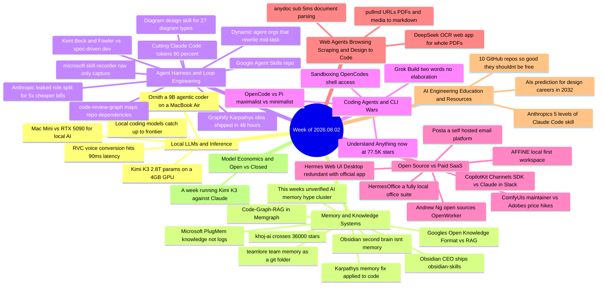

# Weekly Tech Digest — Week of 2026.08.02

*46 captures · [interactive knowledge graph →](./graph.html#2026.08.02)*

## This week's through-lines

The Karpathy "compile a knowledge base once, stop re-reading raw files" pattern keeps multiplying: Graphify's origin story, a follow-up piece applying the same idea to codebases, Understand Anything's return at 77.5K+ stars, and Google Cloud's own Open Knowledge Format are all, underneath the branding, the same bet against RAG-by-default.

The loudest thread this week was also the least substantiated. A run of vague "someone built an incredible memory system" posts — an unnamed Oxford student, an unnamed Russian mathematician, an unnamed Anthropic engineer with an unnamed investor, an unnamed mem0 replacement — shared conspicuously overlapping reply accounts (Gipp, Insomnia, SCOTTY BEAM, Dekos, Fokki, Ridark, monokern, hammertime, and others show up under nearly all of them, regardless of who posted). None names a product or links a repo. Treat virality on these as noise, not signal — see the Quick Hits for the honest, mostly-empty paper trail.

Local inference keeps getting cheaper in stranger ways: the full 2.8-trillion-parameter Kimi K3 running in under 4GB of VRAM via per-expert streaming, a 9B coding model small enough for a fanless MacBook Air, and a memory-chip shortage that's simultaneously making GPUs pricier and Mac Minis smaller — while still leaving the Mac Mini the better buy.

"Open source beats the incumbent" ran across categories that have nothing to do with coding this week — Adobe vs. ComfyUI, Anthropic's Slack bot vs. an open Channels SDK, commercial office suites, even email delivery platforms — and in three of the four cases, a reply in the thread quietly corrected the framing before the digest even had to.

## Map of the week

## Local LLMs & Inference

### Local coding models finally close the gap on frontier

Three weeks of hands-on testing across a 24GB RTX 4090, a 16GB laptop GPU, and an M3 Max MacBook Pro, benchmarked against SWE-bench Verified rather than HumanEval because it's the closer proxy for "can this model actually do my job." The headline: MiniMax M2.5 hit 80.2% (within 0.6 points of Claude Opus 4.6), GLM-5 shipped a 744B MIT-licensed model at 77.8%, and Qwen3-Coder-Next hit 70.6% on just 3B active parameters in 46GB of memory — six models that would have led every benchmark a year ago. The article's model-comparison table itself was cut off by Medium's paywall before it loaded.

*Why it matters: the local/cloud coding-model gap is now single digits on the metric that tracks real bug-fixing, not toy completions — for everyday coding tasks, hardware fit matters more than API budget.*

**Resources:** [Actual Local LLM for Coding in 2026](https://medium.com/@nithin_94885/actual-local-llm-for-coding-in-2026-what-actually-works-on-your-hardware-36ed70445c3a)

### A memory-chip shortage quietly picked this year's local-AI winner

The pitch is a $1,799 Mac Mini beating a $4,300-street-price RTX 5090 for most local AI work, and the number that decides it is 32GB — the 5090's VRAM ceiling, versus the Mac Mini's 48GB unified memory. The twist: the same chip shortage that pushed 5090 prices up also forced Apple to cut the Mac Mini's old 64GB option down to 48GB, squeezing both sides of the market at once and pushing genuinely large (70B+) models off both consumer boxes and into the cloud regardless of which one you buy.

*Why it matters: buying advice built on a raw spec sheet (5090 wins on paper) breaks down once you account for what's actually available and at what price — worth re-checking before any local-AI hardware purchase this year.*

**Resources:** [Mac Mini M4 vs RTX 5090 vs Cloud GPUs for Local AI in 2026](https://medium.com/data-science-collective/mac-mini-m4-vs-rtx-5090-vs-cloud-gpus-for-local-ai-in-2026-2eaf90402bbc) (free-read link in the article; full text behind Medium's member wall past the intro)

### The full 2.8-trillion-parameter Kimi K3, on a single 4GB GPU

AirLLM's old trick for running huge models on tiny GPUs — stream one transformer layer from disk at a time — breaks on Kimi K3 because it's an extreme Mixture-of-Experts model: 93 layers, each holding 896 separate expert networks, and a whole layer expands to roughly 56GB once loaded, more than the card has. The fix is per-expert rather than per-layer streaming: K3 only routes each token to 16 of those 896 experts per layer, so the new technique loads just the experts a given token actually needs. Result: the full unquantized 1.56TB checkpoint, running real inference, in 3.72GB of VRAM.

*Why it matters: MoE architectures were supposed to make "run it on your desktop" harder as models scale into the trillions — this shows the opposite is possible if you stream at the expert level instead of the layer level.*

**Resources:** [Unbelievable! Run Kimi K3 — 2.8 Trillion Parameters — on a Single 4GB GPU](https://ai.gopubby.com/unbelievable-run-kimi-k3-2-8-trillion-parameters-on-a-single-4gb-gpu-23590e7a16c2) · [AirLLM](https://github.com/lyogavin/airllm)

### Ornith: a 9B agentic coder that lives entirely on a MacBook Air

Built on a Qwen 3.5 base and post-trained specifically for the tool-use-and-terminal-commands loop a coding agent needs (not just autocomplete), Ornith-1.0-9B is MIT-licensed, roughly a 5GB download at the right quantization, and runs with a 128K-token context in 24GB of RAM. The author ran it fully offline on a fanless M5 MacBook Air for real coding work — no API key, no code leaving the machine.

*Why it matters: "good enough to stop reaching for the cloud" is a genuinely new claim for a model this small, and it's one more data point that agentic (not just completion) capability is arriving at consumer hardware sizes faster than expected.*

**Resources:** [Meet Ornith](https://ai.plainenglish.io/meet-ornith-the-agentic-coding-model-that-runs-entirely-on-your-laptop-c2b108a8feec) · [Ornith-1.0-9B on Hugging Face](https://huggingface.co/ornith-ai/Ornith-1.0-9B)

## Memory & Knowledge Systems

### Google Cloud open-sources OKF, a formal spec for the "LLM Wiki" pattern

The pitch is that chunk-and-embed RAG has three structural problems — it destroys table structure, retrieval is probabilistic, and keeping embeddings in sync with fast-moving data is an operational nightmare — and Google Cloud's answer is the Open Knowledge Format (OKF v0.1), a vendor-neutral, portable spec that formalizes the "LLM Wiki" idea long associated with Andrej Karpathy: compile documents into a structured, interlinked knowledge base once, then query that structure deterministically instead of doing probabilistic search over raw chunks every time. The article itself cuts off mid-explanation behind Medium's member wall.

*Why it matters: this is the same "compile once, query a structure" bet showing up independently in Graphify, Understand Anything, and Karpathy's own tweet this week — when it starts getting a formal spec from a company the size of Google, it's worth watching as more than a blogger trend.*

**Resources:** [Beyond RAG: Google's Open Knowledge Format](https://medium.com/the-code-frontier/beyond-rag-how-googles-open-knowledge-format-okf-is-replacing-the-vector-database-2ffb5bc2f8eb)

### Your Obsidian vault isn't memory — and here's what actually is

A pointed correction to the "install Obsidian + Claude Code + Obsidian Skills = AI second brain" narrative: Obsidian's official Agent Skills (33K+ stars) are format specifications — they say so plainly — not a memory system. Memory, the author argues, is what a system *does* with stored material: selective retrieval, durable persistence across resets, structured navigation that scales. A folder of markdown files has none of that on its own. The piece then builds a minimal working architecture — three stages, two skills, one hook, about 13 files total — that the author says actually earns the word "memory," with the repo linked at the end of the (paywalled) full article.

*Why it matters: this is a useful corrective to read alongside this week's memory-hype cluster below — it's making the same distinction (storage vs. memory) that the hype posts gesture at without ever defining.*

**Resources:** [Obsidian — Your AI second brain isn't memory](https://medium.com/@roanmonteiro/obsidian-your-ai-second-brain-isnt-memory-and-here-s-the-architecture-that-actually-is-bf944929e144)

### Karpathy's April memory idea, now applied specifically to code

A follow-up to the author's own earlier piece comparing three ways an agent can remember (fresh search every time, a compiled wiki, or acting on distilled knowledge): coding agents have the exact same failure the original piece described for research notes — ask an agent to find every caller of a function, it greps and skims and answers, then starts from zero again tomorrow on the same repo. Two open-source tools (including Graphify, covered separately below) now apply Karpathy's "compile once" pattern specifically to codebases instead of research material.

*Why it matters: connects this week's Graphify coverage to a broader, more deliberate thesis about agent memory rather than treating it as an isolated viral tool.*

**Resources:** [Andrej Karpathy's Fix for LLM Memory Works on Code Too](https://medium.com/ai-all-in/andrej-karpathys-fix-for-llm-memory-works-on-code-too-9a9e38b18b4e)

### Obsidian's own CEO ships the skill that lets an agent run your vault

`obsidian-skills`, installable into Claude Code, Codex, or OpenCode, lets an agent read, create, search, and organize notes directly — including Markdown, Bases, and Canvas files — without manual handling. Framed by posters as "the missing piece for an AI second brain," since the notes already live in Obsidian and the agent now knows how to work them natively.

*Why it matters: an official, CEO-shipped skill is a stronger signal than another third-party wrapper — worth pairing with the "vault isn't memory" piece above for a realistic read on what this does and doesn't solve.*

**Resources:** [obsidian-skills](https://github.com/kepano/obsidian-skills)

### Microsoft's PlugMem: real research, oversold by the viral framing

Underneath the all-caps framing is a real Microsoft Research paper (ICML 2026): PlugMem compiles an agent's raw interaction history into a knowledge graph and feeds the agent only the distilled, decision-ready knowledge rather than the full transcript, cutting context usage by up to two orders of magnitude with no retraining or task-specific redesign required. A reply in the thread does the useful correction work: PlugMem doesn't literally "stop storing history" as the original post claims — it separates history from decision-ready knowledge and normally sends only the distilled slice forward — and building/maintaining that graph carries its own upfront LLM cost, so whether it's a net win depends on how often the memory actually gets reused.

*Why it matters: a rare case this week where the underlying work is genuinely real and citable (arXiv, official Microsoft Research blog, ICML), but still needed a reply to correct the viral summary — a good reminder to check the paper even when the source is legitimate.*

**Resources:** [Microsoft Research: From raw interaction to reusable knowledge](https://www.microsoft.com/en-us/research/blog/from-raw-interaction-to-reusable-knowledge-rethinking-memory-for-ai-agents/)

### khoj-ai crosses 36,000 stars

Self-hostable "second brain" agent connecting docs, PDFs, Obsidian notes, and Notion pages to Claude, GPT, or a local model, with a built-in deep research mode and custom agents, reachable from browser, Obsidian, WhatsApp, or phone. A reply adds the precision the post itself skips: local-model use is what actually keeps data on the machine — routing through Claude or GPT still sends the relevant chunks out to those providers.

*Why it matters: a legitimate, widely-starred project, but the "your data never leaves your machine" framing only holds for the local-model configuration, not the default cloud-model one.*

**Resources:** [khoj-ai](http://github.com/khoj-ai/khoj)

### teamlore: team memory as a folder in git, not a server

When a teammate's Claude Code agent gets corrected or breaks something, teamlore writes a small "lore" file into a `.lore/` folder; that file ships with the PR, gets reviewed like normal code, and is automatically recalled by other teammates' agents when they touch that part of the repo afterward — no server, database, or SaaS bill. A companion `scarmap` command turns the team's accumulated mistake history into a visual heat map of the codebase. The author dogfooded it building the tool itself, so the repo's own `.lore/` folder documents every mistake Claude made while building teamlore. A reply raises the honest limitation the author doesn't address: with no server, two agents writing contradictory lessons about the same module resolve by whichever PR merges last, not by any real consensus mechanism.

*Why it matters: git-native, zero-infrastructure team memory is a genuinely different design point than the vector-DB/server approaches most "agent team memory" tools reach for by default — worth watching whether the merge-conflict problem stays manageable at scale.*

**Resources:** [teamlore on npm](https://www.npmjs.com/package/teamlore)

### Code-Graph-RAG: Tree-sitter parsing into a queryable Memgraph graph

Open-source (MIT), multi-language (C, C#, C++, Dart, Go, Java, JavaScript, Lua, PHP, Python, Rust, TypeScript, TSX) graph-based RAG system for exploring an unfamiliar codebase in plain English instead of hopping between files and search results. Parses with Tree-sitter, stores the interconnected graph in Memgraph, supports Gemini/Ollama/OpenAI for natural-language-to-Cypher translation, returns real source snippets for found functions, and includes a dead-code detector that can fail CI when unreachable functions are found.

*Why it matters: one more entry in this week's crowded "codebase into a knowledge graph" field (alongside Graphify and Understand Anything) — the Memgraph/Cypher approach and CI-integrated dead-code detection are the differentiators here.*

**Resources:** [Code-Graph-RAG](https://github.com/vitali87/code-graph-rag)

## Agent Harness & Loop Engineering

### Graphify: Karpathy asked for a tool, someone shipped it in 48 hours

On April 3, 2026, Andrej Karpathy tweeted about "LLM Knowledge Bases" — instead of RAG-ing raw files on every question, have the LLM compile them into a structured, interlinked markdown wiki once, with summaries, backlinks, concept maps, and an index the model can navigate itself. Karpathy's own version was, in his words, "a hacky collection of scripts." Two days later, developer Safi Shamsi shipped Graphify: point it at any folder and it parses code in 19 languages plus PDFs, markdown, and images (including whiteboard photos) into a queryable knowledge graph — no vector database, no config, one command. *Note: an earlier July digest entry linked a different repo, `Graphify-Labs/graphify`, for what appears to be the same tool; this week's piece links `safishamsi/graphify` — possibly the project moved to an org account since, unconfirmed here.*

*Why it matters: this is the clearest origin story yet for the "compile once, query a structure" pattern showing up independently across multiple entries this week (OKF, Understand Anything, Karpathy's own code-focused follow-up).*

**Resources:** [Andrej Karpathy Asked for a Tool. 48 Hours Later, Graphify Went Viral.](https://www.towardsdeeplearning.com/andrej-karpathy-asked-for-a-tool-48-hours-later-graphify-went-viral-10d8ead5f50e) · [safishamsi/graphify](https://github.com/safishamsi/graphify)

### Kent Beck and Martin Fowler take a swing at spec-driven development — and the middle rung survives

Beck and Fowler, the co-founders of Extreme Programming, publicly criticized the ritual of writing a complete specification before implementation, and the Thoughtworks Radar had already dropped SDD into "Assess" back in November 2025. The author's read: the critique targets *freezing* the spec before implementation — because implementation teaches you things you can't predict in advance — not specs as a concept. Laid out as three rungs (spec-first, spec-anchored, spec-as-source), the piece argues the middle rung survives fully intact: keep a lightweight spec alive next to the code, and when implementation teaches you something new, update the spec first, then the code, with tests guarding the sync.

*Why it matters: a substantive rebuttal from inside the methodology debate, not a dismissal — useful if you've seen the Beck/Fowler critique cited as "SDD is dead" without the nuance.*

**Resources:** [SDD, Kent Beck, and Martin Fowler](https://levelup.gitconnected.com/sdd-kent-beck-and-martin-fowler-why-spec-anchored-development-wins-a4c838d5be11)

### A 5-layer stack claiming 90%+ off Claude Code token usage

Stacks five techniques: a "Codebase Memory MCP" trading file reads for a knowledge graph, a "context-mode" that sandboxes large tool outputs and hands back only a summary, "RTK" compressing CLI output in place, "Headroom" as an API proxy compressing payloads before they leave the machine, and "Caveman" making Claude's own responses terser — enforced by hooks that block raw `cat`/`grep`/`find` and gate `Read`/`Grep` on source until the memory tool is called first. The author claims sessions stretched from 30 minutes to 3+ hours as a result. *No links were captured in this post for any of the five named tools — treat the names as pointers to search for, not verified sources.*

*Why it matters: a concrete, mechanism-level (not just conceptual) approach to the token-cost problem several other entries this week address more vaguely — but verify each named tool independently before adopting, given the missing links.*

**Resources:** *(none captured — see note above)*

### How Google builds, tests, and scales its own Agent Skills

Google's repo for building and evaluating Agent Skills internally, including what one reply calls a "2x2 eval gate." Two corrections surfaced in the replies worth keeping: these are skills scoped to Google's own agents and products, not a universal format any agent can adopt (a non-native-English speaker's reply flags that the distinction is easy to miss from the post alone), and the "test" step looks clean in the repo but — per another reply — skill isolation still breaks down when state leaks between tool calls, so unit tests passing doesn't guarantee the sequence holds in production.

*Why it matters: "open-sourcing the tooling you actually use internally" is more informative than another whitepaper, but the scope and testing caveats matter for anyone hoping to reuse this outside Google's own stack.*

**Resources:** [google/skills](https://github.com/google/skills)

### "Anthropic leaked" a role-split Claude fleet for 5x cheaper bills — it didn't

Despite the framing, this is a user's own cost-routing strategy dressed up as insider information, not anything actually from Anthropic. The idea itself is sound and worth separating from the framing: Opus only plans (one expensive call, never touches a tool), Sonnet executes (where most of the bill lives, parallelized when heavy), Haiku sorts and classifies cheap, frequent tasks that people otherwise default to Opus for without noticing, and a separate model judges the output so the model that wrote something doesn't grade its own work. No implementation repo or link was given.

*Why it matters: role-based model routing by cost tier is a real, well-established pattern — just don't credit the "leak" framing, and don't expect a ready-made repo to drop in.*

**Resources:** *(none captured)*

### code-review-graph: mapping a repo so agents only re-read what changed

Maps every file, function, and connection in a codebase so that changing one function traces exactly what it touches — every caller, dependent file, and test — letting the agent read only what's affected instead of re-scanning the whole repo on every edit. The author claims a task that used to burn ~100,000 tokens (about a dollar) now runs closer to a penny. A reply flags the honest failure mode: the dependency map itself can drift, and once it does, the agent starts trusting stale edges instead of the real current state.

*Why it matters: same underlying problem as the 5-layer stack above (Claude Code re-reading whole codebases), solved here with a specific, installable tool (`pip install code-review-graph`) rather than a bundle of unnamed pieces.*

**Resources:** [code-review-graph](https://github.com/tirth8205/code-review-graph)

## Coding Agents & CLI Wars

### OpenCode vs. Pi: feature-maximalism vs. radical minimalism, and the minimalist still places

A detailed architectural comparison: OpenCode packs 75+ LLM providers, LSP integration, MCP support, subagents, and multi-session parallelism into a client/server design; Pi ships with exactly four built-in tools and treats everything else as a deliberate "anti-feature," including declining seven common capabilities other agents include by default. Despite the minimalism, Pi lands second place on TerminalBench. The author frames the real question as philosophy-fit rather than feature-count: which one matches how you actually work.

*Why it matters: a genuinely substantive comparison (26-minute read, real benchmark data) in a space mostly filled with quick takes — useful if you're choosing a terminal coding agent and want more than a features checklist.*

**Resources:** [OpenCode vs Pi](https://codexpedite.com/opencode-vs-pi-which-terminal-ai-coding-agent-actually-fits-your-workflow/)

### Running OpenCode's shell access in a sandbox instead of your laptop

OpenCode is architecturally similar to Claude Code but open-source, and it runs shell commands autonomously — which raises the obvious question of what happens the moment it runs something you didn't expect (the author's specific fear: asking it to clean build artifacts, and `rm -rf ./build` turning out to hit a symlink into something that still mattered). The fix: route the agent's shell into a disposable cloud sandbox from Tensorlake rather than the local machine, keeping everything else in place.

*Why it matters: a concrete, low-effort mitigation for a real risk that most "just pick a folder you don't care about" advice doesn't actually solve — the symlink scenario specifically defeats folder-based caution.*

**Resources:** [OpenCode Is Powerful. That's Exactly the Problem.](https://pub.towardsai.net/opencode-is-powerful-thats-exactly-the-problem-06eebf266279) · [Tensorlake OpenCode sandbox docs](https://docs.tensorlake.ai/sandboxes/opencode) · [tensorlake-opencode-plugin](https://github.com/tensorlakeai/opencode-tensorlake-plugin)

### Understand Anything returns, now at 77.5K+ stars

First covered here in June, Understand Anything resurfaces with more architectural detail: a Tree-sitter + LLM hybrid pipeline (Tree-sitter for deterministic parsing — imports, exports, function definitions, call sites; LLMs for what parsers can't do, like plain-English summaries and architectural-layer assignment) builds an interactive, color-coded, fully searchable dashboard from any codebase. New this round: a persona-adaptive UI that adjusts detail level for junior devs vs. PMs vs. power users, multi-language dashboard generation (Chinese, Japanese, Korean, Russian), and slash commands for chat, diff-impact analysis, onboarding guides, and business-domain mapping. Works across Claude Code, Cursor, Copilot, Gemini CLI, Codex, OpenCode, and more.

*Why it matters: continued, substantive growth on a recurring tool (rather than a one-week flash) is itself a useful signal in a category — codebase knowledge graphs — that's otherwise full of fresh, unproven entrants this week.*

**Resources:** [Understand Anything](https://github.com/Egonex-AI/Understand-Anything)

## Open Source vs. Paid SaaS

### ComfyUI's anonymous maintainer vs. Adobe's price hikes

A viral thread contrasts Adobe's $150M DOJ settlement (for hiding cancellation fees and trapping users in subscriptions) and subsequent price increases — Photoshop and Illustrator at $22.99/month, Firefly credit-metered monthly — with `comfyanonymous`'s ComfyUI: 123K stars, GPL-3.0, a new release shipped essentially every week, entirely free, running fully locally with nothing uploaded to the cloud. A reply pushes back usefully on the framing: ComfyUI isn't actually a Photoshop replacement — it's a different category of tool (AI image generation, not general image editing) — so the "pirate enemy" framing overstates the direct competition even where the broader point about pricing stands.

*Why it matters: worth reading past the framing — the underlying facts (settlement, pricing, ComfyUI's release cadence) check out, but the "Adobe killer" narrative doesn't.*

**Resources:** [ComfyUI](https://github.com/comfy-org/comfyui)

### Andrew Ng open-sources OpenWorker

An MIT-licensed agent framework: you name an outcome, it breaks that into steps and works across your own files with 25+ integrations, runs on a schedule, and works with any model provider (OpenAI, Anthropic, Gemini, DeepSeek, Kimi, Grok). The pitch is explicitly local-first — keys, tokens, and conversations stay on your machine, with only OAuth brokering touching the cloud. The post claims 13,267 stars in 17 days. A reply flags the sensible first audit point: the OAuth broker is the one piece that isn't fully local, so that's where to look first.

*Why it matters: a named author with real standing (former head of Google Brain, Stanford CS adjunct) and a real, linked repo — one of the more credible "open agent" entries in a week full of unverifiable ones.*

**Resources:** [OpenWorker](http://github.com/andrewyng/openworker)

### HermesOffice: an office suite where the agent runs 100% on your machine

Open-source Word/Sheets/Slides/PDF suite, forked from GenOffice (Apache-2.0), where the AI assistant editing your documents is the same local agent that has access to your files, memory, and tools — no cloud account, no third-party proxy. A reply raises a sharper security question than "is it local": local-first isn't the whole threat model, since Microsoft's Recall stored screenshots in a plaintext database any process running as the user could read (and had to be pulled and rebuilt as a result) — "runs on your machine" still needs an answer for who else has access to that machine.

*Why it matters: a genuinely useful corrective for anyone treating "runs locally" as automatically equivalent to "secure" — those are different properties.*

**Resources:** [HermesOffice](http://github.com/criptogus/HermesOffice)

### An open Channels SDK positioned against Anthropic's Claude-in-Slack — with an important asterisk

CopilotKit's Channels SDK lets any agent implementing the AG-UI standard (LangGraph, CrewAI, Mastra, Google ADK, or plain HTTP) run inside Slack, Teams, Discord, or WhatsApp through per-platform adapters, rather than writing a separate integration per messaging platform per agent. The framing pitches this as undercutting Anthropic's Claude-in-Slack, which only runs Claude and only in Anthropic-supported channels. A reply directly disputes the framing as misleading: the SDK/plumbing is genuinely MIT-licensed and open, but the piece that actually connects to Slack or Teams is still CopilotKit's own hosted service — an SDK for the pipe isn't the same claim as "we open-sourced the agent."

*Why it matters: the underlying engineering problem (N platforms × M agent frameworks = N×M integrations without an adapter layer) is real and the SDK is a legitimate answer to it — but the "blow to Anthropic" framing overstates what's actually free here.*

**Resources:** [CopilotKit Channels SDK](https://github.com/CopilotKit/channels-sdk)

## Web Agents: Browsing, Scraping & Design-to-Code

### anydoc: sub-5ms document parsing, now powering Firecrawl — with mixed early reports

Rust-based parser claiming sub-5ms Markdown conversion and 500 docx files processed in 1.7 seconds across PDF, docx, pptx, and 10 more formats, already integrated into Firecrawl's `/parse`. The replies are genuinely mixed rather than uniformly positive: one user reports it performs poorly for them and doesn't detect basic tables, with columns scrambled; another notes it still needs a text layer in the PDF (no OCR fallback), so a fast parser can still return nothing for the scanned documents that need parsing most.

*Why it matters: the speed claims are real and it's shipping in a widely-used tool, but "100x faster" and "reliable on your actual documents" are separate claims — the replies are doing useful quality-control work the announcement itself skips.*

**Resources:** [anydoc](http://github.com/firecrawl/anydoc)

## AI Engineering Education & Resources

### Asking AI to predict the design industry's own future

A designer asks an AI model to forecast where design careers land by 2032: the "UI/UX Designer" title splits into "Product Engineers" (design and build, prototype in code) and "Design Strategists" (own product thinking and business outcomes at a senior level), AI handles roughly 80% of execution work (wireframes, UI patterns, component generation, copy variants), design systems become actual code repositories agents read and write to rather than Figma files, agencies consolidate hard (three AI-fluent designers replacing what took fifteen people), and generalist mid-tier design work gets commoditized while specialization pays more.

*Why it matters: the predictions track closely with what's already happening in software engineering roles this year — worth reading as a parallel-industry data point on how AI reshapes creative/knowledge work generally, not just coding.*

**Resources:** [I Asked AI How the Design Industry Will Look in 7 Years](https://medium.com/design-bootcamp/i-asked-ai-how-the-design-industry-will-look-in-7-years-here-is-what-it-said-56587fb08045)

### Anthropic's 5 levels of Claude Code operator skill

An analysis of 400,000 Claude Code sessions aimed at explaining why some users get dramatically better results from the identical model. The five levels run from "can you check that again?" (you know something failed, not what) through increasingly specific, evidence-backed feedback ("the parsing fix didn't work, line count is still 742, here's the `wc -l` output"), landing on a single-sentence summary: Claude rarely corrects the user — the user regularly corrects Claude. The model stays constant; the operator's feedback specificity is what changes outcomes. *No link was captured to the underlying writeup itself.*

*Why it matters: a rare data-backed (rather than anecdotal) answer to "why do some people get so much more out of the same AI tool" — the throughline is specificity of correction, not prompt cleverness.*

**Resources:** *(none captured — see note above)*

### 10 GitHub repos "so good they probably shouldn't be free"

A curated roundup spanning: OmniRoute (one endpoint routing to 231 AI providers, 50+ free-tier, with automatic fallback and 15-95% token compression), OfficeCLI (a full Office-suite CLI needing no Microsoft Office install), a repo of leaked system prompts from Claude/GPT/Gemini/Grok/Cursor/Copilot, OpenCut (a browser-based open-source CapCut alternative), an AI job-application agent, a local Whisper+Ollama meeting transcriber, a natural-language trading-strategy builder, an AI-powered open-source vulnerability scanner, a 250K-star self-hosted AI workspace, and Firecrawl.

*Why it matters: a genuinely useful bookmark list rather than filler — several entries (OmniRoute's provider fallback, the system-prompt-leaks repo) are worth a look independent of the roundup framing.*

**Resources:** [OmniRoute](https://github.com/diegosouzapw/OmniRoute) · [OfficeCLI](https://github.com/iOfficeAI/OfficeCLI) · [system_prompts_leaks](https://github.com/asgeirtj/system_prompts_leaks) · [OpenCut](https://github.com/OpenCut-app/OpenCut) · [Firecrawl](https://github.com/mendableai/firecrawl)

## Model Economics & Open vs. Closed

### A week spent running Kimi K3 against Claude, head to head

After Kimi K3 (Moonshot AI's 2.8 trillion-parameter "first open 3T-class model," released July 16) took rank one on the Frontend Code Arena leaderboard ahead of Claude Fable 5, the author ran real backend and Python tasks through both models' APIs for a week, comparing benchmark data, pricing, and everyday friction that launch blog posts don't cover. The author's own caveat, worth repeating: published numbers mix Moonshot's self-reported figures with third-party sources like Artificial Analysis, so anything not independently confirmed deserves caution.

*Why it matters: the most credible kind of model comparison — real workloads over real time, with an explicit warning about which numbers to trust — in a week with several other Kimi K3 claims that don't come with that caveat.*

**Resources:** [I Ran Kimi K3 Against Claude for a Week](https://medium.com/@inprogrammer/i-ran-kimi-k3-against-claude-for-a-week-here-is-what-actually-happened-20c1a17c9206)

## Quick hits

- **This week's unverified "AI memory system" hype cluster** — six separate viral posts (an unnamed Oxford student's revision-weighted memory system, an unnamed Russian mathematician's source-trust-decay context pipeline, a claimed $250→$18/month bill drop from swapping to an unnamed "4-month-old repo," a general "memory engineering is overlooked" framework post naming no tool, an unnamed 1,615-file "living second brain," and an unnamed Anthropic engineer who supposedly "landed a huge investment") — none names a product, links a repo, or survives basic scrutiny, and several share an overlapping cast of reply accounts across different original posters. Treated individually in the graph data for trend-tracking purposes; treated collectively here because that's what the evidence supports. *(no links captured for any of the six)*
- [Diagram-design](https://github.com/cathrynlavery/diagram-design) — Claude Code skill generating 27 diagram types (flowcharts, architecture charts) that auto-match a project's fonts and colors.
- ["Grok Build"](https://x.com/elonmusk/status/2084989366590742585) — Elon Musk's post is literally those two words with no elaboration; replies do the actual work of comparing it to Claude and Cursor.
- [pullmd](https://github.com/AeternaLabsHQ/pullmd) — converts URLs, PDFs, and media to clean Markdown; a reply flags the more useful detail — X-Source/X-Quality tags marking whether text came from OCR or weak extraction, so agents don't mistake degraded text for clean.
- [Posta](https://github.com/goposta/posta) — self-hosted transactional email platform, an alternative to SendGrid/Mailgun/Postmark via a single HTTP API.
- **"Dynamic agent orgs"** — a concept-level post about self-evolving agent org charts where the coordination graph rewrites itself mid-task; no tool is named, and replies immediately raise the obvious audit and runaway-optimization concerns. *(no link captured)*
- [RVC voice conversion](https://github.com/RVC-Project/Retrieval-based-Voice-Conversion-WebUI) — now does real-time conversion down to 90ms latency over ASIO I/O and trains on as little as 10 minutes of speech. *The original capture's snapshot failed (empty page); this text and link were recovered via web search on the post's own wording, not from the raindrop capture itself.*
- [AFFiNE](https://osp.fyi/affine) — local-first, self-hostable workspace merging docs, whiteboards, and databases into one edgeless-canvas app with a multimodal AI writing/presentation partner; a reply asks what happens to the AI features offline, unanswered in the post.
- [microsoft/skill-recorder](https://github.com/microsoft/skill-recorder) — a Microsoft repo (527 stars, 56 forks at capture time); the saved snapshot only contains GitHub's site navigation chrome, not the README, so what the tool actually records or does isn't captured here. *(honest gap, not a content judgment)*
- [DeepSeek OCR web app](https://github.com/rdumasia303/deepseek_ocr_app) — processes entire PDFs and images while preserving LaTeX formulas and table structure, exporting to Markdown or Word.
- **Hermes Web UI Desktop** — a free, open-source visual workspace wrapping the Hermes CLI agent; multiple Spanish-language replies point out Hermes already ships its own official desktop app (`hermes desktop`) with regular updates, making this look like a late, redundant entry. *(no repo link captured in the post)*

---

*46 Raindrop.io captures tagged `2026.08.02`. Every claim above traces to what was actually captured (post text, article excerpt, or linked repo) or is labeled as recovered/uncertain where it wasn't — see inline notes for the handful of entries with missing links, paywalled cutoffs, or a failed snapshot. No summary here was generated from a title alone.*
