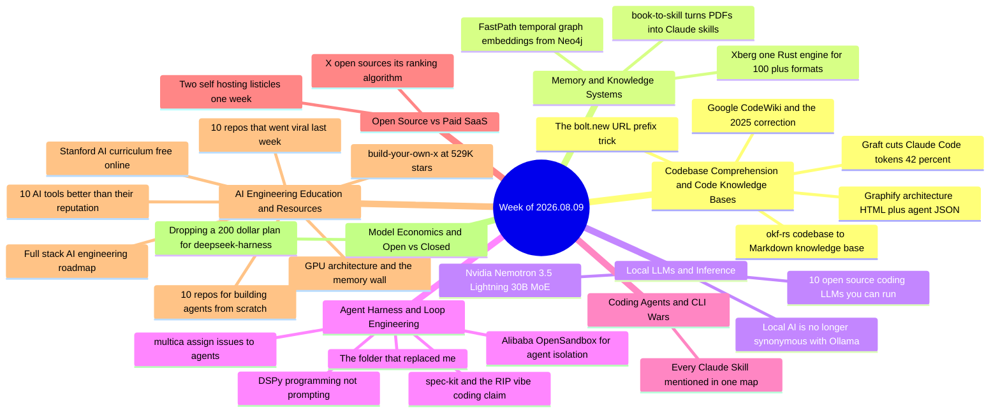

# Weekly Tech Digest — Week of 2026.08.09

*36 captures · [interactive knowledge graph →](./graph.html#2026.08.09)*

## This week's through-lines

**The codebase became the context problem.** Five separate captures ship the same idea from five directions: precompute a structured map of the repo once, so the agent stops re-reading raw files on every task. Graft claims 42% fewer tokens and 60% less wall-clock time across 162 controlled runs. okf-rs makes the map plain Markdown with YAML frontmatter — git-diffable, greppable, no database. Graphify emits an interactive HTML diagram *and* a JSON meant for other agents to read. Google's CodeWiki does it as a hosted service. And the crudest version is a URL prefix. The pitch is never "the agent understands your code better" — it's always token cost. That's this week's real signal: codebase comprehension has stopped being a UX feature and become a line item. It's also why this week mints a new theme (see the end).

**The replies did the editorial work again.** Three of the week's loudest posts were stale or overstated, and the threads said so before this digest had to. Google CodeWiki drew *"you are 9 months late. This is from 2025"* and *"copied from deepwiki."* The "RIP vibe coding, GitHub just dropped spec-kit" post collected a pile of Spanish-language replies pointing out spec-kit shipped in 2025 and that AWS Kiro was doing spec-driven development before that. And the DSPy post drew the sharpest single comment of the week: *"the 'optimize automatically' part assumes you already have a reliable eval signal. Building that eval is often harder than the prompt it's meant to improve."*

**Three "10 GitHub repos that replace $X/year" listicles, three accounts, one week.** Combined claimed star counts of 350k, 560k, and 1.2M; Appwrite appears on two of them. The genre has hardened into a template — a number, a star total, a dollar figure saved, and "save this before you renew." Two of them are near enough to the same post that this digest merges them into one entry. The format's ubiquity is the story; the repos underneath are mostly the same eight or ten every time.

**Local inference is getting specialized, not just smaller.** Nvidia's Nemotron 3.5 Lightning is a 30B mixture-of-experts with 3B active parameters, openly licensed weights *and* training data, built explicitly to do execution — tool calls, result validation, subagent delegation — rather than reasoning. In the same week, a 19-minute piece argues the local stack has outgrown Ollama entirely (llama.cpp, ik_llama.cpp, vLLM, llamafile, llama-swap, Jan), and a coding-model roundup puts DeepSeek V4 Pro at a reported 80.6% on SWE-bench Verified. The shape of the bet has changed: not "a small model that's almost as good," but "a small model that does one job in the loop faster than the big one can."

## Map of the week

## Codebase Comprehension & Code Knowledge Bases

### Graft — a living map of the repo, and a 42% token cut to prove it

Graft builds a persistent graph of a codebase so agents understand the architecture *before* they start working, rather than re-reading files every task. It generates a Markdown card for each meaningful part of the system — summaries, dependencies, source files, relationships between components — and keeps them synchronized as the project changes. Installation is `npx @nanonets/graft init` inside a project; it detects which agents you use and wires itself into each one. For Claude Code specifically it installs a skill, an MCP server, hooks, and a live status bar. `graft build --deep` produces LLM-generated summaries instead of structural ones. The post's headline claim, presented as measured over 162 controlled runs: 42% fewer tokens, 46% fewer tool calls, 60% less time, 32% lower cost, at equal correctness. Free, open source, runs entirely locally. *(Post is in Spanish; the numbers are the author's, not independently verified here.)*

*Why it matters: the first entry in this cluster to publish a controlled-run number rather than a vibe — and if 42% holds even roughly, precomputing the map pays for itself in one session.*

**Resources:** [nanonets/graft](https://github.com/nanonets/graft)

### okf-rs — the same idea, but the output is just Markdown

Jeremy Jeanne's framing of the problem is the clearest of the week: an agent needs to know who calls a function, so it greps, opens a handful of matching files, and reads hundreds of lines just to confirm which hits are actual call sites — and every file it opens costs its full size in context. Do that a few dozen times a session and you've burned an enormous amount of context on what is fundamentally a lookup. okf-rs is a Rust CLI that turns a repository into an Open Knowledge Format knowledge base: `okf-rs generate .` emits a `knowledge/` directory of ordinary `.md` files, one per module, struct, enum, function, or method, each with a small YAML header and a body listing its signature and its calls as relative links to other concept files. A sample run reports 146 concepts across 16 modules, 18 structs, 6 enums, 87 functions, 19 methods, with `okf-rs validate` checking integrity. The deliberate design choice: no proprietary graph database you need their runtime to query, and no AI-specific context blob that's opaque to everything but the model that consumed it. It's git-diffable, greppable, and renders natively on GitHub. Built on tree-sitter and tantivy, and it ships an MCP server so agents query the knowledge base instead of grepping.

*Why it matters: the format is the argument. A knowledge base you can read, diff, and review in a PR is one you'll actually trust; a vector store you can only query is one you have to take on faith.*

**Resources:** [jyjeanne/okf-rs](https://github.com/jyjeanne/okf-rs) · [Full write-up](https://medium.com/@jyjeanne/okf-rs-a-new-rust-tool-for-turning-codebases-into-ai-readable-knowledge-bases-feb61b3554be) · [tree-sitter](https://tree-sitter.github.io/tree-sitter/) · [tantivy](https://github.com/quickwit-oss/tantivy)

### Graphify — one prompt that emits an interactive diagram and a machine-readable twin

Nico Garcia's post is unusual in that it gives away the exact prompt rather than a tool: analyze the whole repository and produce two deliverables — a single self-contained HTML file with an interactive architecture diagram (nodes and connections), a flows panel on the right, click-a-flow-to-highlight-the-whole-path behavior, tooltips on every component, and a clean responsive layout; plus a JSON with the structure `{nodes, edges, flows: [{steps}]}` designed for other AI agents to consume. The follow-up gives the packaged alternative: `uv tool install graphifyy` then `graphify install`, which adds a `/graphify` command. The two-artifact split is the interesting part — the HTML is for the human who needs to explain the system, the JSON is so the next agent doesn't have to redo the analysis.

*Why it matters: Graphify was one of last week's entries too, which makes this the second consecutive week it's surfaced; the new detail is the raw prompt, which means you can get most of the value without installing anything.*

**Resources:** [Graphify-Labs/graphify](https://github.com/Graphify-Labs/graphify)

### Google CodeWiki — and the reply that dated it to 2025

Paste any repository and Google's CodeWiki turns it into interactive documentation: auto-generated diagrams, per-component explanations, step-by-step tutorials, detected architecture and dependencies, plus a chatbot that has read the whole codebase. The Spanish-language post frames it as "the tool every developer has been asking for for years." The replies are less impressed, and worth reading as a set: *"Appreciate the share but you are 9 months late. This is from 2025"*; *"copied from deepwiki"*; and, more usefully, two questions the post doesn't answer — what happens to source-code IP and security when you paste a private repo into a hosted service, and how it behaves on genuinely large repositories, which one reply calls the real test. The best line in the thread is also the fairest summary: *"Documentation debt just got automated into a feature. Half of software archaeology may finally become software tourism."*

*Why it matters: the same capability as Graft and okf-rs, but hosted and closed — and the IP question a reply raises is exactly why the local, plain-Markdown versions in this section exist.*

**Resources:** [CodeWiki](https://codewiki.google/) *(post claims it as new; multiple replies date it to 2025 and compare it to DeepWiki)*

### The bolt.new URL prefix trick

The crudest member of this cluster: prepend `bolt.new/` to any GitHub repo URL — `bolt.new/github.com/user/repo` — and the whole repo is imported into a browser session you can then interrogate in conversation. No cloning, no local setup. The poster's example: a repo untouched for months, one question about why a feature kept breaking, an answer traced across three files in under thirty seconds. Their own framing is the honest one — *"this isn't a new tool, it's a five second habit."* Two replies confirm it works; nobody in the thread tests it on anything large.

*Why it matters: it's the zero-install floor of the whole "make the codebase legible" category, and a useful reminder that most of the value here is in not having to open twenty tabs, not in any particular graph format.*

**Resources:** [bolt.new](https://bolt.new/)

## Memory & Knowledge Systems

### book-to-skill — every technical book you own becomes callable context

A project that converts any technical book PDF into a Claude Code skill in minutes, so the book becomes context the agent can call rather than something you read once and half-remember. The pitch is the before/after: read the book, highlight the good parts, forget most of it, Google the same concepts a year later — versus drop the PDF into the repo, get a working skill, reference it while you code. *"Your library stops being decoration and starts being infrastructure."* Two replies sharpen it considerably. One asks the question the post skips: does it handle equations and diagrams, or only prose-heavy books? The other lands the real design test — *"Useful if the skill keeps the book's constraints, not just its vocabulary. The boring win is not 'the agent read a PDF.' It is 'the agent stops confidently doing the thing the book warned against.'"*

*Why it matters: that second reply is the eval criterion for this entire genre of "turn a document into agent context," and almost nobody publishing in it states one.*

**Resources:** [virgiliojr94/book-to-skill](http://github.com/virgiliojr94/book-to-skill)

### Xberg — one Rust engine instead of five stitched-together libraries

Xberg is a document-intelligence engine that replaces the usual pile — one library for PDFs, one for OCR, one for tables, one for audio, one for code parsing — with a single Rust core and one output format. The specifics it claims: 100+ document formats (PDFs, Office files, images, HTML, email, e-books, structured data); OCR through Tesseract, PaddleOCR, Candle, or VLM backends with fallback chains and confidence scores; layout and table reconstruction via PP-DocLayout-V3, RT-DETR, TATR, and SLANet; audio transcription via Whisper ONNX from tiny through large-v3; and code intelligence across 371 languages, extracting functions, classes, imports, and docstrings pre-chunked for RAG. Fifteen language bindings, and it runs as a library, CLI, REST API, or MCP server — the MCP mode being the one that lets Claude Code, Cursor, Codex CLI, Gemini CLI, or Copilot CLI pull structured data out of any file without you building an ingestion pipeline first. Xberg is the next iteration of Kreuzberg, rebuilt and rebranded on a fresh v1 line. MIT licensed.

*Why it matters: confidence scores and explicit fallback chains are the parts to care about — an ingestion layer that tells you when it did badly is worth more than one that silently hands an agent degraded text.*

**Resources:** [xberg-io/xberg](https://github.com/xberg-io/xberg)

### FastPath — embeddings that remember *when*, not just *what*

A Neo4j Professional Services deep-dive on an algorithm with an unusually crisp motivating example: three failed logins spread across a month is routine; three failed logins in the last five seconds is an attack. The events are identical — only the timing differs, and the timing is the whole story. Most pipelines flatten time-stamped event histories into counts and averages the moment they hand them to an ML model, throwing the timing away. FastPath is a lightweight, training-free algorithm that turns a time-ordered event sequence into a single fixed-length embedding per entity, capturing both the content of a history and its timing relative to a decision point — vectors that drop straight into vector search, clustering, and supervised models. The article walks the full pipeline (timeline windowing, a reference grid of random signatures, time smoothing, recency decay), works an example by hand, and closes with four configuration guardrails: mind the time scale, remember the output time is exclusive, choose a sensible dimension, interpret magnitude carefully. It also asks its own honest question in a section heading — *"Wait, is this even a graph algorithm?"*

*Why it matters: the one entry this week that isn't about agents at all, and the most reusable — customer journeys, clinical histories, clickstreams, and ticket lifecycles all have the same shape, and most teams are still averaging the time out of them.*

**Resources:** [When Timing Changes the Meaning of a Graph Path](https://medium.com/@jose.alvarado-guzman/when-timing-changes-the-meaning-of-a-graph-path-a-deep-dive-into-the-fastpath-algorithm-b34fc870efd8)

## Local LLMs & Inference

### Nvidia Nemotron 3.5 Lightning — a small open model built to execute, not to think

A 30B mixture-of-experts with 3B active parameters, released under OpenMDW-1.1 with weights, training data, *and* training recipes open. What makes it notable is the deliberate narrowness: it targets the execution-focused workloads inside long-running autonomous agents — tool calls, result validation, subagent delegation — rather than complex reasoning. Speculative decoding with multi-token prediction is baked into pretraining, and it ships an NVFP4 quantized checkpoint alongside BF16. Nvidia claims it defines the accuracy-speed Pareto frontier for small open models on the Artificial Analysis Intelligence Index, and on PinchBench completes 10,000 tasks 30% faster than Qwen3.6 35B at similar accuracy. It runs from DGX Spark and a GeForce RTX 5090 up to datacenter Blackwell/Hopper/Ampere, and through llama.cpp, Ollama, and LM Studio.

*Why it matters: the interesting move isn't the size, it's the job description — a model priced and shaped for the ten thousand boring tool calls in an agent loop, with the frontier model reserved for the handful of steps that need it.*

**Resources:** [Nvidia's open Nemotron 3.5 Lightning](https://www.zdnet.com/article/ai-model-release-tracker/) · [NVIDIA technical blog](https://developer.nvidia.com/blog/nvidia-nemotron-3-5-lightning-delivers-fast-accurate-specialized-task-execution-for-long-running-agents/) *(the ZDNET capture recovered only the site's navigation chrome, not the article body; the model details above come from NVIDIA's own technical blog, found by targeted search — not from the capture)*

### "Local AI is no longer synonymous with Ollama"

A 19-minute argument, structured as seven specific complaints and nine alternatives, that Ollama is still the easiest way to *start* running local LLMs and the worst way to *keep* running them. The complaints, as the author lists them: performance left on the table; the DeepSeek naming scandal, where marketing beat transparency; registry wait times that block day-one model access; vendor lock-in over your own downloaded models; the backend fork away from llama.cpp; a values-level drift toward the cloud; and the Modelfile as an abstraction most people don't need. The tour that follows is the useful half — llama.cpp as the engine room, ik_llama.cpp as the performance fork, LM Studio for desktop, vLLM for production serving, koboldcpp as the power-user knife, llamafile for single-file distribution, llama-swap as a multi-model router, Jan as local-first, and Open WebUI as the universal frontend — closing with a side-by-side comparison and a practical "should you migrate right now" guide.

*Why it matters: Ollama's ubiquity has made "local AI" and "Ollama" synonymous in a lot of tooling decisions, and this is the most complete map of what the alternatives actually trade off.*

**Resources:** [Local AI is no longer synonymous with Ollama](https://kvssetty.medium.com/local-ai-is-no-longer-synonymous-with-ollama-5faf1409b608) · [llama.cpp](https://github.com/ggerganov/llama.cpp) · [ik_llama.cpp](https://github.com/ikawrakow/ik_llama.cpp) · [vLLM](https://github.com/vllm-project/vllm) · [koboldcpp](https://github.com/LostRuins/koboldcpp) · [llamafile](https://github.com/Mozilla-Ocho/llamafile) · [llama-swap](https://github.com/mostlygeek/llama-swap) · [Jan](https://jan.ai/) · [Open WebUI](https://github.com/open-webui/open-webui) · [LM Studio](https://lmstudio.ai/)

### The 10 best open-source coding LLMs — and the ones you can actually run

The framing is better than the listicle format suggests: the single best open coding model right now needs a server rack you don't have, and the one that fits on a single 24GB card is a different model entirely — so the question isn't which model is best overall, but which is best among the ones you can run for the kind of coding you actually do. The headline number: DeepSeek V4 Pro at a reported 80.6% on SWE-bench Verified, sitting alongside the most expensive closed models. The article organizes into tiers, starting with a "Frontier Open Six" ranging from 400 billion to nearly a trillion parameters. *The full tier tables sit behind Medium's member paywall; the capture recovered the framing, the DeepSeek V4 Pro figure, and the tier structure, but not the individual model rows.*

*Why it matters: paired with the Nemotron entry above, the same week makes both halves of the local-model case — the biggest open models are at the frontier on the benchmark that tracks real bug-fixing, and the small ones are being purpose-built for the loop.*

**Resources:** [The 10 Best Open-Source Coding LLMs Right Now](https://medium.com/data-science-collective/the-10-best-open-source-coding-llms-right-now-and-which-ones-you-can-actually-run-6bb4ede44bad) *(member-only story; partially recovered)*

## Agent Harness & Loop Engineering

### "The folder that replaced me" — an overnight agent shift, laid out file by file

The most concretely specified harness post of the week, and it reads like a runbook rather than a pitch. The premise: instead of waking up to check what broke overnight and fixing it by hand, wake up to receipts that are already dated, graded, and waiting for review. The layout, as posted:

- **The contract** — `CONTRACT.md`, the shift rules, committed to the repo; `contract.local.md`, personal overrides, gitignored.
- **The harness** (`.claude/loops/`) — `settings.json` for spend caps and timeouts, set once; `schedule.yml` for when the next shift fires; `rubrics/` holding `code.md`, `writing.md`, and `safety.md` as graders that catch what a tired human would miss; and a `pr-hunter/` where `plan.md` wakes it up and `act.sh` does the work.
- **The state** — `receipts/`, one folder per shift, 5,382 kept and counting; `trace.log` for exactly what happened; `checkpoint.json` so the next run resumes where the last one stopped.
- **The edges** — `kill.sh`, the panic switch, still untouched; `.mcp.json`, the exact tools it's allowed near.

The replies are unusually good. One names the pattern: *"You completely removed yourself from the execution loop and built the factory."* One punctures it: *"folder doesn't fix midnight, it just moves it."* And one raises the real risk: *"the real game is in how much you can automate before someone screams 'black box.'"*

*Why it matters: the separation of committed contract from local overrides, and of rubrics from the agent being graded, is the transferable idea here — everything else is scheduling.*

**Resources:** *(no repo link captured in the post — the folder structure above is quoted from the post itself)* · [vorojar/md-preview](https://github.com/vorojar/md-preview) *(offered in a reply for reviewing the resulting Markdown receipts)*

### Alibaba open-sources OpenSandbox

Isolated environments for agents to execute code, browse the web, control full desktops, and run Claude Code, Cursor, Codex, or Gemini CLI inside. SDKs in five languages, Docker and Kubernetes deployment, gVisor/Kata/Firecracker isolation backends, a credential vault, and an MCP server. Apache 2.0, and the post claims 12.5k+ stars and the #1 spot on GitHub Trending at capture time. The best comment in the thread makes the infrastructure argument: agents can be very smart, but without a safe environment to take real actions in they stay limited — and if OpenSandbox becomes the standard layer, it ends up critical infrastructure for the whole ecosystem. A skeptical reply — *"Docker exists, friend"* — gets the short answer it deserves, but the gVisor/Kata/Firecracker options are the actual difference. *(Post is in Spanish.)*

*Why it matters: sandboxing has been the perennially-deferred item in agent stacks; a credential vault plus microVM isolation in one Apache-2.0 package removes the last excuse.*

**Resources:** [opensandbox-group/OpenSandbox](https://github.com/opensandbox-group/OpenSandbox)

### spec-kit, "RIP vibe coding," and a thread that wasn't buying it

The post declares vibe coding dead (2025–2026) and credits GitHub's spec-kit: stop firing requests at the agent at random and write the specification first, then let the agent execute it. Five commands — `/speckit.constitution` for project principles, `/speckit.specify` for what you're building, `/speckit.plan` for stack and architecture, `/speckit.tasks` for a real task list, `/speckit.implement` to build it — working across 30+ agents including Copilot, Claude, Codex, and Cursor, at a claimed 125,000 stars. The replies are a pile-on, and they're right about the facts: spec-kit is not new (variously dated to "three months ago," 2025, and "two years"), and AWS Kiro was doing spec-driven development before it. Two replies are worth keeping anyway. Guillermo Casaus makes the substantive case that spec-first genuinely fixes vibe coding's core failure — building blind — by forcing architecture and stack to be defined up front. And Rishabh lands the sharpest practical note: a spec-kit constitution without a security section still ships the default of RLS off, `USING (true)`, and a service role in the client — the spec should fail the build when `relrowsecurity` is false.

*Why it matters: the tool isn't news, but "put the security invariants in the constitution and fail the build on them" is a genuinely good idea that arrived in a reply to a clickbait post.*

**Resources:** [github/spec-kit](https://github.com/github/spec-kit)

### DSPy — programming instead of prompting, and the eval problem underneath it

Stanford NLP's framework for building modular AI systems by writing compositional Python instead of brittle prompt strings, then automatically optimizing the prompts and weights of classifiers, RAG pipelines, and agent loops — compiling declarative LM calls into self-improving pipelines, backed by published research on prompt evolution and multi-stage optimization. DSPy surfaced twice in the same week: once on its own and again in the week's viral-repos roundup. The reply that matters is Gregor's, and it applies to every framework in this category: *"The 'optimize automatically' part assumes you already have a reliable eval signal. Building that eval is often harder than the prompt it's meant to improve. Is that where teams actually stall with DSPy?"* Nobody in the thread answered it.

*Why it matters: that unanswered question is the honest cost line for automated prompt optimization, and it belongs next to every claim in this space.*

**Resources:** [stanfordnlp/dspy](https://github.com/stanfordnlp/dspy) · [osp.fyi/dspy](https://osp.fyi/dspy) *(second-hop shortener; final destination not verified)*

### multica — assign issues to agents like colleagues

A framework, at a claimed 45,100 stars, for running a business on AI agents: install the CLI, self-host with one flag, connect your laptop as a runtime, then assign issues to agents the way you'd assign them to teammates. The post is pure hype in tone (*"holy sh\*t this is f\*\*king gold"*) and thin on mechanism, but two replies find the load-bearing questions. Gipp: *"assigning issues like colleagues sounds powerful, but permissions will make or break it."* And a longer one from Refinery: the install-and-assign flow is the easy scene — the hard one is when an agent writes to a live CRM or a Postgres row, and what actually matters is what limits scope, detects a changed state, and proves the external write landed.

*Why it matters: the second reply is the correct review checklist for every "agents as employees" product, and it's more useful than the post it's attached to.*

**Resources:** [multica-ai/multica](https://github.com/multica-ai/multica)

## Coding Agents & CLI Wars

### Every Claude Skill mentioned, in one map

A 16-minute survey compiling the skills scattered across roughly fifty articles and podcasts into a single map — what exists, what each does, and whether it's worth the time. The opening scene is the problem it's solving: three hours into a session, the plan is solid but the agent started cutting corners around the ninety-minute mark, the context window is bloated with command noise and the ghost of every wrong turn, and you reset and lose everything. The catalogue, by the article's own section headings: **Caveman** (the one that went viral), **Grill Me** (stops you wasting weeks), **Handoff** (saves sessions from dying), **Superpowers** (the framework the author credits with changing agent coding), **Understand-Anything** (for understanding any codebase), the **Karpathy Guidelines**, a set of UI skills aimed at fighting generic AI slop, a **Trail of Bits** security layer, a document layer for reading/writing/parsing, an **Agent Council** for multi-perspective work, **Context Mode** as a session manager, **Skill Creator** (the skill that builds skills), **Webapp Testing with Playwright**, **Firecrawl** for scraping, and **Remotion** for video. The article dates Anthropic's Skills launch to October 2025 and describes an ecosystem now in the thousands of installable packs, some from Anthropic, some from named engineers including Andrej Karpathy and Jesse Vincent. It ends on an open question about where the ecosystem goes.

*Why it matters: the skills ecosystem has passed the point where you can track it by following announcements — a maintained map is now the only practical entry point.*

**Resources:** [Every Claude Skill Mentioned](https://generativeai.pub/every-claude-skill-mentioned-so-you-dont-have-to-read-50-articles-and-podcasts-166b32628788)

## Open Source vs Paid SaaS

### Two "self-host this and stop paying for that" listicles, one week, one format

Two separate accounts posted structurally identical roundups within a week of each other, and they're merged here because the duplication is the finding. Ridark's version — *"10 GitHub repos with 350k+ combined stars that replace cloud tools costing $40,000+/year"* — covers Gitea (self-hosted GitHub, killing GitHub Team and GitLab seats), Appwrite (self-hosted Firebase), Dokku (Heroku via `git push`, no per-dyno bill), OpenFaaS (serverless on your own Kubernetes), Copyparty (a single-file file server with WebDAV, FTP, and a media player), Tailscale (zero-config WireGuard mesh replacing paid VPN plans), AdGuard Home (network-wide ad and tracker blocking with no per-seat fee), Matomo (analytics without GA360), Seafile (Dropbox with client-side encryption and block-level sync), and Dashy (a homelab dashboard from one YAML file). Unicode's version — *"10 GitHub repos with 560k+ combined stars that could save vibe coders $15,000+/year"* — leans at the AI-built-app stack: shadcn/ui (copy-paste components, "what every AI-generated frontend is actually built on now"), Supabase, open-design (pitched as an open-source Claude Design alternative), awesome-ai-agents, awesome-generative-ai-apps, Medusa (skip Shopify Plus), Appwrite again, Chatwoot (replacing Intercom/Zendesk seats at $100+/agent/month), NocoDB (any database as an Airtable-style UI), and Activepieces (open-source Zapier for AI workflows). Star counts throughout are the posters' claims. The most substantive reply on either thread is also the least excited: *"省钱是真，维护成本也别忘了算"* — the savings are real, don't forget to count the maintenance cost.

*Why it matters: the overlap (Appwrite on both, the same dollar-figure framing, the same "save this before you renew" close) is a better description of the genre than of the tools — and the maintenance-cost reply is the line every one of these lists omits.*

**Resources:** [Gitea](http://github.com/go-gitea/gitea) · [Appwrite](http://github.com/appwrite/appwrite) · [Dokku](http://github.com/dokku/dokku) · [OpenFaaS](http://github.com/openfaas/faas) · [Copyparty](http://github.com/9001/copyparty) · [Tailscale](http://github.com/tailscale/tailscale) · [AdGuard Home](http://github.com/AdguardTeam/AdGuardHome) · [Matomo](http://github.com/matomo-org/matomo) · [Seafile](http://github.com/haiwen/seafile) · [Dashy](http://github.com/lissy93/dashy) · [shadcn/ui](https://github.com/shadcn-ui/ui) · [Supabase](https://github.com/supabase/supabase) · [open-design](https://github.com/nexu-io/open-design) · [awesome-ai-agents](https://github.com/e2b-dev/awesome-ai-agents) · [awesome-generative-ai-apps](https://github.com/Anil-matcha/awesome-generative-ai-apps) · [Medusa](https://github.com/medusajs/medusa) · [Chatwoot](https://github.com/chatwoot/chatwoot) · [NocoDB](https://github.com/nocodb/nocodb) · [Activepieces](https://github.com/activepieces/activepieces)

### X open-sources its "For You" ranking algorithm under Apache 2.0

The source for the default timeline, published openly. The substantive points from the capture: a feed score is a weighted prediction of your behavior, not a like count — the system predicts probabilities for favorites, replies, reposts, clicks, dwell time, follows, mutes, blocks, and reports, then combines them with explicit positive *and negative* weights. Posts from accounts you follow get an advantage over strangers; newer or less-seen accounts can receive an explicit boost; repeated posts from the same author get pushed down. Safety and spam enforcement runs separately, so a post can rank well and still be removed later, and the same post can be visible to followers while being blocked from recommendation to non-followers. X also deliberately suppresses similar posts appearing together even at a cost in predicted engagement. The post is careful about what *isn't* in the release: some enforcement rules and Grok prompts are withheld, deployment infrastructure is absent, and production configuration can change outside the static code.

*Why it matters: the caveat paragraph is the useful part — an open ranking repo tells you the shape of the objective function, not what's actually running in production, and the gap between those is where all the interesting behavior lives.*

**Resources:** [xai-org/x-algorithm](https://github.com/xai-org/x-algorithm)

## AI Engineering Education & Resources

### The full-stack AI engineering roadmap — and the two layers the replies add

A sequenced path from beginner to full-stack AI engineer: coding fundamentals (Python, Bash, Git, testing) → LLM APIs (structured outputs, caching, system prompts) → augmentation basics (fine-tuning, RAG, prompt and context engineering) → retrieval proper (vector DBs, hybrid retrieval, indexing strategies) → RAG pipelines (reranking, multi-step retrieval, orchestration frameworks) → agents (memory, multi-agent systems, human-in-the-loop, agentic patterns) → production infrastructure (CI/CD, containers, model routing, Kubernetes) → observability and evaluation (eval datasets, LLM-as-a-judge, tracing, continuous evaluation) → security (guardrails, sandboxing, prompt-injection defenses) → advanced workflows (voice and vision agents, CLI agents, robotics, agent swarms, self-refining systems). Two replies add what the roadmap leaves out. David Arnal: the missing layer is data and product thinking — knowing what to measure, which failure modes matter, and when *not* to use an LLM at all. OctoOps adds the step that sits after deploy: per-run cost and step budgets, idempotency keys on write tools, concurrency caps per tool rather than per app, and replay from the last durable step — *"what separates a demo from something on-call can own."*

*Why it matters: the roadmap itself is a decent syllabus; the OctoOps reply is the only place this week that names the run-level ops primitives, and it's a better list than most published ones.*

**Resources:** *(no link captured in the post; the referenced follow-up article was promised in-thread but not linked in the snapshot)*

### GPU architecture, explained through the number that actually governs your token rate

The best technical explainer of the week, built around a single ratio. The assumption is that a faster GPU means more compute, so a chip rated for more operations per second generates more tokens per second — and that rarely holds. The H100 does 989 trillion operations per second at 16-bit precision while its memory delivers 3.35 trillion bytes per second: divide one by the other and you get ~295, the number of operations the chip must perform on every byte it fetches just to keep its arithmetic units busy. Token generation comes nowhere close — each weight is multiplied by one number and added to a running total (two operations per weight) and costs 2 bytes to read at 16-bit, so roughly 1 operation per byte, about three hundred times short. The arithmetic units aren't the limit; they spend most of their time waiting for numbers to arrive. Everything else in the piece follows from that: execution nests thread → warp (32 threads in lockstep, the unit the hardware actually schedules) → thread block (up to 1024 threads, pinned to one compute unit) → SM (a self-contained machine with its own arithmetic units, storage, and scheduler; up to 132 on an H100). Memory nests the same way — 256KB of registers per SM (private per thread, effectively free to read), a few hundred KB of shared memory and L1 (the only level you place things into yourself), ~50MB of L2 below all the SMs (the first level every SM can see), and ~80GB of HBM holding weights, KV cache, and activations, sitting outside the processing chip entirely and the slowest thing a GPU does.

*Why it matters: this is the mental model that makes quantization, KV-cache tricks, and speculative decoding stop looking like unrelated hacks — they're all attempts to move less data, because moving data is the only thing that costs.*

**Resources:** [patchy631/time-to-first-token](https://github.com/patchy631/time-to-first-token)

### build-your-own-x, at 529K stars — and the gap it exists to close

A curated collection of "build it from scratch" tutorials across languages and domains, quoting Feynman in the README: *what I cannot create, I do not understand.* The write-up's diagnosis is the reason it's here rather than in the quick hits: we write code faster and faster while understanding it gets harder. Ask an AI to generate a RAG system, a connection pool, or a simple agent and it runs in ten minutes — but when memory spikes, concurrency goes haywire, or indexes fail, all anyone can say is *"why does it do that?"* Plenty of people can use Git but can't explain how objects are stored, can tune Redis but don't know its protocol, can call an LLM but have never hand-written a training loop. The repo's own stack is minimal — Markdown, Git, GitHub — with the value living in the external tutorial links across C, C++, Go, Rust, Python, JavaScript, and Java. Created by Daniel Stefanovic, now maintained by CodeCrafters. The article's comparison is fair about the tradeoff: project-based-learning is better organized by language, build-your-own.org reads more like a systematic textbook on a few topics, and CodeCrafters' platform adds phased tests and feedback — build-your-own-x wins on being free, open, and broad, at the cost of no unified course order and no automated validation. *(Member-only story; the "Project Highlights" section was cut off by the paywall.)*

*Why it matters: the "knowing how to call" versus "truly understanding" gap this describes is exactly the gap agentic coding widens, which makes a from-scratch curriculum more relevant now, not less.*

**Resources:** [This 529K Star Hardcore Open-Source Project](https://blog.stackademic.com/this-529k-star-hardcore-open-source-project-lets-you-truly-master-technical-principles-6123a92acd10) *(the repo itself is [codecrafters-io/build-your-own-x](https://github.com/codecrafters-io/build-your-own-x) — URL inferred from the article's description, not captured as a link in the snapshot)*

### Stanford's AI curriculum, free online

*This capture's snapshot recovered only ZDNET's site navigation, not the article body — so what follows is honest about its sources.* The headline is "Taught by AI pioneers, Stanford's free online course takes you far beyond ChatGPT." The story it points at, corroborated by contemporaneous coverage found via search rather than in the capture, is Stanford making its AI and ML course lecture series openly available — the recurring set being CS221 (Artificial Intelligence), CS229 (Machine Learning), CS230 (Deep Learning), CS234 (Reinforcement Learning), CS224N (NLP with Deep Learning), and CS224U (Natural Language Understanding). Stanford Online also maintains a free-content hub for its AI catalogue. *The specific course, instructor, and enrollment details ZDNET named could not be recovered from the capture and are not asserted here.*

*Why it matters: it's the week's one genuinely free, genuinely deep education entry — and the honest version of it is a course list, not a single miracle course.*

**Resources:** [ZDNET article](https://www.zdnet.com/article/free-ai-course-stanford/) *(capture recovered site navigation only)* · [Stanford Online free AI content](https://online.stanford.edu/artificial-intelligence/free-content)

### 10 repos for building an AI agent from scratch

A roundup at a claimed 1.2M+ combined stars, and the most useful of the week's three listicles because the entries are differentiated rather than interchangeable: n8n (visual agent builder, 400+ integrations, multi-step workflows without a backend, claimed 201k⭐); Hermes Agent (claimed 231k⭐, described as 2026's fastest-growing open agent framework, with a self-improving skill loop and persistent cross-session memory); Dify (visual builder for agentic workflows and RAG, 152k⭐); LangChain (144k⭐); MetaGPT (70k⭐, simulating a whole software company — PM, architect, engineer agents); AutoGen (Microsoft's multi-agent conversation framework, 60k⭐); OpenCode (terminal coding agent, provider-agnostic across 75+ models, 198k⭐); LlamaIndex (52k⭐, indexing and retrieval); CrewAI (57k⭐, role-based crews, "reads almost like plain English, no graph to learn"); and LangGraph (40k⭐, graph orchestration for precise state control in production). Star counts are the poster's claims. The reply that earns its place: *"the hard part starts after you clone the repo."*

*Why it matters: the CrewAI-vs-LangGraph line — plain-English crews versus explicit state graphs — is the actual architectural fork in this space, and this list is the clearest side-by-side statement of it.*

**Resources:** [n8n](https://github.com/n8n-io/n8n) · [Hermes Agent](https://github.com/NousResearch/hermes-agent) · [Dify](https://github.com/langgenius/dify) · [LangChain](https://github.com/langchain-ai/langchain) · [MetaGPT](https://github.com/FoundationAgents/MetaGPT) · [AutoGen](https://github.com/microsoft/autogen) · [OpenCode](https://github.com/opencode-ai/opencode) · [LlamaIndex](https://github.com/run-llama/llama_index) · [CrewAI](https://github.com/crewAIInc/crewAI) · [LangGraph](https://github.com/langchain-ai/langgraph)

### 10 repos that went viral last week

The one roundup with no dollar figure attached, spanning AI development, browser-based coding, analytics, databases, video editing, and image compression: ESP32-BlueJammer (an ESP32/nRF24 wireless security research project for 2.4GHz interference experiments, flagged in the post itself as lawful-controlled-testing only), DSPy (also covered above), Auto-Editor (CLI video/audio editor that detects and removes silent or dull sections), OpenPanel (open-source product and website analytics, a Mixpanel alternative), Markdoc (the Markdown authoring framework behind Stripe's docs), Awesome Quant (quantitative finance libraries and datasets), Apache Cloudberry (an MPP analytics database, currently an Apache Incubator project), code-server (VS Code on a remote machine through a browser), Open SaaS (React/Node/Prisma/Wasp starter with auth, payments, background jobs, and file uploads), and Pic Smaller (browser-based batch image compressor covering JPEG, PNG, WebP, GIF, SVG, AVIF, and HEIC). The sharpest reply generalizes past the list: *"the signal in lists like this isn't the repo count. Distribution is part of product design: strong code disappears if the README hides the first five minutes of value."*

*Why it matters: that reply is the most transferable thing in any of this week's three listicles — README-as-landing-page is now a real determinant of whether an open-source project gets used at all.*

**Resources:** [ESP32-BlueJammer](https://github.com/EmenstaNougat/ESP32-BlueJammer) · [DSPy](https://github.com/stanfordnlp/dspy) · [Auto-Editor](https://github.com/WyattBlue/auto-editor) · [OpenPanel](https://github.com/Openpanel-dev/openpanel) · [Markdoc](https://github.com/markdoc/markdoc) · [Awesome Quant](https://github.com/wilsonfreitas/awesome-quant) · [Apache Cloudberry](https://github.com/apache/cloudberry) · [code-server](https://github.com/coder/code-server) · [Open SaaS](https://github.com/wasp-lang/open-saas) · [Pic Smaller](https://github.com/joye61/pic-smaller)

### 10 AI tools better than their reputation suggests

The one consumer-facing entry of the week, and the framing is what makes it worth including: there's a category of tools that never makes the viral lists — not because they're bad, but because they aren't ChatGPT, Claude, or Gemini, and everything else gets lumped together as "the alternatives" and ignored. The ten, each stated as a dismissal versus a reality: Perplexity AI (dismissed as "just a fancy search engine"; the citation feature is the point — you can verify claims in seconds instead of hunting search results), Gamma (dismissed as generic AI slides; produces in fifteen minutes what takes two hours in PowerPoint, and shares as a link rather than a file), Notion AI, Hemingway Editor (over Grammarly, for readability), Otter.ai, Remove.bg, Quillbot, ElevenLabs, Loom (over long emails), and Consensus (over Google Scholar for non-researchers). *The article's later entries are section headings plus partial body text in the capture; the Perplexity and Gamma write-ups above are the two fully recovered.*

*Why it matters: a corrective to a feed where three model vendors absorb the entire conversation — most of these solve a specific problem better than a frontier chatbot does.*

**Resources:** [10 AI Tools That Are Way Better Than Their Reputation Suggests](https://medium.com/@nk271452/10-ai-tools-that-are-way-better-than-their-reputation-suggests-4a9f25116af4)

## Model Economics & Open vs. Closed

### Dropping a $200/month plan for deepseek-harness

The claim: cancelled a $200/month Claude plan in favor of DeepSeek Harness, which runs on *"a single obsession: plugins all the way down,"* with a setup the poster calls a three-minute speedrun — grab the repo, skim the architecture docs, you're live. The post links nothing and provides no numbers, and the thread is the more interesting half. *"Hahaha you did not drop Claude!"* is the first reply. Two more ask the questions the post skips: how much did a full day actually cost (*"feels like nothing is where my API bills get dangerous"*), and how does response latency compare to running Claude natively. One reply frames the shift generously — *"paying $2.4k a year just to avoid writing a config file was wild anyway"* — and another names the market dynamic directly: price-to-performance is becoming the primary decision factor. Nobody in the thread reports an actual cost figure. *DeepSeek Harness itself is real — `deepseek-ai/deepseek-harness`, tagline "Everything is a Plugin" — but that URL was recovered by targeted search, not captured in the post.*

*Why it matters: the substitution claim is unsubstantiated, but the reply asking "how much did a full day actually cost" is the only honest way to evaluate any of these swaps, and it keeps going unanswered.*

**Resources:** [deepseek-ai/deepseek-harness](https://github.com/deepseek-ai/deepseek-harness) *(URL recovered via search; no link captured in the post)*

## Quick hits

- [TUIOS](https://osp.fyi/tuios) — Go-based terminal multiplexer with vim-inspired modal controls, BSP tiling, and event-driven rendering; built on Bubble Tea v2 and Lipgloss v2 with near-zero idle CPU, 9 workspaces, pane zoom, a fuzzy-searchable command palette, Kitty graphics protocol passthrough, and daemon mode with attach/detach and a JSON control protocol. *(second-hop shortener; final destination not verified)*
- [Magic UI](https://osp.fyi/magicui) — MIT-licensed UI library for design engineers, built so contributing a component takes about five minutes; tracks contributor and star history publicly. *(second-hop shortener; final destination not verified)*
- [ToolJet](https://osp.fyi/tooljet) — open-source internal-tools platform: visual drag-and-drop builder, 80+ data source integrations, 60+ responsive components, a built-in no-code database, and self-hosting on Docker, Kubernetes, AWS, GCP, or Azure. A reply supplies the real test: *"if the critical path still needs their cloud to function, the builder UI was never the layer you needed to own."* *(second-hop shortener; final destination not verified)*
- [Conduit](https://github.com/ConduitPlatform/Conduit) — self-hosted backend with ready-made modules for auth, databases, and the rest of the boilerplate, so you write only the application-specific logic.
- [Rio](https://github.com/rio-labs/rio) — Python framework for building websites and apps with React-style components, no HTML/CSS/JS required; runs locally and on the web. Multiple replies at capture time reported the project's own website offline, and one calls the homepage obviously AI-generated. *(GitHub URL came from a reply; the post itself linked only [osp.fyi/rio](https://osp.fyi/rio) — second-hop shortener, final destination not verified)*
- [OrcaRouter-Lite](https://github.com/Continuum-AI-Corp/OrcaRouter-Lite) — self-hosted OpenRouter alternative with managed fallbacks; the appeal, per a reply, is owning the routing layer instead of paying a middleman for it.
- [awesome-llm-apps](https://github.com/Shubhamsaboo/awesome-llm-apps) — at a claimed 132,000+ stars; the accompanying post promotes an open-source agent skill for running agentic workloads across Claude Fable 5, GPT-5.6, and Gemini 3.7 Flash, but names neither the skill nor a separate repo for it.
- [500-AI-Agents-Projects](https://github.com/ashishpatel26/500-AI-Agents-Projects) — 500 agent projects indexed across healthcare, finance, education, and retail, each linking to an open-source implementation. The reply worth keeping flags what a project index can't give you: *"most of these still miss the hardest part in real organisations: secure access to internal systems and data."*

---

*36 Raindrop.io captures tagged `2026.08.09`. Every claim above traces to what was actually captured — post text, article body, reply threads, or a linked repo — or is labeled where it doesn't: two ZDNET captures recovered site navigation only, three Medium articles were cut off by member paywalls, two posts captured no outbound link at all, and five links are `osp.fyi` second-hop shorteners whose final destinations weren't followed. Star counts, benchmark figures, and cost savings are the posters' own claims unless a primary source is cited alongside. No summary here was generated from a title alone.*
