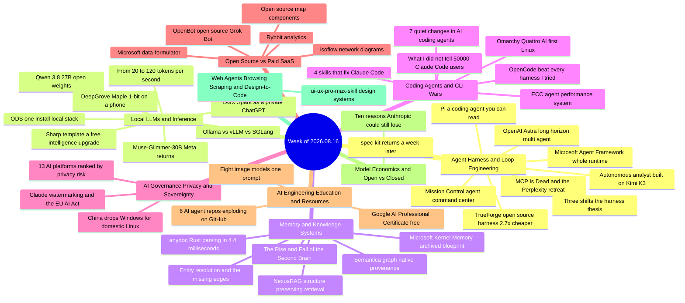

# Weekly Tech Digest — Week of 2026.08.16

*42 captures · [interactive knowledge graph →](./graph.html#2026.08.16)*

## This week's through-lines

**The harness stopped being plumbing and became the product.** The clearest statement of it is a forecast piece that says so outright — *"the value isn't the model, it's the harness"* — but the week supplied the evidence independently. TrueFoundry open-sourced TrueForge and published the number that makes the argument concrete: tied with Claude Managed Agents on DevRev's Enterprise-Bench, same model, at roughly a third of the tokens and ~40% fewer round trips, about 2.7× cheaper. Microsoft open-sourced its entire agent runtime (loop, compaction, resumable history, tool approval, file memory) as `agent-framework`. A one-year harness bake-off ends with OpenCode beating Claude Code. And Mario Zechner's Pi arrives as the deliberately small one — 82 lines to understand the core. The common claim underneath all four: the model is interchangeable, the runtime around it is where cost and reliability actually live.

**And the counter-current: MCP took its first serious public beating.** Perplexity dropped MCP internally and went back to plain APIs and a CLI, citing 72% of the agent's context window consumed by server schemas before the first request. The essay built on that ("MCP Is Dead") isn't anti-MCP so much as anti-deployment — it's fine inside your own perimeter, it was never designed to cross a trust boundary, and the failure mode is the weekend tool that ends up processing real money. Note the tension with the paragraph above: the same week that crowned the harness also questioned the protocol most harnesses use to reach tools. One caveat on weight: the forecast piece in the harness paragraph and this essay come from the same publication, and the forecast's seventh prediction is the same verdict in advance — *"MCP is a dead protocol for the internet."* Two articles, one editorial position, so treat it as one voice with a defector's data point rather than as independent corroboration.

**Governance showed up in the feed, not just the policy blogs.** Four captures, all ZDNET, all about who controls the stack: Anthropic began watermarking Claude's text output to comply with Article 50 of the EU AI Act (and watermark-removal repos appeared on GitHub within days); Incogni ranked 13 AI platforms by privacy risk and found the biggest platforms mostly the worst, with ChatGPT the exception; China ordered agencies off Windows 10 China Government Edition onto domestic Linux, moving the EOL date up; and a Linux distro shipped AI coding agents as first-class citizens while telling objectors *"there's a lot of anti-AI distro options."* That's enough weight, and enough distinct from "open source vs paid SaaS," to mint a theme this week (see the end).

**Open weights had a genuinely loud week — and the cheapest upgrade wasn't weights at all.** Meta came back with Muse-Glimmer-30B under Apache 2.0, Qwen shipped 3.8-27B alongside the 2.4T-parameter Max, DeepGrove's Maple claims 2024-frontier quality at 100+ words/sec on a phone, and ODS reduces the whole local stack to hardware detection plus one install. But the post that best captures the moment is the Sharp template: someone edited a chat template — no fine-tune, no retraining — and reports the same Qwen3.8-27B weights fixing post-cutoff bugs cleaner than Claude Opus 5 High. As one reply put it: *"Closed-source labs spending $100M on fine-tuning, only for a guy on LocalLLaMA to match Opus performance by editing a Jinja file."*

**Knowledge graphs got specific about how they fail.** The genre has finally moved past "put your documents in a graph." This week's best thread does arithmetic on it: entity resolution by naive string matching benchmarks around 70% on real corpora, which means one edge in three is silently missing, and the loss compounds by hop — 49% at two hops, 34% at three. Semantica answers with deterministic graph construction, conflict detection at ingest, and W3C PROV-O provenance on every fact. NexusRAG answers by refusing to flatten document structure. Microsoft's Kernel Memory is the reference blueprint for the whole shape — and was archived in June.

## Map of the week

## Agent Harness & Loop Engineering

### TrueForge — the harness argument with a benchmark attached

TrueFoundry open-sourced TrueForge, an MIT-licensed agent harness, and the post frames it as the thing Sam Altman argued for in July arriving a month later. The diagnosis is precise: a large share of an agent's token bill is the model re-reading things it already read, and that's the runtime's doing, not the model's — an agent that pulls 400 CRM rows at step four is still paying input rates to re-read them at step nineteen because the harness reassembles the whole conversation into every prompt. Four levers follow: load tool schemas on demand rather than shipping all 100 into every prompt; offload large results to disk and pass a preview plus a file path; delegate to subagents so thirty tool calls collapse into one returned summary; and run toolchains in code so one script joins three tools instead of three turns each dragging a full response. The second half is call frequency — skipping planning, verification, and reflection when the work doesn't need them. On DevRev's Enterprise-Bench, TrueForge and Claude Managed Agents completed the same number of tasks on the same model; the tie is the point, because it means the gap underneath isn't a quality tradeoff. TrueForge got there on close to a third of the tokens with ~40% fewer model calls, roughly 2.7× cheaper. Swapping in GLM-5.2 scored slightly higher than either, with the whole benchmark run costing about $3 at list prices.

*Why it matters:* this is the first time this year's harness argument has come with a same-model, same-score, one-third-the-tokens number attached — which is the only form of the argument that survives contact with a procurement conversation.

**Resources:** [truefoundry/trueforge](https://github.com/truefoundry/trueforge) · [TrueFoundry's TrueForge announcement](https://www.truefoundry.com/blog/engineering/trueforge-open-source-agent-harness/) · [VentureBeat coverage](https://venturebeat.com/orchestration/truefoundrys-open-source-ai-agent-harness-trueforge-boasts-30-75-cheaper-task-completion-than-claude-managed-agents) · [InfoWorld coverage](https://www.infoworld.com/article/4211969/truefoundry-debuts-open-source-ai-agent-harness-claiming-up-to-75-lower-costs.html)

### Microsoft open-sourced the whole agent runtime

The pitch is that a raw model only writes text, and everything that turns it into an agent — the loop, tools, memory, planning, approvals, and knowing when it's done — is a separate layer Microsoft has now shipped with everything on by default. What's in the box: an automatic tool-calling loop with iteration limits; history saved after every call so a crash resumes instead of restarting; context compaction that summarizes when the window fills; a persistent todo list plus plan and execute modes; file memory that survives across turns; tool approval with standing rules and auto-approval; OpenTelemetry tracing and web search built in; and Agent Skills that load domain expertise on demand. It runs against Azure OpenAI, OpenAI, Anthropic, and GitHub Copilot, hosts on Microsoft Foundry, and ships for Python, .NET, and Go, stable since mid-2026. One line to start: `create_harness_agent(client, name, instructions)`.

*Why it matters:* the feature list is a de facto spec for what "production harness" now means — and it lands the same week TrueForge argues the harness is where the money is and Perplexity argues the tool protocol underneath is broken.

**Resources:** [microsoft/agent-framework](https://github.com/microsoft/agent-framework)

### MCP Is Dead — the protocol's first serious autopsy

Written off the back of Perplexity announcing it was dropping MCP and returning to plain APIs and a command-line tool. The author isn't hostile — they use MCP daily with LangGraph and Strand — but the argument is that MCP is a hack that should never leave your local network, and that this isn't fixable by iteration. Simplicity is the selling point: an API for people who don't want to think about APIs, USB for agents. That works inside a trust perimeter. It doesn't work across one, because MCP was never designed to cross a trust boundary and therefore skips everything three decades of enterprise APIs learned the hard way — authentication, authorization, rate limiting, versioning, separation of concerns, audit trails, quality-of-service contracts. The piece is honest about what MCP genuinely solves: the natural-language layer gives you automatic discoverability, so adding Slack to a server makes it instantly available to an agent with no code change, turning months-long integration projects into plug-and-play. The two concrete failures: no contracts, so a non-deterministic system makes no promises about what it will do; and context scale — Perplexity found MCP server schema overhead consuming **72% of the agent's context window before the first request**. Enterprise APIs split discovery, command, and data into separate channels precisely because discovery doesn't change often and can be cached or compiled. The line that lands: *"You cannot run a bank the way a family business runs a cash till."*

*Why it matters:* MCP has had two years of uncontested adoption. This is the first well-argued case that its ceiling isn't a roadmap item, and it comes with a production defector and a number.

**Resources:** ["MCP Is Dead"](https://medium.com/the-leading-indicator/mcp-is-dead-1b24fe6a3e64) · [Repello AI on what Perplexity's move means for security teams](https://repello.ai/blog/mcp-vs-cli) · [Junia AI's write-up of the switch](https://www.junia.ai/blog/perplexity-mcp-vs-apis-ai-agents)

### Three shifts coming to AI in the next 12 months

The week's thesis piece, from the same publication as the MCP autopsy. **Shift one: the value isn't the model, it's the harness.** Developers are developing loyalties to harnesses, not models — vim vs. emacs — and the harness is the *deterministic* program wrapping the non-deterministic one: application logic, eval loops, context, security rails. Enterprises will build their own on LangGraph, CrewAI, or AutoGen, because "prompt engineering" was never a durable discipline and enterprise AI is just software engineering: translating processes into deterministic code. The most interesting prediction in this section is that document-based workflows, not agent-to-agent orchestration frameworks, become the workhorse — companies already run on documents, folders, and forms, each form is a human API, each updated document is an event, and the format already handles tracing, roles, and cross-org integration. **Shift two: the model becomes a commodity.** The frontier arms race is hitting real API bills as subsidies give way to true costs; models keep getting better while utility doesn't, and most of the world will run on cheap LLMs the way most of it runs on cheap CPUs. The second half is lock-in: hosted models are subsidized below true cost on a bet that inference gets cheap enough fast enough, and after lock-in the price goes up — at which point tasks you'd happily hand to AI today stop being cost-effective. So the structural advantage of a custom harness is **model independence**, and cost control becomes one of the harness's deterministic guardrails. The supporting example is Netflix already running its own LLM servers on open models for direct cost control.

**Shift three: the LLM is one part of a plural, networked system.** Two predictions here, and they're the least covered elsewhere. *The LLM is not a silver bullet* — the analogy is relational databases, which people used for message queues and file systems because they were adaptable, and the observation that teams are now pushing LLMs at prediction, recommenders, search, and data parsing where the older deep-learning, ML, NLP and predictive techniques still outperform them and cost far less. Multi-modal agents will use the full spectrum, with the LLM doing the fast flexible gluing rather than replacing the specialists. *Today's protocols are not the destination* — stated flatly as **"MCP is a dead protocol for the internet"**, with the author unsure the successor is A2A but certain that cross-organizational agent coordination will start from a protocol designed for security and scale rather than bolting them on afterward, as the internet did.

The conclusion ties it: value moves off the model onto the harness; the model becomes a commodity you run rather than rent; and what you build is a plural system of specialists coordinated through the most boring durable infrastructure available — documents. *"None of this is the AI the hype promised. It's better, because it's the AI that actually ships."*

*Why it matters:* it names, a week ahead of the evidence, exactly what TrueForge and Microsoft's runtime release then demonstrate. And prediction 7 is the same publication's MCP verdict arriving in forecast form — the two pieces in this digest that most directly agree with each other are these two, which is worth weighing when reading either.

**Resources:** ["Three Shifts Coming to AI in the Next 12 Months"](https://medium.com/the-leading-indicator/three-shifts-coming-to-ai-in-the-next-12-months-dc2e9c207d00) *(not paywalled; recovered in full)*

### Pi — the coding agent small enough to read

A counter-move to the week's other harness news: instead of shipping everything, ship the least. The framing is a complaint about learning materials — LangChain is too big to learn from, Claude Code is a polished commercial product whose source isn't meant to be read, and the minimal alternatives are usually a `while` loop with ambitions. Pi is positioned as *"a minimalist, extensible terminal coding Agent shell"* — about 6,800 words in its opening chapter and **82 lines of code** for the core understanding, concepts explained. The detail that earns attention: the author is Mario Zechner, who wrote libGDX. A game-engine developer writing an agent framework is a different set of instincts than most of this field brings. The write-up's own metaphor: not a ready-made car, a box of building blocks.

*Why it matters:* every harness this week is a big one. The pedagogical version matters more than it looks, because "the harness is the product" is only actionable if you can see inside one.

**Resources:** [Article (GitHubDaily)](https://githubdaily.medium.com/this-may-be-the-most-worthwhile-ai-agent-framework-to-learn-this-year-53dd35c6a5bd) *(member-only story with no author free link; the walkthrough of Pi's architecture was cut off by the paywall)* · [@mariozechner/pi-coding-agent on npm](https://www.npmjs.com/package/@mariozechner/pi-coding-agent) *(the post itself named no repo; package located by search)*

### OpenAI's Astra and the case for long-horizon orchestration

Astra is reported to have solved ten mathematical problems that had been open for over a decade, at roughly $2,000 in compute. The write-up's argument is that the math isn't the story — the architecture is. Astra is built for long-horizon tasks measured in hours or days, and instead of one large brain it operates as an orchestrator coordinating multiple independent agents in parallel: one plans, one executes sub-tasks, one evaluates the second's output. The reasoning given for that split is the practical one every agent builder recognizes: a single agent eventually drifts because its context window fills with dead ends, so you distribute the cognitive load. Every generated proof was formalized in Lean to guarantee correctness. The article's subtitle flags a cybersecurity incident when the system was given too much autonomy, which the recovered text sets up but does not reach.

*Why it matters:* it's the frontier-lab version of the same conclusion the open-source harnesses reached — capability now comes from the arrangement around the model, and the containment problem arrives with it.

**Resources:** ["OpenAI's New Astra Model Is Total Overkill"](https://ai.plainenglish.io/openais-new-astra-model-is-total-overkill-c87fdefee2f5) *(member-only story; the security-incident section was beyond the recovered text)*

### The autonomous analyst — and the reply that supplies the missing half

The claim: the first AI agent most companies should build is an autonomous competitor analyst, buildable on Kimi K3 — it watches competitors overnight, remembers every move, and surfaces launches, pricing changes, and positioning shifts. The post itself is a video and a call to paste the article into Kimi; the thread is where the engineering is. One reply makes the safety case well: an analyst is a good first agent precisely because its failure mode is *reviewable* — monitor, compare, summarize, surface evidence, all before anyone grants authority to act. Read-only intelligence is the safest on-ramp. The best reply names the actual hard part: *"The agent part is the easy half. The hard half is state: storing a normalized snapshot of each competitor so tomorrow's run diffs against yesterday instead of resummarizing the same page. Skip that and you get a digest that reports the same pricing page as news three times a week. Diff first, then summarize the diff."* A third adds the mechanism — diff the rendered DOM tree against yesterday's hash and hand the model the structural patch, not the raw HTML.

*Why it matters:* the diff-not-resummarize point generalizes to every scheduled agent, this digest's own pipeline included.

**Resources:** *(no link captured in the post; the referenced article was not included in the snapshot)*

### spec-kit, one week later, in Arabic

GitHub's Spec Kit surfaced again — second consecutive week, this time from an Arabic-language account, with the same "goodbye to vibe coding" framing and the same five-command flow: `/speckit.constitution` for project principles, `/speckit.specify` for what you're building, `/speckit.plan` for stack and architecture, `/speckit.tasks` for the task list, `/speckit.implement` to build. 30+ agents supported including Copilot, Claude, Codex, and Cursor; a claimed 125,000 stars. Two replies are worth the entry. The sympathetic one: most teams still don't know how to spec an idea before handing it to an agent, which is why this matters long-term. The sharp one, which is the same objection the tooling keeps failing to answer: *"a constitution file is still just text sitting in the context window. It guides the agent, it does not constrain it. Seen agents drift from their own spec the moment a later prompt contradicts it. Rules as markdown are not rules as code."*

*Why it matters:* spec-driven development is being adopted faster than it's being enforced, and two weeks running the replies have located the same gap — the spec is advisory until something in the build fails on it.

**Resources:** [github/spec-kit](https://github.com/github/spec-kit)

## Local LLMs & Inference

### The Sharp template — a free intelligence upgrade, no weights touched

Someone took Qwen3.8-27B and changed **only the chat template** — no fine-tune, no retraining — and reports the same weights fixing real post-cutoff bugs faster and cleaner than Claude Opus 5 High in their tests. It's called the Sharp template, it's free, and it drops onto any Qwen 3.5 / 3.6 / 3.8 model with llama.cpp. The model card for the GGUF that ships it fills in the mechanism and the numbers: it's a modification of froggeric's fixed Qwen template adding a terseness system prompt and disabling maximum-effort reasoning by default, embedded in GGUF metadata without altering weights. The claimed effect of the identical edit on the base model: **+7.4 points** on the Claw-Eval answer component to 66.7%, **59% fewer answer tokens** (5,393 → 2,217), and 22% fewer tokens per correct answer on MMLU-Pro — summarized on the card as "the same answers in a bit over half the words, with accuracy moving *up*." The replies are as good as the post. One pushes back usefully on the hardware claim: *"I can't get 3.8-27B to run on my MacBook Pro with standard M5 and 24 GB, so saying 22 GB of RAM is enough is a bit misleading unless you mean 22 GB on top of the RAM the system is already using."* Another reports pairing it with strict AST schema validation in local agent prompts for a ~70% drop in syntax-error retries. And the one that captures the week: *"Closed-source labs spending $100M on fine-tuning, only for a guy on LocalLLaMA to match Opus performance by editing a Jinja file."*

*Why it matters:* the cheapest available upgrade to a local model right now is not a new quant or new weights — it's the prompt scaffolding shipped alongside them, which almost nobody treats as a versioned artifact.

**Resources:** [peculiar-ragdoll/Dirk-Qwen3.8-27B-GGUF](https://huggingface.co/peculiar-ragdoll/Dirk-Qwen3.8-27B-GGUF) *(the post named no link; the template's model card was located by targeted search)* · [Original post](https://x.com/itsharmanjot/status/2090033437533213079)

### Qwen 3.8-27B goes open-weights alongside the 2.4T Max

The framing is a deliberate inversion of the headlines: Alibaba's Qwen3.8-Max is the spectacle, but the 27-billion-parameter open-weight model is the one developers will actually run. Both landed on Hugging Face and ModelScope after a one-sentence announcement from the official Qwen account — *"Next week, the open weights of Qwen3.8-Max will be released, and Qwen3.8-27B is also going open-weights to meet you all!"* — with Max at 2.4 trillion parameters. The article's case for the 27B is ownership rather than benchmarks: it's the model that can leave the cloud.

*Why it matters:* the 27B is the size class that anchored three separate entries this week — the Sharp template, the DGX Spark build, and the Meta comparison below all revolve around it.

**Resources:** [Qwen/Qwen3.8-27B](https://huggingface.co/Qwen/Qwen3.8-27B) · [Qwen/Qwen3.8-2.4T-A95B](https://huggingface.co/Qwen/Qwen3.8-2.4T-A95B) · [The Qwen announcement post](https://x.com/Alibaba_Qwen/status/2084100707423289643) · [Article](https://medium.com/@rosgluk/qwen-3-8-27b-is-coming-and-it-could-be-the-most-important-local-ai-release-of-2026-c1cf381d5292) *(member-only story with no author free link; the hardware and quantization sections were cut off by the paywall)*

### Muse-Glimmer-30B — Meta comes back to open weights

No press conference, no pre-announcement, just a Hugging Face drop: a dense 30-billion-parameter multimodal model under **Apache 2.0** — fully permissive, no restrictions, no API keys. Meta's own benchmarks claim it beats Qwen3.6-27B on most agentic tasks and comfortably clears Gemma4-31B. The author is explicit about not vouching for those numbers, only reporting them, and frames the release against Llama 4's launch and the long silence from Meta Superintelligence Labs that followed. Corroborating sources found by search describe it as optimized for local, always-on agent workflows and designed to run on-device.

*Why it matters:* the open-weight tier that mattered this year has been almost entirely Chinese. A permissively licensed 30B from Meta changes the shape of that conversation, if the benchmarks survive contact with independent testing.

**Resources:** [meta-models/Muse-Glimmer-30B](https://huggingface.co/meta-models/Muse-Glimmer-30B) · [Meta AI Research announcement](https://research.meta.ai/blog/introducing-muse-glimmer-open-agentic-model) · [VentureBeat coverage](https://venturebeat.com/technology/meta-returns-to-open-source-with-muse-glimmer-an-apache-2-0-licensed-30b-parameter-ai-model-optimized-for-agents-available-now) · [Article](https://xhinker.medium.com/muse-glimmer-30b-can-metas-new-open-weight-model-surpass-qwen-s-27b-model-abfeaa63c12a) *(member-only story; the technical-detail and hardware-requirement sections were beyond the recovered text)*

### 1-bit models and DeepGrove's Maple

The argument is the familiar one — LLMs are software that demands hardware most people can't afford, which forces trust onto companies with every incentive to monetize your data — but the exhibit is new. DeepGrove, a startup the author hadn't heard of, released **Maple**, claimed to run at 200+ words/second on a Mac Mini and 100+ words/second on an iPhone or comparable phone, while beating the state of the art from less than two years ago — models like OpenAI's o1, September 2024's best in the world.

*Why it matters:* if the claim holds, the meaningful threshold isn't "a small model that's almost good enough" — it's 2024-frontier quality on a phone, which is the point at which privacy stops costing capability.

**Resources:** [DeepGrove Maple preview](https://deepgrove.ai/maple-preview) · [Article](https://medium.com/@ignacio.de.gregorio.noblejas/why-1-bit-ais-are-a-big-deal-and-they-are-here-3320fcb97fe4) *(member-only story; the technical section on the quantization approach was cut off)*

### A DGX Spark turned into a private ChatGPT

NVIDIA shipped the author a DGX Spark and they built the thing most people describe wanting and few finish. The Spark is a small gold box around the GB10 Grace Blackwell superchip with **128 GB of unified memory**, so a 17 GB model leaves enormous headroom for context; it runs headless under the desk over SSH, and Ollama installed without drama. The model is Qwen3.6 27B, chosen for two properties that shaped the app: image input, and a real thinking toggle where `think: false` genuinely skips the reasoning phase rather than hiding it.

The architecture is the payoff, and its defining quality is how little there is: one FastAPI process talking to Ollama over HTTP, relaying to the browser over SSE, with SQLite in WAL mode underneath — no queue, no cache server, no worker pool. **About 3,100 lines total, no framework, no build step, no npm.** The stated reason is that this is software meant to run under a desk and be read end to end by one person.

Most of the engineering went into a problem the author framed as one uncomfortable question: *can a message disappear on its way to the model?* The answer was yes, in three distinct places, each needing a different repair. The question is written to `localStorage` before it leaves the browser; the server stores it and immediately returns a **receipt frame** carrying the chat id, at which point the client clears the local draft. That receipt is the signal that separates the three cases — a client that never saw it knows nothing was stored and can safely resend, while one that did knows the question is on disk and switches to regenerate-or-reload instead. A `finally` block closes every turn regardless of how it ended, writing partial text to the database and releasing the chat's turn lock, which is why a stopped generation keeps its output and a dropped connection never loses an in-flight answer. One more detail worth stealing: the stream is never allowed to go idle — an SSE comment frame every 10 seconds, invisible to the client parser, which every proxy counts as traffic. Without it, ngrok and mobile carriers kill the connection while a large model is still loading, before the first real token.

The web-grounding pipeline adds 3–8 seconds in four stages: rewrite the question into a standalone keyword query (temperature 0, 40-token cap, thinking off, falling back to the raw text on any failure); search via `ddgs` across DuckDuckGo, Google, Brave and Mojeek while impersonating a real browser's TLS fingerprint (a plainly scripted request gets a bot check); fetch the top seven in parallel, capped at 12s and 2MB each with a 25s budget for the phase; then feed extracts to the model at 3,200 chars per page and 24,000 total, per-page cap applied first so one rambling page can't crowd out the other six. **Placement mattered more than expected:** the block sits immediately before the question rather than in the system prompt, because with a long history the system prompt is far away and models weight what sits next to the question. Context is raised to 16,384 for that turn only.

The security work is unusually thorough for a hobby project: PBKDF2-HMAC-SHA256 at 200,000 rounds, HMAC-signed session cookies, login throttling with a dummy-hash comparison so an unknown username isn't detectably faster than a wrong password, ownership checks written into the SQL rather than an `if` after the fetch, and 404-not-403 on unreachable chats so id guessing can't distinguish "not yours" from "doesn't exist". Plus an **SSRF guard**: every search result's hostname is resolved and checked before fetching, with private, loopback, link-local, reserved and multicast ranges refused, so a poisoned search result can't turn the page reader into a LAN probe. The author is equally clear on limits — single process, single SQLite file, no HTTPS of its own, heuristic page extraction, regex-based auto-search — and notes the code isn't public yet.

*Why it matters:* the two features they had to build (cross-session memory and cited retrieval) are exactly what hosted assistants ship by default. But the durable content is the recovery design and the SSRF guard — the parts every "build your own ChatGPT" tutorial omits and every real deployment needs.

**Resources:** [Article](https://www.towardsdeeplearning.com/nvidia-sent-me-a-personal-supercomputer-i-turned-it-into-my-private-chatgpt-cf91c2a2ce19) *(member-only story; recovered in full via the author's published free link)* · [NVIDIA DGX Spark](https://nvidianews.nvidia.com/news/nvidia-dgx-spark-arrives-for-worlds-ai-developers) · [ddgs](https://pypi.org/project/ddgs/)

### From 20 to 60–120 tokens/sec — a local workstation that survived contact with real work

A year of local inference described honestly: it disappointed more often than it delivered, and when real work had to be done the author still reached for cloud subscriptions. What changed wasn't enthusiasm but economics — *"the amount of money that used to cover a month of work can now disappear in a day."* The hardware section rejects both the stacked-Mac-Pro flex and the Raspberry Pi novelty and states four rules instead: **VRAM capacity first** (model plus context must fit; 32GB and 48GB are the economically achievable sweet spots); **multiple GPUs are about fitting more, not running faster** (a second card buys VRAM, and distribution adds communication overhead — expect a penalty, not a speedup); **topology matters** (you want the GPUs behind the same PCIe switch or on CPU-connected lanes, not routed through the chipset); and **power and cooling are part of the design**. The insight that follows is the practical one: that second rule is hard to satisfy on consumer boards, where two physical slots don't imply a good path between them — but used Xeon business workstations have the lanes and factory 1kW+ PSUs and were built for multiple pro GPUs, often cheaper than an equivalent modern consumer platform. The build: two RTX 5060 Ti 16GB (cheapest route to 32GB VRAM, good power efficiency) in a used Xeon workstation, **about $1,100 total**, with one card zip-tied to the case on a PCIe extension because it didn't physically fit.

The performance ladder is three specific steps, all on Qwen3.6-27B: **~20 t/s** on a naive model/layer split under LM Studio with flash attention on; **~50 t/s** switching to tensor parallelism (splitting each layer across both GPUs rather than assigning layer ranges, which trades cross-GPU reductions per layer for lower latency); and **~60 t/s** average after replacing llama.cpp's internal AllReduce with NVIDIA's **NCCL**. The surprise finding: the prebuilt llama.cpp runtime shipped with the LM Studio version tested had NCCL support compiled out. Peak generation runs to ~84 t/s with prompt processing near 950–970 t/s, and Gemma-4-26B-QAT is roughly twice as fast again.

The ending is what makes this worth reading, because the author does the payback arithmetic and it doesn't flatter his own build. At $0.36/$2.80 per million input/output tokens, a 15:1 coding read/write ratio and sequential prompt-processing, the machine displaces about **$0.775 of API usage per hour of actual inference** — so $1,100 of hardware breaks even at roughly **1,420 hours**, before electricity, maintenance, or failures. His verdict: *"if you are looking only at local inference as an AI assistant, the economics are not particularly convincing."* It only turns over once you run agentic orchestration and semi-autonomous pipelines that keep the machine busy — in his case around 12 hours a day.

*Why it matters:* it's the clearest statement this week of what's driving local adoption (subscription limits tightening faster than usage falls) and simultaneously the most honest rebuttal of it — local inference doesn't pay for itself as a chat box, only as a pipeline that never idles.

**Resources:** [Article](https://tinkerd.medium.com/from-20-to-60-120-tokens-s-building-a-local-ai-workstation-that-actually-works-a65a1f0e1ff9) *(member-only story; recovered in full via the author's published free link)* · [NVIDIA NCCL](https://developer.nvidia.com/nccl)

### ODS — hardware detection as the actual unlock

Install ODS, let it detect your hardware, and it downloads the best model for that hardware, then starts local inference and Open WebUI for you. From there it adds voice, agents like Hermes, workflows, RAG, search, and image generation, all managed from one dashboard, turning a PC, Mac, or Linux box into a private AI server with no cloud and no subscription. The replies are the reason this is a full entry rather than a quick hit — they're split cleanly between the thesis and the reality. For: *"Hardware detection doing the model pick is the part that removes the actual barrier. Most people who bounce off local inference bounce at choosing a quant, not at installing anything."* Against, from an actual user: switching models fails and requires reinstalling from zero, updates don't update, and any edit to `.env` to add API keys breaks the install. Another installed it fine, saw it correctly detect an NVIDIA card, and then found the dashboard and Hermes running everything on CPU. And the most useful forward-looking reply asks the question the whole category dodges: once agents are in the stack, how do you tell whether a smaller local model is good enough for a given task? Their answer — a short golden set per workflow beats benchmark scores, because tool calls are where small models slip first.

*Why it matters:* the framing is right (quant selection, not installation, is where people bounce) and the bug reports are specific enough to be actionable — this is a reply thread doing the work a README won't.

**Resources:** [Osmantic/ODS](https://github.com/Osmantic/ODS)

## Memory & Knowledge Systems

### A 100-node graph has 4,950 possible edges. Your pipeline found 300.

The best piece of knowledge-graph writing this week, and it's a single thread with no product attached. The gap between 300 extracted edges and 4,950 possible ones isn't missing data — it's *edges nobody wrote down because they were obvious to whoever wrote the doc*. Entity resolution is where most of them die: same company, four spellings, four nodes, zero connection. Naive string matching benchmarks around **70% on real corpora**, so one edge in three is silently absent — and the loss compounds by hop: 70% over two hops is 49%, three hops is 34%. The diagnosis that follows is the useful part: your traversal isn't failing on the query, it's failing on a merge that didn't happen at ingest. The prescribed fix is deliberately unglamorous — blocking, then embedding similarity, then a model only on the ambiguous pairs, which is usually under 5% of candidates and therefore affordable. Then degree distribution: a handful of hub nodes touch everything and drag noise into every walk, so **cap traversal by degree, not relevance** — two hops answers most questions, three returns your whole database. The closing test is one anyone can run today: count the distinct entities in your graph, then count how many you actually have; the gap is your real accuracy.

*Why it matters:* every graph-RAG product this year sells traversal. This is the arithmetic showing that traversal quality is decided at ingest, before any of that machinery runs.

**Resources:** *(no link captured in the post — it is a standalone thread with a video)*

### Semantica — provenance as first-class infrastructure

An open-source infrastructure layer that sits *underneath* your existing LLM, vector store, and agent framework as a **deterministic** layer — no LLM required for graph construction, reasoning, or provenance. The problem it names: most agents act without a trail. They process context, decide, and move on, with no structured record of what was used, what was ruled out, or what reasoning led where. Fine for a chatbot; not fine for consequential decisions. Three additions to the stack: every decision becomes a first-class graph node, traceable and searchable by precedent and causally linked to what came before and after, so "why did the agent do that?" becomes a structured query; conflicting facts are detected *before* entering the graph and resolved deliberately instead of silently overwritten; and every fact carries **W3C PROV-O provenance** — source, extraction time, confidence, extractor — exportable in a format compliance frameworks accept. Underneath: forward chaining, Rete, Datalog and SPARQL for fully explainable paths, point-in-time snapshots for time travel, and entity resolution and semantic deduplication at scale. Polyglot storage across RDF triple stores and LPG (Neo4j, FalkorDB, Apache AGE), with an MCP server, REST API, and native plugins for Claude Code, Cursor, and Codex. The best reply extends rather than disputes it: *"Traceability explains the path. Governance determines whether the path was legitimate"* — knowing what produced a decision answers "why did this happen," but not whether the decision was authorized and admissible under the conditions that existed at the time.

*Why it matters:* it's the same week's governance current arriving in the infrastructure layer — and the entity-resolution entry above is precisely the failure Semantica's deterministic ingest is built to prevent.

**Resources:** [semantica-agi/semantica](https://github.com/semantica-agi/semantica) *(the post said "link in the comments"; no link was captured — repo located by targeted search)* · [Original post](https://x.com/Sumanth_077/status/2088638226177380592)

### NexusRAG — keep the structure, keep the citations

A hybrid RAG system built on the premise that most pipelines flatten documents and lose exactly what makes an answer checkable. Retrieval runs vector over-fetch and knowledge-graph entity lookup (LightRAG) **in parallel**, then reranks candidates with `BAAI/bge-reranker-v2-m3`. Parsing switches between Docling and Marker while retaining headings, page boundaries, tables, and images; images get captioned and tables summarized before that context joins the page chunks, so visual content is searchable rather than dropped. Citations are clickable and carry short inline IDs with filename, page number, heading path, and document-viewer navigation. Generation runs on Gemini or Ollama, with sentence-transformers available for fully local knowledge-graph embeddings. The sharpest reply gets the architecture right: hybrid retrieval increases candidate *coverage*, but reranking is what decides which candidates earn scarce context-window space — optimize recall first, then precision before generation.

*Why it matters:* structure-preserving parsing plus heading-path citations is the combination that makes a RAG answer auditable rather than merely plausible, and it's still rare.

**Resources:** [LeDat98/NexusRAG](https://github.com/LeDat98/NexusRAG) *(the post said "link in the reply"; no link was captured — repo located by targeted search and matched on its stated feature set)*

### Microsoft's Kernel Memory — the blueprint everyone keeps rebuilding, and it's archived

A complete RAG pipeline that turns a pile of files into an AI memory that answers with citations: ingest PDFs, Word, PowerPoint, Excel, web pages and images; extract, chunk, and embed; store vectors with metadata while keeping originals in blob storage; then answer questions by pulling the right chunks with semantic plus hybrid search, returning a grounded answer with links to the exact source and full token usage. It's deliberately swappable at every layer — Azure OpenAI, OpenAI, Ollama or Anthropic for models; Qdrant, pgvector, Redis or Azure AI Search for vectors; every step a replaceable handler. One command to run: `docker run kernelmemory/service`. The post is straight about the catch, and it's a significant one: **Microsoft archived the repo in June 2026** and ships it as a reference blueprint, not production software.

*Why it matters:* an archived reference implementation from Microsoft is still the cleanest published map of how RAG and agent memory actually fit together — which says something uncomfortable about how much of this ecosystem is being rebuilt from scratch each time.

**Resources:** [microsoft/kernel-memory](https://github.com/microsoft/kernel-memory) *(archived June 2026 per the post)*

### anydoc — 14 document formats to Markdown in 4.4 milliseconds

Firecrawl open-sourced anydoc, a pure-Rust document parsing engine. The comparison that gives it the headline: converting a docx through LibreOffice and feeding it to a model could leave a report queued for over a second before any manual work; anydoc reports a **median of 4.4 ms**, covers 14 common formats, and outputs unified GitHub-flavored Markdown. The design choice underneath is a single document model — Word, PowerPoint, Excel, OpenDocument, RTF, EPUB, CSV, and PDF all parse into it and serialize out the same way, so a legacy 2003 `.doc` and a `.pptx` exported yesterday produce identical treatment of heading levels, merged cells, footnotes, and task lists. It runs locally with no external services and no ML models, and already powers Firecrawl's own Parse endpoint, with scanned PDFs routed through additional OCR.

*Why it matters:* document ingestion has been the reliably slow, reliably ugly first step of every RAG pipeline for three years. Two orders of magnitude, locally, with format-independent output, is the kind of boring improvement that quietly changes what's practical to ingest.

**Resources:** [firecrawl/anydoc](https://github.com/firecrawl/anydoc) · [Firecrawl's announcement post](https://www.firecrawl.dev/blog/anydoc-and-pdf-inspector) · [Article](https://githubdaily.medium.com/250x-faster-than-libreoffice-pure-rust-document-parsing-powerhouse-anydoc-boosts-document-parsing-c16ab607b743) *(member-only story with no author free link; the benchmark tables were cut off by the paywall — the 4.4ms and 250x figures above are from the visible portion and are corroborated by Firecrawl's own announcement)*

### The Rise and Fall of the Second Brain

The counterweight to every knowledge-system entry above. Four note apps in five years, looking for the one that would finally make the author smart. In 2022: roughly 1,900 saved notes and no ability to say what was in a single one of them. *"I opened the graph view, watched the little constellation of dots glow, and felt like a genius. Then I closed the laptop and went to bed no smarter than I woke up."* The list of things people do instead of thinking is short and accurate: install a new app whenever the old one feels heavy, watch a two-hour tutorial on someone else's tagging system, highlight a book and feel you've absorbed it, save the article to read later where later never comes. The cost isn't the subscription — it's *"the winter I spent tagging things I never reopened while my actual work sat untouched."*

*Why it matters:* it lands in a week where four separate captures sell knowledge infrastructure, and it's the only one asking whether accumulation was ever the bottleneck. A full vault and an empty one think exactly the same.

**Resources:** [Article](https://medium.com/health-science/the-rise-and-fall-of-the-second-brain-30d164b56750) *(member-only story; the recovered text ends at the diagnosis, before whatever the piece proposes replaced it)*

## Coding Agents & CLI Wars

### Why OpenCode beat every other coding harness I tried

A year of testing across Gemini CLI, Claude Code, Kiro, Antigravity, and OpenCode, and the winner isn't Claude Code. Four or five months ago the author would have said Claude Code or Codex without hesitation: those labs had the strongest agentic-coding models, finished tasks in fewer tokens, and their subscriptions beat raw API pricing. What changed is the open-weight tier, and the piece puts numbers on it. **GLM 5.2** (Z.ai, mid-June, ~750B MoE, plain MIT) performs comparably to Opus 4.8 while costing $0.6 less per million input tokens and **$20.6 less per million output**. **Kimi K3** (Moonshot, mid-July, 2.8T) is comparable to Fable 5 at $7.0 less input and **$35.0 less output** per million — and takes the top spot on the community-voted Frontend Code Arena, ahead of every closed model. The author is careful about where the gap remains: Opus 4.8 still wins on aggregate benchmarks, and the difference *is* visible when one-shotting an entire app or game from scratch. But that isn't how most developers work — debugging, refactoring, writing tests, exploring unfamiliar code — and across that slice the capability difference no longer justifies the price. *"'Still ahead on the hardest slice of tasks' and 'worth several times the price for everything else' are two different claims."*

The harness choice came down to Pi or OpenCode, and the tiebreaker is a preference worth noting: after a year of CLI/TUI agents the author decided he didn't want the agent *in* his IDE at all. A separate GUI is easier to navigate, better for reviewing diffs, tool calls, and reasoning, and supports remote environments and mobile control. OpenCode (built by the Anomaly team since mid-2025, now 190,000+ stars) has a desktop app in beta alongside its CLI and TUI. It's also **human-first** by design: Plan mode is read-only and asks before touching your shell, Build mode writes code, and you flip between them with one keystroke — the agent never acts fully autonomously. That's set explicitly against **agent-first** platforms where you brief an orchestrator that spawns sub-agents: *"Most of what I build doesn't need five agents managing themselves in parallel. It needs one agent I can steer and supervise directly."*

The economics are the most concrete part. OpenCode Go is $10/month for $60 of raw API credit, chosen over Ollama Cloud Pro and Z.ai Lite on user reports of downtime and lag at the alternatives. The resulting workflow is model-routing by task: GLM 5.2 for planning and hard implementation, DeepSeek V4 Pro and MiniMax M3 for standard coding, free DeepSeek V4 Flash for chat. Daily spend ran $3–4, no downtime in two months — until the project passed 20,000 lines and the weekly ceiling started binding, at which point the recommendation becomes a hybrid: Go as the base, Zen pay-as-you-go credits for overflow. Aside worth keeping: he advises skipping OpenRouter for pay-as-you-go and points at Neuralwatt instead.

*Why it matters:* it's the harness thesis arriving as a switching decision with a bill attached — and the human-first vs. agent-first distinction is the clearest articulation this week of why not everyone wants the orchestrator everyone else is building.

**Resources:** [OpenCode](https://opencode.ai/) · [Article](https://pub.towardsai.net/why-opencode-beat-out-every-other-ai-coding-harness-i-tried-4f1d60922303) *(member-only story; recovered in full via the author's published free link)*

### What I didn't tell 50,000 people who set up Claude Code

A follow-up to a widely used setup guide, written six months later by someone who lived with their own configuration. Setup is the easy 20%; a serious stack works perfectly on day one and then **drifts without ever telling you**. The three failures, each with a mechanism:

**Memory that rots.** There are two memory systems, and most people who followed the original guide have never opened the second. Yours is `CLAUDE.md` plus path-scoped rules. Claude's is auto-memory at `~/.claude/projects/<project>/memory/` — machine-local, outside the repo, shared across every git worktree, writing itself since your first command. Two failure modes follow. *Truncation:* `MEMORY.md` loads only the first 200 lines or 25KB; past that, writes still succeed but the overflow is dropped on next load with no terminal warning. *Poisoning:* stale notes outlive the corrections that should have killed them — tell it to use UUIDs, hit the performance cost a week later, revert the code, and the next migration still comes back with UUIDs because the old instruction survived every context clear. The fix is to organize memory by *how it loads*, not what it contains: a small always-loaded index pointing at a large greppable trail, with tiers 2 and 3 free until explicitly searched. And the correction that matters most: **`CLAUDE.md` is not a system prompt.** It's delivered as a user message after the system prompt, so it's early text in a long conversation with no guarantee of compliance, and conflicting rules resolve arbitrarily. Anything load-bearing — "never drop a database", "never bump the model without running evals" — belongs in a `PreToolUse` hook that intercepts at the system level. `CLAUDE.md` is for style.

**Connectors that lie.** The green "connected" label may just be pinging the web platform. Even working connectors have structural ceilings: a Slack connector reads channels and threads only inside a conversation you actively start — it cannot watch a channel in the background or triage an alert while you get coffee. The worst version is scheduled runs, where the agent reports it has no Gmail tool available, doesn't crash, and politely gives up: the runtime dropped the connector tools even though `permitted_tools` looks correct.

**Subagents that hallucinate success.** In headless mode (`-p`), any tool call that would need human approval is auto-denied. The model, lacking a strict error path for that denial, continues anyway — assumes the write succeeded, invents a summary of what it *intended* to write, and finalizes. You check the logs, see "changelog updated successfully", run `git status`, and the tree is clean. The prescribed defense is plain-text-first: make the filesystem the source of truth, treat connectors as a fragile edge, and verify headless work against `git diff` because a generated summary is not proof of execution.

There's also a rhythm section with two rules worth stealing: if you've corrected the assistant twice on the same issue, stop and `/clear` — you're now fighting a context window full of failed approaches. And run `/compact` manually around **60%** usage, steering it (`/compact keep: the auth token logic`), because at 95% the summarizer no longer has room to read the full history and write a good summary — and if you let it fill completely you hit compaction deadlock, where the session is too long to continue *and* too long to compact, leaving `/clear` as the only exit.

*Why it matters:* silent degradation is the hardest class of bug to notice and the least covered in agent tooling. "Subagents that report success for work they never did" is a sentence worth putting on a wall — and "CLAUDE.md is a user message, not a system prompt" is the correction most setups are built without.

**Resources:** [Article](https://medium.com/data-science-collective/i-helped-50-000-people-set-up-claude-code-heres-what-i-didn-t-tell-them-1e9a9e936b74) *(member-only story; recovered in full via the author's published free link)*

### ECC — 262 skills, an agent security scanner, and a claimed 213,000 stars

A Spanish-language post about ECC ("Everything Claude Code"), pitched as neither model nor app nor framework but *the system that makes your AI agent work better*, packaging in one repo what the best users of Claude Code, Codex, Cursor, and OpenCode have converged on. ECC 2.0 as described: **262 public skills** across coding, research, security, media, enterprise and agent workflows; **AgentShield**, which scans a Claude Code configuration for vulnerabilities, injections, and exposed secrets; a red-team/blue-team mode running three Opus agents in parallel as attacker, defender, and auditor; 1,282 tests at 98% coverage with 102 static-analysis rules; shared memory across agents with compressed cross-session context; and compatibility with Claude Code, Codex, Cursor, OpenCode, Gemini, Kiro, and Zed so the same skills run everywhere without rewriting. MIT-licensed, 14 releases, built by Affaan Mustafa at the Anthropic × Cerebral Valley hackathon using Claude Code — and the 2.0.0 release, per the post, automated itself end to end, Discord bot, announcements, and deploy. The goal in one line: stop rewriting the same prompts and turn behavior that already works into portable infrastructure.

*Why it matters:* AgentShield is the interesting half. A scanner for prompt injection and leaked secrets *in your agent's own configuration* is a category that barely existed six months ago and follows directly from treating agent config as infrastructure.

**Resources:** [affaan-m/ECC](https://github.com/affaan-m/ECC) *(the post embedded a video rather than the repo URL; located by targeted search — the star count is the poster's claim and other sources report different figures)*

### 4 skills that fix 95% of Claude Code's problems

The premise is a fair complaint from a paying user: Claude Code writes code well but drops the ball when asked to watch a video, remember a 10,000-file repository, or design a front end that isn't the same purple gradient and rounded icon tile everyone else gets — and at $100/month those shouldn't be open problems. Four free open-source tools, each aimed at one gap: **video**, **front-end design**, **memory**, and **research**. The recovered text reaches only the first — Claude Video, which gives Claude Code the ability to watch video, since out of the box it cannot.

*Why it matters:* the four gaps named are a decent map of where a general coding agent stops being general, and the "same purple gradient" complaint is the design-taste problem three other captures this week also circle.

**Resources:** [Article](https://divadsanders.medium.com/4-skills-that-fix-95-of-claude-codes-problems-hero-claude-stack-440b6a55bd74) *(member-only story; three of the four tools were beyond the recovered text and are not named here)*

### 7 things that quietly changed about AI coding agents in July

Explicitly not another ranking — the argument is that every monthly roundup covers the same three or four launches at the wrong altitude, while the real changes live one layer down in pricing decisions, benchmark policy, product boundaries, and access, arriving as changelog entries and support-forum threads rather than launch posts. The one item fully recovered is the most consequential: **OpenAI stopped trusting the benchmark it built.** It audited SWE-bench Verified — the 500-task human-curated benchmark it had championed since 2024 — with consequences that kept surfacing through July. The author calls it the most under-discussed shift shaping how anyone should read a benchmark chart this year.

*Why it matters:* SWE-bench Verified is the number in nearly every coding-model announcement, including two in this digest. Its own author auditing it is the kind of change that should propagate to how every one of those figures is read.

**Resources:** [Article](https://medium.com/beyond-localhost/7-things-that-quietly-changed-about-ai-coding-agents-in-july-2026-291f2526438d) *(member-only story; six of the seven items were beyond the recovered text)*

### Omarchy Quattro — a Linux distro that picked a side on AI

ZDNET's review of one of the first Linux distributions to go all-in on AI, and the developer's framing is unusually direct: *"Omarchy is leaning fully into the future and the age of agents. This is how we truly democratize Linux... If that's not your jam, there's a lot of anti-AI distro options."* The implementation is more restrained than the rhetoric. Every major coding-agent CLI is pre-wired as a lazy-loaded launcher — tiny mise-managed stubs in `~/.local/bin/` so nothing downloads until first run — and the manual's phrasing is that Omarchy treats AI coding agents as first-class citizens without picking a favorite. Local AI is a menu item: Install → AI → LM Studio, chosen over Ollama for the GUI, and it runs alongside the CLI agent. The genuinely novel features are OS-level: a top-bar agent icon appearing the first time AI coding use is detected, tracking subscriptions, plan, usage percentage, weekly limits, and token usage by day and by model; and `systemd-coredump` watched by AI, so a segfault raises a "Process crashed" notification that hands the core dump to your default agent via a built-in `diagnose-crash` skill that decides whether it's worth reporting. Agent skills also tailor the system itself — Hyprland config, top bar, themes. The reviewer's honest verdict is that it's for developers, not average users: Hyprland demands memorized keybindings, Gemini setup put an auth browser window behind an overlay he couldn't reach until a third app forced a retile, and Google account login failed so he had to create an API token instead.

*Why it matters:* subscription usage in the system tray and crash dumps auto-routed to your agent are the OS quietly assuming you have an agent — the first captures this year of AI as a *desktop-level* default rather than an app.

**Resources:** [Omarchy](https://omarchy.org/) · [ZDNET review](https://www.zdnet.com/article/omarchy-quattro-linux-distro-power-users-ai/)

## AI Governance, Privacy & Sovereignty

### Claude's watermarks, the EU AI Act, and the argument about whose words they are

Anthropic began watermarking text output from several Claude models to comply with **Article 50 of the EU AI Act**, which requires transparency tools for AI-generated content — and public outrage multiplied about as fast as the watermark-removal repos that appeared on GitHub. Anthropic's follow-up guidance explains the mechanism: LLMs pick each word probabilistically, and watermarking replaces the arbitrary random number generator with one seeded by a key plus the preceding words, so "the words Claude picks are still random, but one can check the sequence and see if it's consistent with the choices Claude would make using the key," yielding a probability the text was Claude-generated. Anthropic's stated bound is that the watermark attaches only to words Claude chooses, so lightly edited or proofread human text carries little or nothing — with no guarantee. The dissent worth reading is John Gruber's, the co-creator of Markdown, who rejects the premise that these are "low stakes" synonym choices: *"The exact words we choose when writing matter. I want any LLM I use to choose the very best, most precise words at every single decision point."* His sharpest line — *"the idea that anything other than my needs should factor into the generation of text for me is patently offensive"* — is where the ZDNET author breaks with him, arguing Claude is a product owned by a tech company and was never optimized solely for the user, and that expecting otherwise is a logical fallacy regardless of how well it's been marketed.

*Why it matters:* this is the first time an EU AI Act provision has changed the actual token stream a general audience receives — and the removal tools shipping within days is the more durable signal about how provenance requirements will land.

**Resources:** [Anthropic's watermarking announcement](https://www.anthropic.com/news/claude-text-watermark) · [Anthropic's guidance on how it works](https://support.claude.com/en/articles/16266773-how-claude-marks-ai-generated-content) · [John Gruber's rebuttal](https://daringfireball.net/2026/08/anthropics_watermark_text_adulteration_in_claude_is_a_perversion_of_writing) · [EU code of practice on AI-generated content](https://digital-strategy.ec.europa.eu/en/policies/code-practice-ai-generated-content) · [ZDNET article](https://www.zdnet.com/article/how-to-avoid-claude-watermarking-your-content/)

### 13 AI platforms ranked by privacy risk — and the biggest are mostly the worst

Incogni's "Gen AI and LLM Data Privacy Ranking 2026" scores ChatGPT, Claude, Gemini, Grok, Vibe (formerly Le Chat), Perplexity, Qwen, DeepSeek, Z.ai, Kimi, Meta AI, Pi, and Copilot across three question groups: what happens to user data (is it trained on, can you opt out, is it shared), whether policies are findable and comprehensible, and what personal data is gathered and where it goes. Lower is better. The headline finding is that the largest platforms pose the greatest risk **with one exception** — Gemini and Meta AI score among the worst, while Vibe, ChatGPT, and Pi score best. Ranked lowest to highest risk as summarized: Mistral's Vibe (clear policies, privacy-friendly apps, minimal third-party sharing), ChatGPT (simple policy, straightforward training opt-out, explicit about security/marketing sharing), Inflection's Pi (complex policy, separate EU handling, possible sharing with commercial and research partners), Perplexity (easy but thin policy, easy opt-out, sharing with affiliates), Qwen (unclear what's shared and whether conversations train models), DeepSeek (open weights let data stay local; hosted versions "more serious"), Z.ai (same open-weight caveat, ambiguity around training), Gemini ("partial" policy defaulting to Google's general one, atop everything Google already collects), Claude (extensive policy and resources, claims no training on user data by default, but its July 2026 policy suggests users now have to opt out), Grok (trained on public X conversations as well as Grok data, sharing with affiliates), and Kimi. Disclosure noted in the article: ZDNET's parent, Ziff Davis, has an April 2025 suit against OpenAI.

*Why it matters:* it's a rare cross-vendor comparison scored on policy *legibility* as well as practice — and the DeepSeek and Z.ai entries make the argument for open weights on privacy grounds rather than cost.

**Resources:** [Incogni's Gen AI and LLM Data Privacy Ranking 2026](https://blog.incogni.com/gen-ai-llm-privacy-ranking-2026/) · [ZDNET article](https://www.zdnet.com/article/best-and-worst-ai-for-your-privacy-ranked/)

### China moves its government desktops off Windows, ahead of schedule

Per a Bloomberg report attributed to China's Ministry of State Security, some government agencies have been ordered to drop **Windows 10 China Government Edition** for Chinese-made Linux distributions, with the end-of-life date pulled forward from February 2027 to later in 2026. The build being retired isn't ordinary Windows 10: it was developed by CMIT, a 2016 joint venture between Microsoft and the state-owned China Electronics Technology Group, with localized activation and updates, consumer services removed, and Chinese cryptographic standards supported. Officials cited data security concerns without detail; Microsoft told Bloomberg it is "not aware of a security incident affecting this product." No replacement was named, but the stock prices of Kylin Software and UnionTech jumped immediately — **Kylin OS** (unrelated to Ubuntu Kylin, and with a fully open `openKylin` edition) and **UOS**, whose desktop lineage runs through Deepin and Debian, are the only mature options positioned for institutional deployment; Huawei's HarmonyOS 2 is being developed into a PC platform but isn't close. The article is careful about scope: this is not a nationwide Windows ban, Windows Home China 11 remains available, the directive's breadth is undisclosed, and the migration is the hard kind — application testing, driver and peripheral validation, identity integration, document-format compatibility, retraining, and replacing Windows-dependent line-of-business software.

*Why it matters:* this is the digital-sovereignty pattern already visible in France and the EU arriving at the largest possible scale, and the speed of the pull-forward suggests the migration work was already underway.

**Resources:** [Bloomberg report](https://www.bloomberg.com/news/articles/2026-08-18/china-axing-microsoft-windows-from-state-agencies-ahead-of-plan) · [ZDNET article](https://www.zdnet.com/article/china-drops-windows-for-linux/) · [France's parallel move](https://www.zdnet.com/article/france-leaves-windows-for-linux-desktop/)

## Open Source vs Paid SaaS

### OpenBot — an open-source Grok Bot that works with any harness

Presented with maximum enthusiasm (*"INSANE. This is 100% Open Source version of Grok Bot. Works with any Agent harness."*) and, unusually, a reply thread that supplies both the deployment details and the skepticism. On deployment, from the thread: Docker Compose brings up every part of it, data sits in your own PostgreSQL, and no model ships in the box — an administrator supplies the credential, encrypted at rest and never logged. On skepticism, three replies do real work. The most substantive: *"The real story isn't the open source part. It's that grok is now a commodity API wrapper and the moat just evaporated."* Several others note this territory is already occupied — *"so, hermes?"*, a pointer to Iron-Jarvis from two months prior, and a jab that *"code has become so cheap that with the right skills you can create an open source version of any tool and name it open-\<tool\>."* One reply asks whether Hosted Intelligence is a required subscription and whether self-hosting needs a license; it goes unanswered in the capture. The credited builders in the thread are @ataiiam and the CopilotKit team.

*Why it matters:* "works with any harness" is the whole pitch, and it's the same claim TrueForge and Microsoft's runtime make from the other direction — swap the model underneath without rewriting the product around one provider.

**Resources:** [CopilotKit/OpenBot](https://github.com/CopilotKit/OpenBot) *(the post embedded only a video; repo identified by targeted search from the reply-thread attribution to CopilotKit — match is probable, not confirmed by the capture)* · [Agentlas-OS](https://github.com/agentlas-ai/Agentlas-OS) *(offered in a reply as an orchestration-side alternative)*

### Microsoft's data-formulator — charts you can edit, not a code dump

Connect any source — CSV, Postgres, BigQuery, even a live URL — then build charts with a mix of drag-and-drop and plain English, while an AI agent writes the SQL and transformations underneath and hands back *an editable chart rather than a code dump*. Drag fields onto x/y/color and it builds the chart; anchor a cleaned result so follow-up questions don't drift back to raw data; branch any chart to explore a variation; connect live data with auto-refresh. Bring your own model key and it runs locally. The one substantive reply names what's actually different: *"Editable charts change the unit of work from asking for an analysis to inspecting, branching, and revising an artifact. Anchoring cleaned results is the quiet feature that keeps follow-up questions from drifting."*

*Why it matters:* anchoring is the fix for the failure everyone has hit with conversational data tools — three questions in, the model has quietly gone back to the uncleaned source.

**Resources:** *(no repo link captured in the post; the tool is named as Microsoft's `data-formulator`)*

## AI Engineering Education & Resources

### Six AI agent repos exploding on GitHub

A Spanish-language roundup, and the most concretely differentiated of the genre this week — six repos, each with a stated mechanism rather than a star count: **agency-agents**, a full AI agency of 232 specialized subagents across 16 areas; **codebase-memory-mcp**, which turns a codebase into a knowledge graph across a claimed 158 languages, reducing tokens by over 99% and answering in milliseconds; **OpenMontage**, turning a coding agent into a video production studio — planning, script, assets, editing, rendering, all from prompts; **Agent-Reach**, giving an agent eyes on X, Reddit, YouTube, and GitHub without paid APIs; **Orca**, managing and running multiple coding agents in parallel; and **OmniRoute**, a free gateway unifying a claimed 237 AI providers (90+ free) behind one endpoint with up to 95% token reduction. The reply threads are unusually good. On what the poster actually uses daily: agency-agents, Agent-Reach, and Orca, for both work and personal projects. One reply singles out the right one — *"the codebase-as-knowledge-graph is the one that pays off most: it follows relationships between files that a flat grep never reaches."* And two make the broader argument that value has moved from syntax to problem selection and structuring, with one poster going further than most would: manual programming may end up secondary or obsolete. The dissent worth keeping: *"real impact comes from integrating these agents with external data and using them to drive actual business decisions, not just novelty."*

*Why it matters:* codebase-memory-mcp is the fifth distinct tool in three weeks betting that a precomputed graph of the repo beats letting the agent re-read files — the theme this archive minted two weeks ago is still compounding.

**Resources:** [agency-agents](https://github.com/msitarzewski/agency-agents) · [codebase-memory-mcp](https://github.com/DeusData/codebase-memory-mcp) · [OpenMontage](https://github.com/calesthio/OpenMontage) · [Agent-Reach](https://github.com/Panniantong/Agent-Reach) · [Orca](https://github.com/stablyai/orca) · [OmniRoute](https://github.com/diegosouzapw/OmniRoute) *(star and percentage figures are the poster's claims)*

### The Google AI Professional Certificate, free if you beat the trial clock

ZDNET's David Gewirtz completed the whole thing and recommends it, having started skeptical. It's eight roughly hour-long Coursera courses — AI Fundamentals, Brainstorming and Planning, Research and Insights, Writing and Communicating, Content Creation, Data Analysis, App Building, App Deployment — each a few Google-staffer video clips, one or two AI-narrated overviews, and lab time. The review's most useful section is the pedagogical one, and it's not filler: the sequence is built on scaffolding (each course's knowledge stacked deliberately on the last, so nothing in the later data-analysis and app-building modules arrives as a surprise) and on constructivism (labs are guided Gemini use where each prompt leaves room for your own subject matter, so every student's work is different). Quizzes gate progression until the app-development courses, where they become open-ended and ungraded — the reviewer's one substantive disappointment. Unlike Google's AI-agnostic AI Essentials course from last year, this one is emphatically Gemini-centric, though most of the learning transfers. The data-analysis hour covers Gemini, Sheets, and Canvas on genuinely unstructured data; the app-building hours go through AI Studio to build three usable apps plus testing, debugging, and deployment — not commercial-grade, but deployable internally. Free requires moving fast enough to finish inside the Coursera trial window.

*Why it matters:* eight hours to go from generative-AI basics to having actually built and deployed something is a defensible ratio, and "free if you beat the trial clock" is the practical detail most coverage omits.

**Resources:** [Google AI Professional Certificate](https://grow.google/ai-professional/) · [ZDNET review](https://www.zdnet.com/article/you-can-earn-your-google-al-professional-certificate-for-free/) · [ZDNET's roundup of free AI courses](https://www.zdnet.com/article/best-free-ai-courses-and-certificates-for-upskilling/)

## Model Economics & Open vs Closed

### Ten reasons Anthropic could still lose the AI race

Written against the grain of a year of good Anthropic news — the piece grants upfront that Anthropic leads OpenAI on valuation and revenue in 2026 and then argues the structural position is weaker than the numbers suggest. **Compute dependence:** $88 billion in pledged partner capital on top of Anthropic's own $100 billion AWS commitment, but multi-cloud spreads risk without removing it — Anthropic doesn't fabricate chips, own data centers, or set power-contract terms the way Google does through its TPU program, so a supply crunch leaves no fallback layer that belongs to it, and every arrow in the diagram comes from a company that also runs or backs a competing model. **Distribution:** Claude's share of AI app downloads went from 1% to 14% in a quarter, which is real growth against an unfair comparison — Google ships Gemini through Search, Android, Chrome, Gmail, and Workspace; Microsoft ships Copilot through Windows and Office; both are already on the device. Anthropic owns no OS, browser, search engine, or inbox and must earn every signup from a standing start. **The enterprise lead:** Ramp's 34.4%-to-32.3% figure comes from transaction data rather than a survey, which makes it harder to fake, but Ramp's panel skews to US mid-market and growth-stage companies and misses the large global enterprise contracts where OpenAI still leads on total revenue — and a metric that quadrupled in twelve months can fall as fast if one competitor moves.

*Why it matters:* the methodological caution is the valuable part — it's a rare piece that takes the bullish data seriously enough to name what each specific number can and can't support.

**Resources:** [Article](https://pub.towardsai.net/anthropic-will-lose-the-ai-race-here-is-10-reasons-why-64e27ce012b1) *(member-only story; reasons 4–10 were beyond the recovered text)* · [Forbes on Anthropic's valuation](https://www.forbes.com/sites/antoniopequenoiv/2026/05/28/anthropic-is-now-worth-almost-1-trillion-more-than-openai/) · [AI Weekly on enterprise AI spending](https://aiweekly.co/alerts/anthropic-overtakes-openai-in-business-ai-spending) · [MindStudio on the Ramp data](https://www.mindstudio.ai/blog/anthropic-vs-openai-business-adoption-2026-ramp-data-2)

## Web Agents: Browsing, Scraping & Design-to-Code

### ui-ux-pro-max-skill — design systems in seconds, and a thread that isn't buying it

A skill that generates complete design systems by analyzing project requirements. The post is one line and a link; the replies are the entry. Two independently make the same complaint in different languages — that the official site has a heavy "AI smell" (*"官网都是一股浓重的AI 味"*, *"ui好有ai味"*) — which is a pointed criticism of a design-system generator specifically. The substantive objection: *"analyzing requirements in seconds sounds great until the design system needs a human to untangle the edge cases."* Against that, one user reports generating all their recent X social creatives with it via an agent working from the library and its documentation, and another asks the question the thread never answers — how it handles mobile-first flows.

*Why it matters:* the "purple gradient and rounded icon tile" complaint from the Claude Code skills entry is the same problem from the other end; a generator whose own site reads as generated is the sharpest available illustration of it.

**Resources:** [nextlevelbuilder/ui-ux-pro-max-skill](https://github.com/nextlevelbuilder/ui-ux-pro-max-skill)

## Quick hits

- [Mission Control](https://github.com/MeisnerDan/mission-control) — open-source command center for solo entrepreneurs delegating work to AI agents: runs locally to preserve control and avoid lock-in, with prioritization, assignment, and supervision from a single dashboard. The one reply is the right one: *"running locally solves lock-in and hands you the other problem, which is that the agent now has your real filesystem and your real tokens. The design question that decides whether it is usable is what it may do without asking first."*
- **Ollama vs. vLLM vs. SGLang** — the capture recovered only a reply, not the original poll post, so the framing here is that reply's: *"Ollama for anything on one person's machine. With a single local user and one request at a time, batching and prefix caching buy you nothing and setup cost buys you everything."* [Original post](https://x.com/alexxubyte/status/2089734964497793306) *(post body not recovered in the snapshot)*
- [Rybbit](https://github.com/rybbit-io/rybbit) — open-source Google Analytics alternative covering web and product analytics, with session replays and funnel dashboards. A reply pushes past the feature list to the interesting question: whether self-hosted analytics changes how we think about data ownership and consent, or just moves the same model in-house.
- [isoflow](https://github.com/markmanx/isoflow) — draws network diagrams with a drag-and-drop editor and exports them as code or images. The reply names the use case exactly: skipping the *"explain my infra to a PM"* dance.
- **Open-source map components** — a collection of customizable map components (markers, popups, tooltips, routes, controls) for adding maps to web apps without building from scratch. *(no link or name captured in the post — it embedded only a video; the description matches [mapcn](https://github.com/AnmolSaini16/mapcn), a shadcn-style MapLibre GL component collection, but this identification is inferred and unconfirmed)*
- **Eight image models, one prompt** — a hyperrealism-only comparison of eight 2026 image generators over nine portraits, written as a rebuttal to a roundup that named Krea 2 while omitting Midjourney and Reeve (the author says its writer admitted in the comments to not having used Midjourney lately). Cost and implementation are explicitly out of scope. [Article](https://medium.com/@halfjourney/the-best-ai-image-generators-of-2026-i-tested-8-models-with-the-exact-same-prompt-c46ffe914a61) *(member-only story; the reveal and verdict were beyond the recovered text)*

---

*42 Raindrop.io captures tagged `2026.08.16` — 20 from X, 17 from Medium and its publications, and 5 from ZDNET. Every claim above traces to what was actually captured — post text, article body, reply threads, or a linked source — or is labeled where it doesn't.*

*Paywalls: 15 captures were member-only stories truncated at the free preview. **Four carried a free link the author had published in the article itself and were recovered in full** — the OpenCode comparison, the Claude Code maintenance piece, the DGX Spark build, and the local-workstation build — and those four entries are written from complete text. The remaining 11 are labeled individually at the point their recovered text stops. One entry, "Three Shifts", was corrected in the opposite direction: it is not paywalled at all and has been rewritten from the complete article.*

*Other gaps: six posts embedded a video in place of any link, of which four repos were recovered by targeted search (Sharp template, ECC, OpenBot, Semantica) and two were not (the entity-resolution thread, data-formulator); two posts said "link in the comments" with no link captured; and one capture recovered only a reply rather than the original post. One identification — the map component library — is explicitly marked as inferred and unconfirmed. Star counts, benchmark figures, and cost claims are the posters' own unless a primary source is cited alongside. No summary here was generated from a title alone.*
