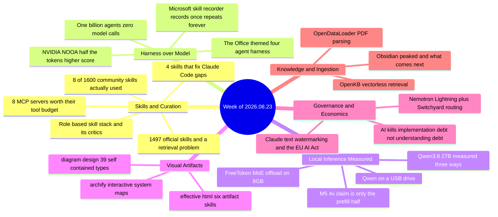

# Weekly Tech Digest — Week of 2026.08.23

**38 captures · tag `2026.08.23` · 27 August–30 August window · [explore this week in the knowledge graph →](./graph.html#2026.08.23)**

---

## This week's through-lines

**Curation replaced discovery as the bottleneck.** One capture counts 1,497 official agent skills. Another counts 1,600 community ones. A third lays out a full agency org chart made of thirty-five repos. And every piece with actual usage behind it this week is an act of *subtraction*: eight skills kept out of fifty tested, four kept out of hundreds, eight MCP servers kept out of fourteen installed. The sharpest line of the week came from a reply, not a post: at 1,497 skills, the scarce thing stops being the skill and becomes knowing which one applies — which is a retrieval problem, the same problem skills were introduced to solve one level down.

**The harness, not the model, is where the gains moved.** NVIDIA's NOOA report is the clean experiment: identical model, roughly half the tokens, *higher* accuracy, purely from how the surrounding software represents tool results and stores state. NVIDIA's other release the same fortnight — Nemotron Lightning plus the Switchyard router — makes the same argument from the economics side, and a billion-agent simulation makes it from the extreme end by pre-computing every possible model call and then making none at runtime. An essay on technical debt arrives at the identical conclusion from outside the agent world: implementation is now the cheap part, and understanding is the expensive one.

**Local inference got measured instead of announced.** Qwen3.8–27B landed and hit the feed three separate times in one week, from three different measurement stances — a deployment-footprint argument, a two-GPU release-day benchmark, and a 3-bit compression down to a 16 GB Mac mini. The most useful thing in all three is where they stop: vendor benchmarks flagged as vendor benchmarks, a 24 GB claim labeled an inference rather than a runtime test, and an honest report that the Mac mini build failed a real coding-agent loop four times out of four. Apple's own "4× faster" M5 claim gets the same treatment elsewhere in the week.

**Artifacts that outlive the chat.** Three separate captures push agents toward producing a single self-contained HTML file — architecture maps, interactive system diagrams, wireframes — rather than an answer in a transcript. The argument underneath is small and good: a Mermaid block only renders where the renderer is, so the diagram stops travelling the moment it leaves the repo. This is a large enough recurring cluster that it gets its own theme in the graph starting this week.

---

---

## Local LLMs & Inference

### Qwen3.8–27B — one release, three measurements, three different honest stopping points

Alibaba shipped Qwen3.8–27B under Apache 2.0 on 14 August, and it reached the feed three times this week from three writers who each measured a different thing. The vendor claim is a 27B dense multimodal model with a 262K native context that beats its own predecessor by 9.6 points on Terminal-Bench 2.1 (73.0 vs 63.4) and 8.2 on SWE-bench Pro (61.7 vs 53.5), trailing Opus 4.6 Max on the first and leading it on the second.

The three treatments are worth reading as a set. The first works from the GGUF weight ladder — Q4 at 15.7–17.9 GB, Q5 at 19.3–20.2, Q6 at 22.9 — and concludes only that a 24 GB card is a *plausible entry point* for Q4 experiments, explicitly refusing to call weight sizes a runtime test, because KV cache, buffers, driver reservation and vision inputs all still have to fit. The second actually benchmarks it on two mid-range cards (RTX 4070 + 5060 Ti) on release day: 23.63 tokens/sec generation, reproducible to the second decimal, because generation is bandwidth-bound arithmetic — 16.68 GiB of weights re-read per token at 423 GB/s. That piece also reports the number it *couldn't* pin down, prompt processing at "around 900 t/s" with ~10% dispersion, rather than rounding it into a clean figure. The third compresses the model to 11.55 GB at 3 bits, vision tower included, and runs it entirely in memory on a base 16 GB Mac mini at 3.7 tokens/sec — reading pace — and then reports that the same build failed a planted-bug coding-agent task four times out of four on the mini while passing four out of four on a 64 GB M4 Max. The author's own recommendation, against his own format: if you have the RAM for 4-bit, take Apple's MLX affine build instead, which is 2.6× faster for a 0.3% perplexity difference.

Two architectural details recur across all three and explain the rest: only 16 of the model's 64 layers keep a KV cache (the other 48 use Gated DeltaNet linear attention), which is why prompt-processing throughput stays flat instead of collapsing past 2,000 tokens; and a dense 27B has no knobs — twice the tokens per second requires twice the bandwidth or half the model.

*Why it matters: three independent write-ups on the same model in one week, and the useful content in each is where the author declined to extrapolate. That's a healthier local-AI discourse than the release itself.*

**Resources:** [Qwen3.8-27B model card](https://huggingface.co/Qwen/Qwen3.8-27B) · [Qwen 3.8 Is Finally Out, Opus Level Agentic Coding With Local AI](https://medium.com/the-ai-brief/qwen-3-8-is-finally-out-opus-level-agentic-coding-with-local-ai-c97f86dc6dd2) · [Qwen3.8–27B on Two Mid-Range GPUs, Measured on Release Day](https://pub.towardsai.net/qwen3-8-27b-on-two-mid-range-gpus-measured-on-release-day-e0b8e62d4aa0) · [Qwen3.8–27B on a 16 GB Mac mini](https://medium.com/data-science-collective/qwen-3-8-27b-on-a-16-gb-mac-mini-alibabas-new-vision-model-fully-in-memory-f3aaaacbfeb4) · [TurboQuant-MLX](https://github.com/manjunathshiva/turboquant-mlx)

### FreeToken — the MoE offload trick, and a reply thread that immediately audits it

UC Berkeley open-sourced FreeToken, an inference engine claiming 2–4× faster local serving than Ollama on Mixture-of-Experts models: Qwen3.6-35B at 39.3 tok/s on an 8 GB GPU, DeepSeek-V4-Flash 284B at 22 tok/s on 32 GB, GLM-5.2 753B at 14.9 tok/s on 96 GB. The mechanism is specific and legible. MoE models activate a small fraction of their parameters per token, so compute was never the bottleneck; the problem is what happens when the router picks an expert that isn't resident on the GPU. Existing engines pick one recovery path at load time — copy over PCIe, or compute on the CPU — and freeze it. Both read from the same system memory and therefore compete for one bandwidth pool rather than adding to each other. FreeToken profiles both paths once per machine and splits each step's misses proportionally, merging results exactly. The consequence the post highlights is that two machines with the same GPU can want opposite strategies, which no spec sheet tells you.

The second half is aimed squarely at coding agents: FreeToken checkpoints at the exact boundaries agent frameworks cut on, so an edited history only reprocesses the new part. Worst-case first-token latency stays under 44 seconds against 232 for llama.cpp and 946 for KTransformers. It serves the OpenAI and Anthropic APIs under Apache 2.0.

The replies are the useful half. One points out the benchmark rig had a 192 GB DDR5 host and calls the framing "kind of misleading," since the model still has to fit in system RAM. Another reports 45–55 t/s from a locally compiled llama.cpp on comparable hardware. A third doubts 39.3 t/s survives a cache miss on the router. And one reply makes the sharpest observation in the thread: everyone will fixate on the memory routing, but the exact-boundary checkpointing is the sleeper feature, because local coding agents have been suffocating on context recalculation.

*Why it matters: the offload trick is clever, but the durable claim is the second one — prefill latency, not decode throughput, is what has been keeping local autonomous workflows unusable.*

**Resources:** [FreeToken repo](https://github.com/FlashML-org/FreeToken) · [paper (arXiv PDF)](https://arxiv.org/pdf/2608.16157) · [original thread](https://x.com/akshay_pachaar/status/2091150763418620133)

### The M5's "4× faster" AI claim is only half the benchmark

Apple's headline for the M5 — over 4× the peak GPU compute for AI versus M4 — is real, and it measures exactly one of the two phases a language model runs in. In Apple's own MLX benchmark table, every model shows the same split: time-to-first-token improves 3.3–4.1×, while token generation improves 1.19–1.27×. Both columns, same chip, same row. Prefill is compute-bound and is what the M5's new per-core Neural Accelerators (1,024 FMAs/cycle, Apple's first true matrix-multiply hardware inside the GPU) attack. Decode is memory-bandwidth-bound, so it tracks the bandwidth improvement instead — 153 GB/s against 120, about 28%, which is almost exactly the 19–27% generation gain observed.

The practical rule the piece extracts: if your workload front-loads a long system prompt or a big retrieved context you are buying the 4×; if it's short prompts and long answers you are buying the ~20%. It includes a runnable `mlx-lm` script that prints `prompt_tps` and `generation_tps` side by side so you can see the split on whatever Apple Silicon you already own, no M4-vs-M5 comparison required.

*Why it matters: the same prefill/decode distinction explains the Qwen3.8 results above and FreeToken's checkpointing design. Three unrelated captures this week turn on it — it's the most load-bearing concept in local inference right now.*

**Resources:** [The M5's "4× Faster" AI Claim Is Only Half the Benchmark](https://medium.com/@nuthalapativarun/the-m5s-4-faster-ai-claim-is-only-half-the-benchmark-f330a0d66f70)

### Qwen 3 on a pendrive — local AI as luggage rather than installation

A field report from a client site that treats WiFi as a security incident: llama.cpp as a portable binary plus a Qwen3.5 GGUF on a USB 3.2 SSD, with a launcher script, and nothing installed on the host machine. The recommendation is Qwen3.5 4B for a drive you carry between unknown machines — runs on a plain 8 GB laptop with no GPU at 10–25 tok/s — stepping up to Qwen3 8B only when you know the host has RAM to spare and coding quality matters.

What lifts it above the genre is that the failure modes are named rather than skipped: Gatekeeper and SmartScreen both block the binary on first run, Windows builds commonly need the MSVC redistributable, `chmod +x` is required on Mac and Linux, and `llama-server`'s web UI keeps conversation in the browser tab and writes no history to disk. It also gets the two things right that most "air-gapped AI" posts miss — some secure environments disable USB ports entirely, so confirm before you show up; and if you're carrying client material, encrypt the drive (VeraCrypt, BitLocker To Go) rather than relying on the model's offline nature, because a lost pendrive with plaintext chat logs is a real exposure.

*Why it matters: an honest scope statement — a pendrive model is an insurance policy for when the cloud isn't an option, not a replacement for a daily driver.*

**Resources:** [I Put Qwen 3 on a USB Drive. Now My AI Works With Zero Internet.](https://blog.stackademic.com/i-put-qwen-3-on-a-usb-drive-now-my-ai-works-with-zero-internet-416f24ca5048)

---

## Agent Harness & Loop Engineering

### NVIDIA's NOOA — same model, half the tokens, higher score

The number that will circulate is 82.2% on SWE-bench Verified with GPT-5.5. The number that matters is 1.1 million: NOOA reached that score using roughly 29 model calls and 1.1M tokens per task, while a comparison harness running *the same model* needed 66 calls and 2.2M tokens to land at 78.2%, and OpenCode burned ~1.3M for 78.6%. NVIDIA's claim, from its own published table, is that harness design alone produces double-digit accuracy swings and large cost differences on an identical model.

The core mechanism is one architectural decision: pass tool results by reference, not by value. When a NOOA tool returns something large — a parsed repository, a result set, a dataframe — the object stays alive in the Python execution environment and the model receives a typed, bounded preview plus an address, never the payload. NVIDIA reports that NOOA needed *no context compaction at all* to solve SWE-bench with frontier models; median sessions peaked at 22K–72K prompt tokens against 200K–400K windows. There's a compounding second-order effect: because the transcript stays append-only rather than being rewritten and re-summarized, the prefix stays stable, which is exactly what prompt caching needs to hit.

Around that sit five more capabilities the paper argues belong together: typed input/output contracts, code-as-action (the model expresses multi-step logic as real Python with loops and conditionals inside one action, instead of a chain of single tool calls), a programmable orchestration loop the developer *or the model* can inspect and modify, explicit typed object state rather than state reconstructed by re-reading chat history, and model-callable harness APIs for managing its own context.

The write-up is careful in two places worth repeating. First, the honest scope: NVIDIA showed harness architecture can move the accuracy-vs-cost frontier without touching model weights; it did not show that installing NOOA halves the cost of your workload. Second, the security posture — NOOA executes LLM-generated Python, and its AST validation and module deny-lists are explicitly defense-in-depth, not a containment boundary. Treat the validator as a linter; the isolation layer (container, microVM) is the actual security boundary, and building it is on you. NOOA ships as a research preview, not production software.

The portable version, for people who will never install it: don't serialize large tool outputs into the prompt by default, make state explicit and typed, treat conversation history as a log rather than a database, return previews instead of payloads, protect your prefix cache by not rewriting early context, and evaluate harness and model as an independent matrix rather than swapping model names and calling it optimization.

*Why it matters: two years of agent optimization has pulled the one lever that's easiest to pull — the model name. This is the best-documented evidence yet that the layer underneath was quietly doing a large part of the work.*

**Resources:** [NVIDIA's NOOA Proves the Harness Matters More Than the Model](https://pub.towardsai.net/nvidias-nooa-proves-the-harness-matters-more-than-the-model-and-everyone-s-watching-the-wrong-74f646695823) · [NVIDIA-NeMo/labs-OO-Agents](https://github.com/NVIDIA-NeMo/labs-OO-Agents) · [Six Agent Harness Capabilities (NVIDIA blog)](https://developer.nvidia.com/blog/six-agent-harness-capabilities-for-higher-model-performance/) · [paper (arXiv)](https://arxiv.org/html/2607.20709v1)

### A billion agents on four GPUs, with zero model calls at runtime

The same "stop making model calls" idea, taken to its limit. Simulating a billion LLM-grounded social agents the obvious way — one inference call per interaction — works out to 1.5 trillion tokens, roughly 2.5 years of continuous four-GPU time, for a single topic under a single seeding condition. The build's one idea is that the state deciding an interaction is small and *finite*: fix the persona pool at 10,000 and the stances at 3, and the simulation can only ever ask 10,000 × 10,000 × 3 × 3 = 900 million distinct questions — a number that does not grow with population. So you answer them once, offline, and run the world out of an array.

The pipeline: 96,125 World Values Survey records rendered into written personas and sampled down to 10,000; a billion-node scale-free graph in compressed rows; a 235B open Qwen model as the teacher, paid once for 270,000 labelled questions; a 4.5M-parameter surrogate trained on both the teacher's answers *and its hesitation*; and the surrogate enumerated over all 900M questions into an 858 MB byte table. Total build: 4h 09m, of which the teacher labelling is 71.6% and the actual billion-agent run — 100 rounds, 1.49 billion interactions — is 104 seconds, or 0.7%.

Two results give the post its credibility. The crossover is computed and stated plainly: below about 180,000 agents the whole pipeline is a net loss and you should just call the model. And a chart showing network topology driving opinion spread turns out, under a control that caps message fan-out, to be mostly an exposure effect rather than a structural one — "the first reading of that chart would have been mostly wrong." The closing section is six explicit reasons the work proves nothing about people, including that the runtime is a stochastic automaton whose transition rule a language model estimated, that there is no memory or message content, and that fidelity is measured against one Qwen model rather than against reality.

*Why it matters: the generalizable advice isn't "simulate more agents." It's "build the table, then check whether the scale you paid for changed the answer."*

**Resources:** [Building a Society of One Billion Agents on Four GPUs](https://levelup.gitconnected.com/building-a-society-of-one-billion-agents-on-four-gpus-ad39928fc449) · [FareedKhan-dev/earth-scale-society](https://github.com/FareedKhan-dev/earth-scale-society)

### Microsoft's skill-recorder — record a task once, and the caveats in the replies

An open-source tool that records a real work session (screen, clicks, windows, pages, narration), has Copilot reconstruct it as one intent plus an ordered step list, and turns that into a Skill the agent runs on demand or an Automation on a schedule. The post is written in the standard breathless register; the replies supply the engineering.

The key correction, from a reader who read the README: it does not replay clicks like a macro — it translates them into the agent's native tools (`gh`, `web_fetch`), which is why layout changes don't break it. The constraints that the post omits: it needs a GitHub account with Copilot access for the analyze step, macOS is the primary target with Windows 11 supported, and it's a v0.5.0 source release. Two further replies mark the real boundary: the reconstruction requires human approval before it becomes a reusable skill, which is what stops one bad recording from becoming repeated automation — and an open question nobody answers, how it holds up against sites that randomize selectors.

*Why it matters: "generalize from one demonstration" is the interesting claim, and it's plausible only because the output is native tool calls rather than coordinates. The review gate before a recording becomes a skill is the load-bearing safety design.*

**Resources:** [microsoft/skill-recorder](https://github.com/microsoft/skill-recorder) · [original thread](https://x.com/vicky_grok/status/2092627157961035868)

### munder-difflin — four coding agents in one repo, themed as *The Office*

An open-source harness that puts Claude Code, Codex, Antigravity and Cursor to work together on your existing subscription limits. The theme is the hook; the replies immediately relocate the interesting problem. One reader: the artifact that matters isn't four tools sharing one subscription, it's the merge protocol — different context windows and failure modes need shared task state, explicit handoffs, and a test that decides when the team is done, or it's four tabs with branding. Another proposes the benchmark that would settle it: give Claude, Codex and Cursor the same repo and task graph, then measure duplicate edits, merge conflicts, wall time and subscription usage, because multi-agent only wins when coordination overhead stays below the parallelism gain. Neither question is answered in the thread.

*Why it matters: multi-agent orchestration keeps shipping as a UX theme and keeps being evaluated as a systems problem. The gap between those two is the whole story.*

**Resources:** [chaitanyagiri/munder-difflin](https://github.com/chaitanyagiri/munder-difflin) · [awesome-llm-apps](https://github.com/Shubhamsaboo/awesome-llm-apps) · [original thread](https://x.com/saboo_shubham_/status/2092129885296951481)

---

## Coding Agents & CLI Wars

### Eight MCP servers worth their slot — and the tool budget nobody budgets

The framing is the contribution: every MCP server you connect dumps its tool list into the system prompt, so slots are a strict allowance rather than a free upgrade. The author hit the wall concretely — 14 servers exposing 73 tools, ~18,000 tokens per turn spent loading schemas for tools not in use, and Claude Code reaching for a Jira server to satisfy a request to grep a local directory. Their observed breaking point is around 50 visible tools, past which the model can't tell similar tools apart and starts guessing.

The eight that survived: **Context7** for version-pinned library docs injected into the prompt (the fix for agents writing implementations deprecated a year ago); the **official GitHub** server for issues, PRs and remote code search; **Postgres MCP Pro** with `--access-mode=restricted`, described as non-negotiable on staging or production because it disables INSERT/UPDATE/DELETE at the server level; **Playwright MCP**, which makes the agent verify its own change by reading the accessibility tree rather than trusting a screenshot; **Sentry** for unminified production stack traces; **Brave Search** for live web; plus scoped **Filesystem** and **sequential-thinking** as flex slots. A full `.mcp.json` is included, with secrets passed by `${VAR}` interpolation so the file is committable, and `--scope project` recommended so a team shares one toolset.

The cut list is as useful: archived reference servers (the old `@modelcontextprotocol/server-postgres`), third-party wrappers anywhere an official vendor server now exists, and anything that duplicates a native client ability — the failure mode there is a tool collision, illustrated by an agent trying a third-party `execute_script` for `npm install`, failing on a path error, then writing a Python script rather than using the native shell.

*Why it matters: the same subtraction discipline as the skills stories, applied to the layer where the cost is measurable in tokens per turn.*

**Resources:** [I Tested 8 MCP Servers With Claude Code](https://medium.com/data-science-collective/the-8-mcp-servers-every-claude-code-setup-needs-in-2026-fac76ac7d013)

### 1,600 community skills, eight survivors, tracked over seven weeks

A genuine follow-up rather than another list: of 50 community Claude skills reviewed previously, the author tracked which ones they actually opened over seven weeks, with "installed but not opened in four weeks" counted as inactive. Eight made it. `avoid-ai-writing` is the highest-frequency one — run over every draft before publishing, on the reasoning that you can't reliably catch your own AI patterns at reading speed (it found eleven problems in a 1,400-word piece already considered finished). `brand-guidelines` removes a recurring ten minutes of re-briefing voice and format at the start of every session. `skill-creator` is the one they'd install first, because every custom skill in the setup started there. `docx` and `pdf` cover editable and fixed deliverables respectively. `deep-research` compresses 30–45 minutes of manual reading into ten minutes of review, opened before roughly one article in three. `youtube-transcript` converted a 700-episode podcast backlog from an untouched archive into a content asset. `brainstorming`, from the superpowers collection, gets opened when the topic is known but the angle isn't.

The elimination criterion is the honest part: what got cut solved problems other skills in the setup already handled — a grammar checker Claude does natively, an X formatter the brand-guidelines doc already covered, a research summarizer `deep-research` did better.

*Why it matters: a 7-week usage log is a far better recommendation signal than a star count, and the 42-of-50 uninstall rate is the number the skill-marketplace enthusiasm keeps leaving out.*

**Resources:** [The Claude Community Built 1,600 Skills. These 8 Are the Only Ones I Actually Use!](https://dkspeaks.medium.com/the-claude-community-built-1-600-skills-these-8-are-the-only-ones-i-actually-use-5d96acfe9e3d)

### Four skills aimed at four specific Claude Code gaps

A tighter list built around named failure modes rather than categories. **Ponytail** attacks overbuilding: before writing, it forces the agent through a short interrogation — does this need to exist, did I already build it elsewhere, does the browser handle it for free, can this be one line instead of fifty — which saves tokens twice, once on the code not written and again on the confusion that code would have caused later. The author names its cost honestly: it compresses chat replies too, sometimes to the point of needing two or three reads, with the fix being to ask for the explanation in plain terms while keeping the code lean. **Claude Video** gives the agent actual visual context from YouTube, Loom, TikTok, X and Instagram rather than a transcript alone. **Last30Days** replaces indexed-article research with reads of Reddit, X, YouTube and Threads *including the comments*, cross-checking complaints across platforms so that one angry comment is ignored and three independent ones get flagged. **Humanizer** runs text through 33 patterns derived from Wikipedia's own documented AI-writing tells; the author is clear it's a cleanup tool, not a writing tool — weak writing stays weak.

One line in the piece deserves wider circulation: before installing anything from GitHub, be aware of prompt injections hidden in the repo, and ask the agent to analyze the repo first rather than pulling it in wholesale.

*Why it matters: the prompt-injection warning sits inside a skills-recommendation post, which is exactly where it needs to be given how casually 1,500-skill catalogs get installed.*

**Resources:** [I Tested Claude Code Skills Until I Struck Gold](https://divadsanders.medium.com/i-tested-claude-code-skills-until-i-struck-gold-4-best-claude-skills-bc199475e2b8) · [bradautomates/claude-video](https://github.com/bradautomates/claude-video) · [mvanhorn/last30days-skill](https://github.com/mvanhorn/last30days-skill) · [blader/humanizer](https://github.com/blader/humanizer)

---

## AI Engineering Education & Resources

### The role-based skill stack — thirty-five repos, and a reply thread that won't buy it

A capture laying out agent skills by job function: Senior Engineer (Superpowers, Addy Osmani's agent-skills, Karpathy Skills, GStack), Product Designer (UI UX Pro Max, Taste Skill, Impeccable), QA, Docs, Marketer, Social Manager, Motion Designer, Researcher, Ops Manager, and a "whole agency" tier. Two readers independently describe it the same way — an org chart replaced by repos, an AI agency you can install from GitHub.

The dissent is unusually specific for a thread this size and is the reason the entry is here. On Superpowers: "agents fight themselves and produce 10 documents before writing 10 lines of code," and separately, that it's a token consumer best used to start a project and then turned off. A blunter reply dismisses Karpathy Skills and calls GStack bloated. And the observation that generalizes past this particular list: people still need to learn how to prioritize and contextualize these skills rather than collecting them like trophies. Two small accuracy notes on the list itself — the Marketer section links MarkItDown where a marketing-skills repo was evidently intended (the same URL appears under Docs Team), and one entry goes through an `lnkd.in` shortener whose destination isn't verifiable from the capture.

*Why it matters: the same week produced both the most comprehensive skill inventory and the loudest pushback on the largest item in it. That pairing is the story, not either half.*

**Resources:** [obra/superpowers](https://github.com/obra/superpowers) · [addyosmani/agent-skills](https://github.com/addyosmani/agent-skills) · [anthropics/skills](https://github.com/anthropics/skills) · [Q00/ouroboros](https://github.com/Q00/ouroboros) (reader addition) · [codeaholicguy/ai-devkit](https://github.com/codeaholicguy/ai-devkit) (reader addition) · [original thread](https://x.com/roundtablespace/status/2092609257338200469) · one listed item resolves through `lnkd.in` (second-hop shortener; final destination not verified)

### awesome-agent-skills — 1,497 skills, and the best line of the week

A collection of official agent skills from engineering teams at Anthropic, Google Labs, Vercel and Stripe. The post is one line and a link. The reply is the entry:

> At 1497 the scarce thing stops being the skill and becomes knowing which one applies. That is a retrieval problem, which is the same problem skills were introduced to solve one level down. Worth watching whether the index ends up mattering more than the entries.

*Why it matters: it names the recursion this whole week is circling. Skills were a retrieval mechanism for capability; at catalog scale they become the thing that needs a retrieval mechanism.*

**Resources:** [VoltAgent/awesome-agent-skills](https://github.com/VoltAgent/awesome-agent-skills) · [original thread](https://x.com/tom_doerr/status/2092266436366332114)

### Ten repos for building with agents

A straightforward roundup, useful mainly for what it groups together: **OpenViking** (Volcengine's context database unifying memory, knowledge and skills), **AgentMemory** (persistent memory across coding-agent tasks), **anthropics/skills**, **diagram-design**, **scientific-agent-skills** (160+ research skills and databases), **awesome-harness-engineering** (patterns for memory, skills, security, evals and orchestration), **Anthropic-Cybersecurity-Skills**, **ai-job-search**, **OpenHands**, and **browser-use**. One reply makes the point the list implies: unifying memory and knowledge in one context store beats bolting memory onto an agent after the fact.

*Why it matters: "harness engineering" now has an awesome-list of its own, which is usually the moment a practice stops being individual craft and starts being a field.*

**Resources:** [OpenViking](https://github.com/volcengine/OpenViking) · [rohitg00/agentmemory](https://github.com/rohitg00/agentmemory) · [ai-boost/awesome-harness-engineering](https://github.com/ai-boost/awesome-harness-engineering) · [K-Dense-AI/scientific-agent-skills](https://github.com/K-Dense-AI/scientific-agent-skills) · [OpenHands](https://github.com/OpenHands/OpenHands) · [browser-use](https://github.com/browser-use/browser-use) · [original thread](https://x.com/divyansht91162/status/2091879586045018406)

### AI will kill technical debt as we know it

The strongest conceptual piece in the week, and it never mentions an agent framework. The argument starts with Ward Cunningham's 1992 metaphor and points out that the field has been misusing it for two decades. Cunningham's debt was never messy code — it was the gap that opens as you learn more about a problem while the code stays behind, repaid by refactoring to match your new understanding. (Uncle Bob's definition, "intentionally suboptimal structure," is a third definition again; the field never agreed.) The reason the meaning drifted is an incentive: the code was visible and expensive, so it looked like the debt, while the gap in understanding was invisible and got ignored.

Then the economics changed. Writing code is cheap and refactoring is nearly free, so the thing we've called tech debt for twenty years is now the cheap part to pay down — and "we had to cut corners to ship" stops working as an excuse when an agent rewrites an implementation in seconds. What stays expensive is knowing what you actually want. The evidence offered: a CodeRabbit study of 470 real-world pull requests found AI-coauthored PRs carry about 1.7× more issues, with the largest jump — 75% — in logic and correctness rather than style. That is not AI writing uglier code. That is AI letting teams skip the thinking.

The piece names the split as **implementation debt** (doomed to become cheap) versus **understanding debt** (set to explode), and follows it into management consequences: hire for the judgment to know which questions must be answered before opening an agent, redefine seniority as the ability to remove ambiguity, and change planning from "can we build this?" to "do we understand what we're building?"

*Why it matters: it's the NOOA finding restated for humans. The expensive layer moved, and the organizations still optimizing the old one will keep paying interest on the wrong thing.*

**Resources:** [AI Will Kill Technical Debt as We Know It](https://levelup.gitconnected.com/ai-will-kill-technical-debt-as-we-know-it-d2c73ffdfb46)

### Seven repos for learning networking and security

A hands-on list, off the AI beat but a good one: **Containerlab** (spin up real network topologies in containers and test routing without hardware), **Scapy** (the Python packet-manipulation library most security courses teach on), **Sniffnet** (real-time traffic monitoring, visualized), **System Design 101**, two differently curated *Awesome Networking* collections, and **Multiplayer Networking Resources** for game netcode — latency, jitter, packet loss, rollback. The most useful reader note: Containerlab plus Scapy makes the jump from diagrams to packet-level debugging much less intimidating.

*Why it matters: agent infrastructure is increasingly a networking and isolation problem — see the NOOA sandboxing caveat above — and this is the ground layer for it.*

**Resources:** [srl-labs/containerlab](https://github.com/srl-labs/containerlab) · [secdev/scapy](https://github.com/secdev/scapy) · [GyulyVGC/sniffnet](https://github.com/GyulyVGC/sniffnet) · [ByteByteGoHq/system-design-101](https://github.com/ByteByteGoHq/system-design-101) · [nyquist/awesome-networking](https://github.com/nyquist/awesome-networking) · [facyber/awesome-networking](https://github.com/facyber/awesome-networking) · [MultiplayerNetworkingResources](https://github.com/0xFA11/MultiplayerNetworkingResources)

### Five slide mistakes that tell executives you don't understand how they think

Not an AI piece, but a clean one on structural communication. The five: building the deck bottom-up so the recommendation lands on slide 14 instead of slide 1; titling slides with topics ("Q3 Performance") instead of conclusions ("Q3 Revenue Below Target Due to UK Market Softening"); designing for zero interruptions when senior audiences interrupt as a way of signalling what matters; using slides as speaker notes, which loses fast readers and slow ones for opposite reasons; and adding slides to cover uncertainty, where volume signals indecision rather than depth. The single root cause named for all five is that the deck was built for the presenter's logic rather than the executive's decision.

*Why it matters: the same conclusion-first discipline these decks need is the discipline a good agent brief needs — and the second half of this week's tech-debt argument says that brief is now the expensive artifact.*

**Resources:** [Five Slide Mistakes That Tell Executives You Don't Understand How They Think](https://medium.com/@marybeth.hazeldine/five-slide-mistakes-that-tell-executives-you-dont-understand-how-they-think-caf376d8f466)

---

## Diagrams & Visual Artifacts

*New theme this week — see the notes at the end.*

### effective-html — six skills for artifacts that survive leaving the chat

A collection of agent skills for producing self-contained HTML artifacts, from low-fidelity wireframes to working prototypes: a broad `html` skill that routes the work, `design-artifact` for creative direction without imposing a house style, `html-wireframe` (deliberately unfinished so reviewers look at structure), `html-prototype` (one credible flow with its real states, keyboard support, responsive behavior), `html-plan` (roadmaps that preserve source commitments), and `html-diagram`. The stated design principle is a separation of creative freedom from reliability, with detailed guidance living only in the specialist skill that needs it. The repo is explicit that you can use it as a reference without installing anything.

The capture that surfaced it — a Chinese-language post demonstrating it on a real project — adds the part the README doesn't: the output is an interactive HTML file where nodes are clickable, the right panel shows node detail, and the call flow can animate itself, which makes it a way to *read* an unfamiliar codebase. Two replies do the necessary work. Asked directly whether the diagram stays in sync with the code as architecture shifts, the author answers plainly: manual update. And another reader posts a near-identical project, archify, with the comment that the two look the same.

*Why it matters: the sync question is the one that decides whether generated architecture diagrams are documentation or decoration, and the honest "manual update" answer puts them firmly in the second category until someone solves it.*

**Resources:** [plannotator/effective-html](https://github.com/plannotator/effective-html) · [original thread](https://x.com/indie_maker_fox/status/2091805637294555170)

### archify — the same idea, with verification receipts

The project a reader named as a near-duplicate of effective-html, and the comparison is fair on output but not on approach. Archify turns a codebase or system description into an interactive system map — five diagram types, four presets, dark/light themes, exports to PNG/SVG/WebM and 1200×630 share cards — installable into Cursor, Claude Code, Codex CLI, OpenCode and Raven. What differentiates it is a verification posture: a typed JSON intermediate representation with deterministic checks, revision-verified source links, and a documented claim that interactions stay grounded — you can trace upstream/downstream reach and exact routes "without inventing topology." It also does before/after review: compare two validated snapshots as Before / Delta / After with explicit added, removed, changed, moved and rerouted facts, which is aimed squarely at reviewing architecture changes before a merge. The repo publishes a "Proof Lab" of eleven checked-in scenarios with their JSON sources and validation receipts, including a real repository traced at a specific commit.

Worth noting for readers evaluating it: the project carries commercial sponsors, disclosed on the page.

*Why it matters: two projects, one week, same output format — and the interesting difference is that one of them treats "did the diagram lie about the code?" as a checkable property.*

**Resources:** [tt-a1i/archify](https://github.com/tt-a1i/archify)

### diagram-design — 39 types, and the argument for self-contained HTML

An agent skill for Claude Code, Codex, Factory Droid and Pi: you ask for a diagram and get one self-contained HTML file that opens offline. 39 diagram types implemented as designed templates the agent fills in, semantic patterns so a queue or a trust boundary can reuse the nearest type, redrawing of existing draw.io and Mermaid files, and SVG export for Figma.

The best reply in the week's diagram cluster explains why the file format is the point rather than a detail: a Mermaid block only renders where the renderer is, so the diagram stops travelling the moment it leaves the repo, while one file that opens in any browser survives review, tickets and email. The same reader identifies why the fixed type list matters — the agent picks a diagram instead of inventing a layout, and inventing the layout is where these usually fall apart. A third reader keeps the humans in it: the agent gets you to a strong draft, a person still makes the final visual call.

*Why it matters: the constraint (a closed set of 39 templates) is doing more work than the generation. That's a transferable lesson well beyond diagrams.*

**Resources:** [cathrynlavery/diagram-design](https://github.com/cathrynlavery/diagram-design) · [original thread](https://x.com/milan_milanovic/status/2092582084661653635)

---

## Memory & Knowledge Systems

### Obsidian peaked — a careful argument, not a hit piece

The claim is narrow and the author repeatedly protects it: Obsidian the product is still excellent, still shipping, and its markdown-first, local-first stance is still the most principled position in the category — but its *adoption trajectory* has three problems, two of which aren't product problems at all. First, the "second brain" cultural wave that drove its growth is receding; the people who were going to get excited about linked thinking already did. Second, plugin fatigue flipped from strength to friction: the community energy moved from "look what I discovered" to "here's my 47-plugin setup," and the gap between installing Obsidian and having a working system widened, with a first-hand account of a technical colleague bouncing off after a weekend of trying to replicate a YouTube vault tour. Third, the power-user identity became the ceiling — compared with Notion, whose community made templates that produce a working system in ten minutes, Obsidian's community makes showcases that are aspirational but not reproducible.

The product critiques are lighter but pointed: Canvas reads as built because other tools have whiteboards; Bases (database views) is called a philosophical hedge from the tool that once said you need links, not databases. The alternatives are framed as different ideas rather than replacements — **Tana** (supertags make every bullet simultaneously free text and a structured object; steep learning curve, genuinely so), **Heptabase** (spatial layout on infinite whiteboards, so you can find a note by *where* it was rather than what it was called; no free tier, $8.99/mo annual), **Capacities** (object-based notes), and **SiYuan** (open-source, local-first, no plugin dependency). The counter-argument gets its own section, and the author concedes it: every tool recommended fails the data-ownership test to some degree, and for people who weight that above everything, staying is the right call.

*Why it matters: the strongest version of the "PKM tools plateau" argument, made by someone who keeps naming what the incumbent still does better.*

**Resources:** [Obsidian Peaked. Here's What I'm Watching Instead.](https://talking-tech-with-j.medium.com/obsidian-peaked-heres-what-i-m-watching-instead-1867694064f2) · [Tana](https://tana.inc/) · [Heptabase](https://heptabase.com/) · [Capacities](https://capacities.io/) · [SiYuan](https://b3log.org/siyuan/en/)

### OpenKB — vectorless retrieval, and four readers asking the same question

An open-source system that compiles raw documents into a structured, wiki-style knowledge base, using PageIndex for what it calls vectorless, reasoning-based retrieval. The post is a single line; the thread is a small peer review, and it converges from four directions on one gap. How does PageIndex guarantee accurate recall without embeddings? Vectorless retrieval "sounds clean until update propagation hits edge cases." And the most constructive contribution proposes the property that would make the design worth it: attach every generated claim to the exact document span it came from, so the knowledge base stays auditable statement by statement. None of these get answered in the thread.

*Why it matters: dropping embeddings is the interesting bet — it trades a similarity search for a reasoning pass over structure. The unanswered recall and update-propagation questions are exactly the right ones to take to the repo.*

**Resources:** [VectifyAI/OpenKB](https://github.com/VectifyAI/OpenKB) · [original thread](https://x.com/tom_doerr/status/2093263745120178207)

### OpenDataLoader PDF — parsing as the easy half of the problem

An open-source PDF parser that converts PDFs into AI-ready Markdown, JSON and HTML, with OCR for scans and handling for tables, formulas and charts. Two replies are worth more than the post. The first relocates the difficulty: converting to clean Markdown is the *ingestion* step, and the hard part for RAG is keeping table relationships and page provenance intact once the document gets chunked — how is that structure exposed to downstream retrieval? The second reply is a common objection worth flagging as a partial misread: "why not parse programmatically with code, it's cheaper and doesn't hallucinate" — the repo documents a deterministic local mode as its default, with the AI-assisted path an optional hybrid mode for complex pages, so the objection describes the tool's own primary design rather than an alternative to it.

*Why it matters: the chunking-provenance question is the recurring unsolved edge of document RAG, and it's the same auditability point the OpenKB thread raised independently the same week.*

**Resources:** [opendataloader-project/opendataloader-pdf](https://github.com/opendataloader-project/opendataloader-pdf) (URL de-obfuscated from the author's follow-up reply, which wrote it as `github(DOT)com/...`) · [original thread](https://x.com/rammcodes/status/2091860481590087724)

---

## Open Source vs Paid SaaS

### openworker — Andrew Ng's outcome-shaped coworker, with the honest section attached

An open-source desktop agent framed around delivering finished work rather than chat: state the outcome ("prepare the customer brief", "untangle my calendar"), watch it decompose the task and work across desktop, files and apps, with writes, sends and shell commands approval-gated. It connects 25+ tools — GitHub, Slack, Jira, Notion, Gmail, Calendar — plus anything over MCP, runs on your own key across OpenAI, Anthropic, Gemini, DeepSeek, Kimi and Grok, or fully local with Ollama.

The poster appends their own caveats, which is rarer than it should be: open beta, macOS signed, Windows builds unsigned for now, and models outside the curated tool-calling list are at-your-own-risk. The best reply sharpens the remaining gap — the planning demos well, and the hard part starts when it touches a real calendar or a real card: scoped credentials, and a log of what it actually did. "Still mostly homework." A second reader identifies what's actually notable: shipping an outcome-focused coworker instead of another chatbot.

*Why it matters: the approval gate and the bring-your-own-key stance are the two design decisions that make a desktop agent evaluable at all. The missing audit log is the reason it isn't finished.*

**Resources:** [andrewyng/openworker](https://github.com/andrewyng/openworker) · [original thread](https://x.com/vicky_grok/status/2092990755396870471)

### AnduinOS — Ubuntu that looks like Windows 11, from a former Microsoft engineer

Not a Windows skin over Ubuntu but a trimmed derivative with intent: GNOME 50, Ubuntu 26.04 packages, kernel 7.0, support promised to April 2031, Flatpak configured out of the box, and Canonical's Snap format deliberately absent (joining Zorin, Mint and Pop!_OS in that choice). The size difference is the concrete pitch — a 2.53 GB ISO against Ubuntu's ~5.9 GB, and 4 GB RAM / 20 GB storage minimums against 6 GB / 25 GB. Users pick between an "11" style with centered taskbar and a "Classic" left-aligned layout, and can move the menu bar to any screen edge, which the author notes Windows itself only began working on in 2026.

The review's own reservation is the durable one: one-man distributions concentrate update vetting and security patching on a single person, and that is the risk you accept alongside the polish. Also worth stating plainly: it is not a Microsoft product, and the author says that fact makes them *more* willing to try it.

*Why it matters: a credible on-ramp for Windows leavers who have muscle memory but no appetite for a new interface — with a single-maintainer risk that belongs in the decision.*

**Resources:** [This Linux Distro Looks a LOT Like Windows 11](https://medium.com/@michaelswengel/this-linux-distro-looks-a-lot-like-windows-11-475c42e1cbb4)

---

## Model Economics & Open vs Closed

### Nemotron Lightning and NeMo Switchyard — why a chip company gives models away

The framing device is that Jensen Huang posted on X for the first time in 33 years on 24 July 2026, arguing that open models strengthen safety, accelerate diffusion and enable sovereignty — and that restricting open-source AI in the US wouldn't stop Chinese labs training on it, it would only leave a closed American ecosystem competing against an open Chinese one. Three weeks later NVIDIA released **Nemotron 3.5 Lightning**, a free MoE model under the OpenMDW-1.1 license: 30B total parameters with roughly 3B active per step, speculative decoding via two purpose-built draft models (DSpark for low concurrency, DFlash using block diffusion for throughput), running on a single H100, consumer RTX cards, DGX Spark and Jetson edge devices.

The engineering argument underneath is the part worth keeping. Long-running agents spend roughly 80% of their time on execution work — tool calls, return-value checks, delegation, format validation — and 20% on planning and genuine judgment. Most teams route all of it through one frontier model, which is like sending every phone message slip to the managing partner. Lightning is built explicitly for the execution layer, and **NeMo Switchyard** is the open-sourced routing library that decides which steps go where, on configurable quality, latency and cost criteria, across open *and* proprietary models, without rewriting the application above it. The reported production numbers: Ramp 58% cost reduction and 33% runtime reduction, Cognition 28%, Classmethod 27% at equal quality, Boomi 100% domain-routing accuracy. Kong is delivering Switchyard through its AI Gateway; LiteLLM is adding it as a proxy plugin; Nous Research has integrated it into Hermes.

Note that the cost figures are vendor-relayed customer reports rather than independent measurements, and the article's framing of Kimi K3 and the Washington reaction is one writer's reconstruction of the policy debate.

*Why it matters: "the model layer commoditizes, the infrastructure layer persists" is a coherent strategy, and multi-model routing is the architecture it implies. That's the third independent argument this week that the money is in the layer around the model.*

**Resources:** [Nvidia Just Released a Free AI Model. Here Is What Jensen Huang Is Actually Doing.](https://medium.com/predict/nvidia-just-released-a-free-ai-model-here-is-what-jensen-huang-is-actually-doing-b3aa602bd975) · [NVIDIA-NeMo/Switchyard](https://github.com/NVIDIA-NeMo/Switchyard)

---

## AI Governance, Privacy & Sovereignty

### Claude is watermarking generated text — the mechanism, and its stated limits

Anthropic announced machine-readable marks in Claude-generated content across Claude, the API, Claude Code, Cowork, and Claude accessed via AWS, Google Cloud and Microsoft Foundry. The driver is Article 50 of the EU AI Act: from 2 August 2026, providers of generative AI systems must make synthetic text, images, audio and video machine-readable and detectable as artificially generated. The EU also grants an exemption for content that has undergone substantive human review and remains under human editorial responsibility — which the author finds more confusing than clarifying.

The mechanism explanation is the article's substance, and it's careful to flag that Anthropic hasn't published its algorithm, so this is the standard scheme rather than a description of Claude's. At each step a model has several plausible next tokens; a watermark secretly partitions them into favoured ("green") and unfavoured groups and gives the green ones a small boost. No single word reveals anything — detection is a statistical hypothesis test on the accumulated imbalance, like spotting a weighted coin over 10,000 tosses rather than ten. The direct consequence is that **longer text is much easier to classify**: a 2,000-word article gives a detector many measurements, a seven-word Slack message gives it almost none, and Anthropic explicitly warns short passages may carry too little evidence.

The limits section is unusually complete. What weakens or removes a mark: heavy paraphrasing (the DIPPER study evaded multiple detectors including watermark-based ones), though a competing study found fragments survive because rewrites retain original phrasing, needing roughly 800 tokens for detection after strong human paraphrase at a low false-positive setting; translation by an outside system (but note that if *Claude* does the translating, it can place a fresh mark); dilution, where a 200-word Claude passage inside a 2,000-word human article gets drowned out — counterable by scanning overlapping windows; recursive paraphrasing; and simply using an unwatermarked model, since Claude's detector identifies compatible Claude marks, not AI writing in general. The theoretical ceiling comes from the "Watermarks in the Sand" result: meaning is stable but wording is replaceable, so a mark attached to one wording can't control every text expressing the same idea.

The interpretation warnings deserve the most circulation. A positive result means Claude *processed* the text — proofreading, translation, summarisation and file conversion all produce marks — not that Claude authored the ideas. A negative result proves nothing about human authorship. And even a 0.1% false-positive rate wrongly flags about 100 essays in a collection of 100,000, which is why a watermark result should not by itself be used to punish a student, fire a worker or accuse an author.

The author also offers a speculative motive beyond compliance — that clean provenance lets a lab exclude its own outputs from future training data and avoid model collapse — alongside some sharply-worded personal opinions about current model writing quality that are clearly marked as opinion.

*Why it matters: a statistical tripwire, effective against direct copying, light editing and bulk low-effort publishing; progressively unreliable against rewriting, translation, short excerpts and mixed authorship. Both halves need saying every time this is discussed.*

**Resources:** [Claude Is Watermarking AI Text: Everything You Need to Know](https://medium.com/realworld-ai-use-cases/claude-is-watermarking-ai-text-everything-you-need-to-know-1c3a7924bb62)

---

## Web Agents: Browsing, Scraping & Design-to-Code

### openbot — an open-source Grok Bot where every bot gets its own browser

A 100% open-source alternative in which each bot runs with its own browser, its own logins and its own files. The isolation model is the whole pitch and the reason it's worth watching: per-bot browser profiles are the boundary that decides whether a fleet of agents can hold credentials for different accounts without cross-contamination. The capture is thin — a one-line post, a video, and replies that are mostly enthusiasm plus one asking whether it's legal (the poster says yes, with no elaboration) — so treat the isolation claim as documented-by-README, not verified.

*Why it matters: the same sandboxing question NOOA raises for code execution, one layer up at the session and credential level.*

**Resources:** [CopilotKit/openbot](https://github.com/CopilotKit/openbot) · [original thread](https://x.com/granite0x/status/2091933757246693607)

---

## Quick hits

- **[WaterCrawl](https://github.com/watercrawl/WaterCrawl)** — crawls websites and transforms extracted content into LLM-ready data structures. One-line post, no replies, no further detail captured.
- **[RAGFlow](https://osp.fyi/ragflow)** — reads complex files like contracts and reports and extracts answers from unstructured data; open source and self-hostable. The only reply asks the right question and gets no answer: how does it handle scanned PDFs versus native text ones? *(second-hop shortener; final destination not verified)*
- **[Ragas](https://osp.fyi/ragas)** — evaluation for AI apps: generates test scenarios, scores responses on objective metrics, tracks real-world data. *(second-hop shortener; final destination not verified)*
- **[gridex](https://github.com/gridex/gridex)** — a native database IDE across macOS, Windows and Linux with no web views, covering PostgreSQL, MySQL, SQLite, Redis, MongoDB, SQL Server and ClickHouse, with a built-in MCP server for AI integration. A reply notes the AI integration is that MCP server and nothing more; another asks how it compares to tabularis, advertised the day before. Neither is answered.
- **[xyOps](https://github.com/pixlcore/xyops)** — job scheduling, workflow automation and server monitoring in one open-source platform. Replies ask how it differs from Airflow and how alerting and retries hold up under cron-heavy load; unanswered.
- **[LiveCharts2](https://osp.fyi/livecharts2)** — charts and graphs from one design across phones, desktop and web, addressing limitations of its predecessor. *(second-hop shortener; final destination not verified)*
- **["Everything You Have Been Told About AI Is Fatally Wrong"](https://ai.gopubby.com/everything-you-were-told-about-ai-is-fatally-wrong-28078540ad7e)** — a member-only story arguing that AI's problems are mathematical rather than scale-related, pointing at geometry and symmetry, equivariance, topology and hyperbolic representations as the foundation for a structurally sounder architecture. **Only the setup was recoverable**: the capture is a free preview that stops at the first section heading ("Most of the AI World Still Isn't Having This Conversation in Public"), and the publication host could not be reached in the browser this run, so the arguments and the animations the piece is built around are not summarized here.

---

## New this week in the graph

**One new theme — `theme:visual-artifacts`, "Diagrams & Visual Artifacts."** Three entries this week (effective-html, archify, diagram-design). See the closing notes for why this was minted rather than filed under an existing theme, and for a proposed migration that needs your approval before it happens.

**One new topic tag — `tag:mixture-of-experts`** (aliases: MoE, sparse experts), applied to FreeToken, Nemotron Lightning, and the merged Qwen3.8–27B entry.

---

*38 captures under tag `2026.08.23`. Every claim in this digest comes from the captured page text, the reply threads in the capture, or Terry's notes — nothing is inferred from a title. Twelve captures were paywalled previews; eleven were recovered in full (four via author-published friend links, seven via a signed-in browser session) and are cited by canonical URL. The one that could not be recovered is labeled as such in Quick Hits rather than summarized from its preview. Second-hop shorteners and de-obfuscated URLs are annotated inline where they occur.*
